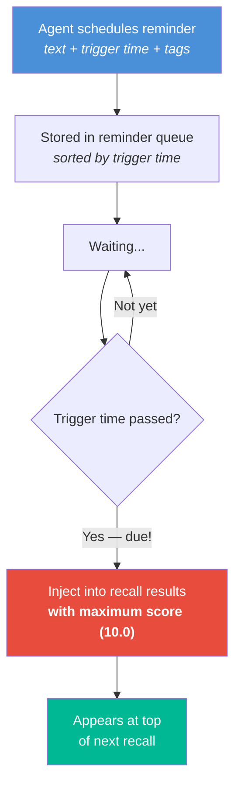
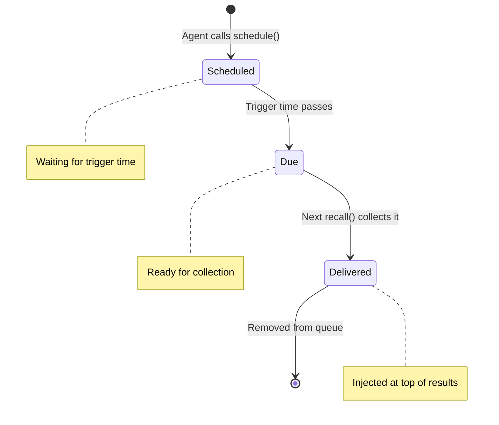
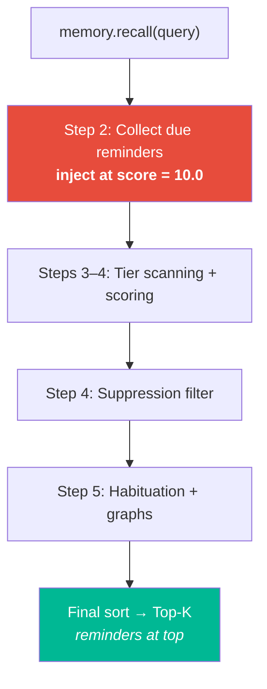

# 🔮 Prospective — Future Intents

> **Biological Analog**: **Prospective memory** is the ability to remember to perform an intended action in the future — "Remember to call the doctor at 3pm." Unlike retrospective memory (recalling the past), prospective memory is future-oriented and time-triggered.

---

## The Concept

An AI agent needs to remember not just *what happened*, but *what to do next*. Prospective memory enables:

- "Remind me to check the build in 10 minutes"
- "Flag this issue for follow-up tomorrow"
- "Alert when deployment completes"

---

## How It Works



### Reminder Lifecycle



Each reminder carries:

| Field | Description |
|---|---|
| **text** | The reminder content |
| **triggerAt** | When to surface the reminder |
| **tags** | Synaptic tags for contextual association |

---

## Where It Fits in the Pipeline

Due reminders are injected at **Step 2** of the recall pipeline — before scoring, ensuring they always appear at the top of results with maximum score (10.0):



---

## Example Usage

```
Agent: "Remind me to check the deployment in 30 minutes"
→ memory.scheduleReminder(
      text: "Check deployment status",
      triggerAt: now + 30min,
      tags: ["deployment", "monitoring"]
  )

... 30 minutes later ...

Agent: memory.recall("what should I do?")
→ Result[0]: "Check deployment status" (score: 10.0, type: PROSPECTIVE)
```

---

## Next Steps

- :material-mirror: [**Metamemory — Self-Reflection**](metamemory.md) — memory health analytics
- :material-lightning-bolt: [**6-Phase Scoring Pipeline**](scoring-pipeline.md) — the full recall flow
