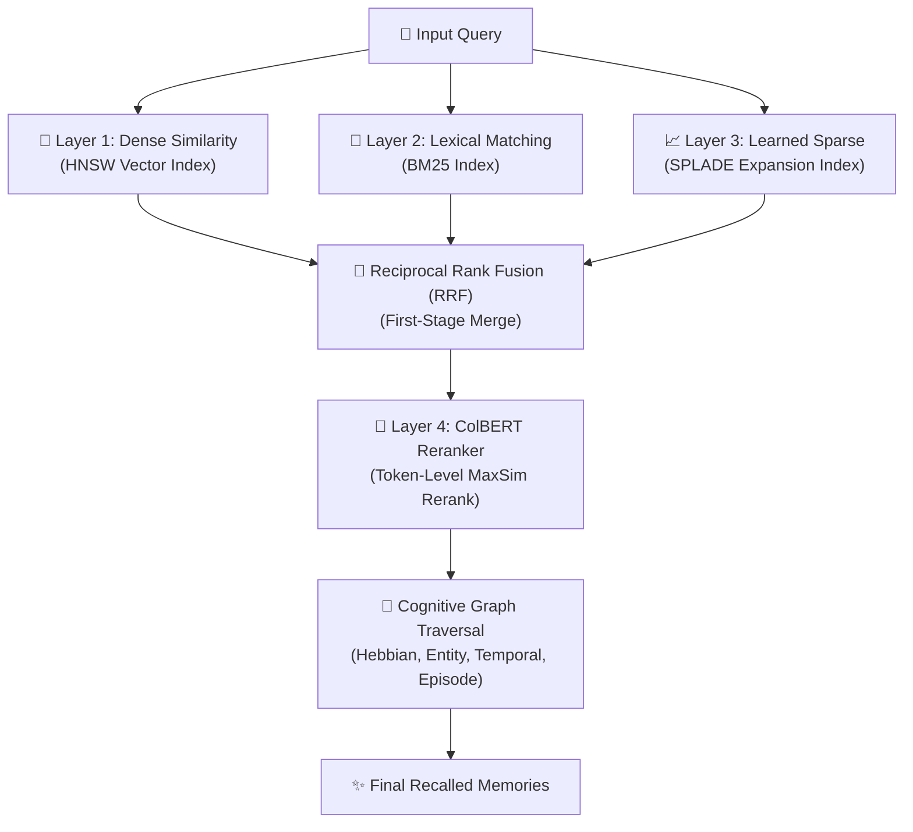

# 🔍 Retrieval Stack Overview

Spector features a unified **4-layer hybrid retrieval stack** that acts as the candidate generation and reranking phases of the Memory Recall pipeline. Rather than relying on simple semantic vector matches, Spector combines lexical precision, learned sparse expansions, deep late-interaction reranking, and multi-layer graph traversal in a single cohesive pass.

---

## 🏗️ The Memory Recall Flow

Spector coordinates query execution by retrieving candidates in parallel from the first three layers, merging them, reranking them, and finally traversing the cognitive graph to discover associated memories:

| Layer | Primary Purpose | Best For |
|:---|:---|:---|
| **Layer 1: Dense Similarity** | Semantic similarity retrieval | Conceptual matching, synonyms |
| **Layer 2: Lexical BM25** | Exact term and keyword matching | Code snippets, IDs, specific terms |
| **Layer 3: Sparse (SPLADE)** | Learned sparse / neural term expansion | Capturing keyword intent without exact matches |
| **Layer 4: ColBERT v2** | High-precision candidate reranking | Complex reasoning queries, grounding context |

---

## 🎛️ Retrieval Modes

You can control which layers of the retrieval stack are active during memory recall by configuring the retrieval mode:

| Mode | Active Layers | Description |
|:---|:---|:---|
| `HYBRID` *(Default)* | BM25 + Dense Vector | Combines lexical exact-matches with semantic vector recall, merged via RRF. |
| `KEYWORD_ONLY` | BM25 only | Bypasses dense vector computations. Best for specific error codes or names. |
| `VECTOR_ONLY` | Dense Vector only | Pure semantic similarity search. |
| `SPLADE` | SPLADE only | Uses learned sparse representations with term expansions only. |
| `SPLADE_HYBRID` | SPLADE + Dense Vector | Combines semantic recall with neural term expansion, bypassing BM25. |
| `LI_LSR` | Li-LSR only | Fast, inference-free learned sparse retrieval utilizing precomputed tables. |
| `COLBERT_RERANK` | BM25 + Vector + ColBERT Reranker | Runs first-stage hybrid search, then reranks candidates using ColBERT v2. |
| `FULL_STACK` | All Layers (Vector + BM25 + SPLADE + Colbert) | Maximum retrieval quality. Merges all first-stage signals and reranks with ColBERT. |

---

## 🧬 Reciprocal Rank Fusion (RRF)

When multiple first-stage layers are active (e.g., in `HYBRID` or `FULL_STACK`), Spector merges their ranked lists using **Reciprocal Rank Fusion (RRF)**. 

The RRF score for a candidate document $d$ is calculated as:

\[RRF(d) = \sum_{m \in M} \frac{1}{k + r_m(d)}\]

Where:
- $M$ is the set of active retrieval modes (e.g., Vector, BM25, SPLADE).
- $r_m(d)$ is the rank of document $d$ in retrieval mode $m$ (1-indexed). If the document is not retrieved by mode $m$, $r_m(d) = \infty$.
- $k$ is a constant smoothing parameter (defaults to $60$).

RRF ensures that documents ranked highly across multiple retrieval strategies are elevated to the top of the final candidate list, regardless of the scale differences in their raw scores.

---

## 🔗 Graph Traversal & Expansion

Once the retrieval stack generates and reranks the top candidate memories, Spector passes them to the **Cognitive Graph Traversal** stage. This phase discovers hidden connections and adds related context that first-stage similarity cannot find:

1. **Hebbian Co-activation**: Traverses strong co-activation edges to pull in memories frequently recalled together (spreading activation).
2. **Entity-Relationship Graph**: BFS traversal of extracted entities (e.g., people, projects, concepts) and their relationships to recall related structured facts.
3. **Temporal Causal Chains**: Follows chronological links forward and backward to reconstruct the event context of a conversation or activity.
4. **Event-Episode (Hyperedge) Graph**: Links groups of entities and actions belonging to a single temporal episode.

For a deep dive into graph parameters, thresholds, and spreading activation decay formulas, see the [4-Layer Cognitive Graph](hebbian.md) documentation.
