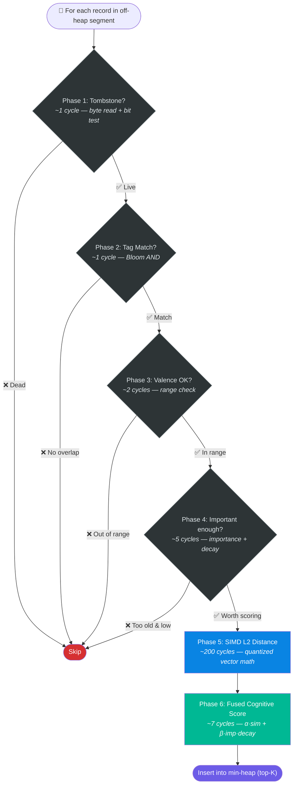
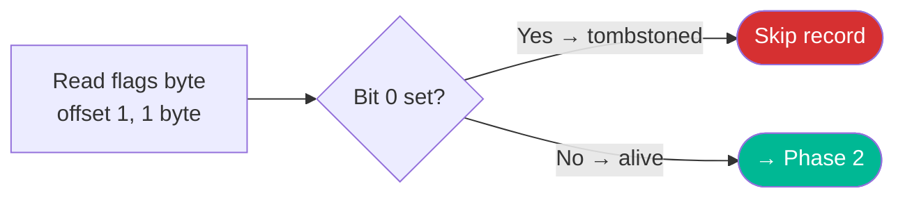
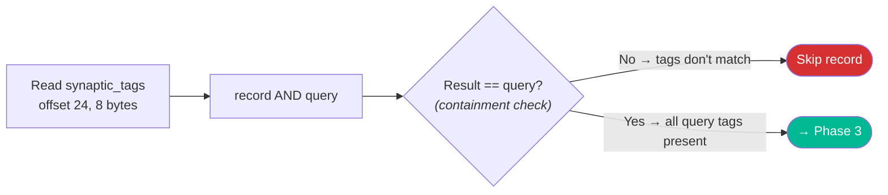
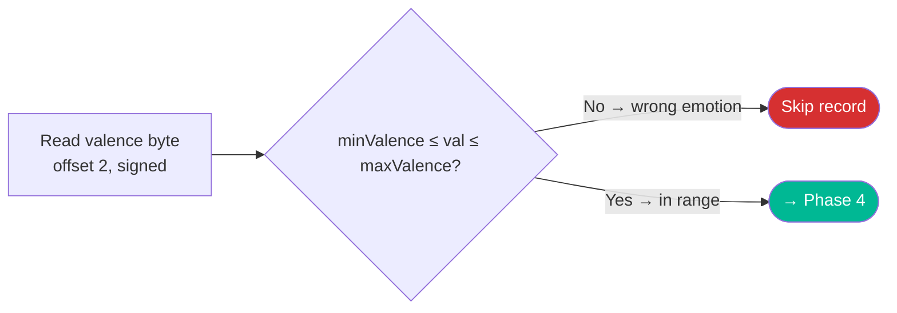
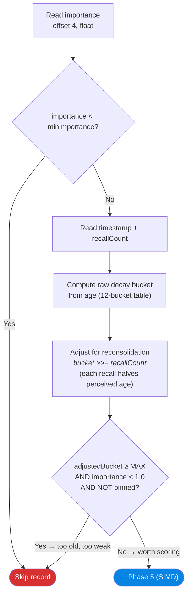
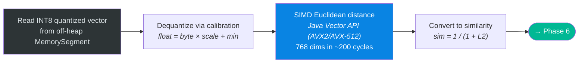
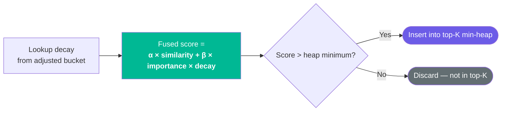
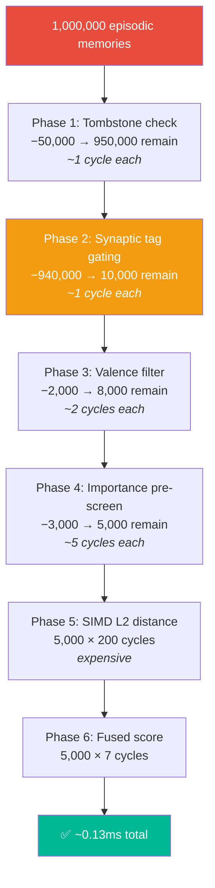

# The 6-Phase Scoring Pipeline

The `CognitiveScorer` is the performance-critical inner loop of Spector Memory. It scans off-heap `MemorySegment` data using **six sequential phases**, each eliminating candidates before the expensive SIMD vector math. This design is inspired by the brain's **sensory gating** — the auditory cortex filters out background noise before the prefrontal cortex evaluates it.

---

## Why Fused Scoring?

### The Truncation Trap

In a standard vector database, you:

1. Retrieve the top-K nearest vectors by L2 distance
2. **Then** apply business logic (importance, time, tags) in Java

This **fails catastrophically** for AI memory:

!!! danger "The Problem"
    If an AI agent asks *"What is the user's core preference?"*, the most important memory might be 6 months old and slightly less semantically similar than a useless conversation from 5 minutes ago. If you pull the top-100 nearest vectors and *then* sort by importance, the vital 6-month-old memory was already **dropped at step 1**.

### The Fix: Fuse Everything

Spector fuses temporal decay and importance directly into the scoring loop:

$$\text{Similarity} = \frac{1}{1 + \text{L2\_Distance}(q, x)}$$

$$\text{FinalScore} = \alpha \cdot \text{Similarity} + \beta \cdot \text{Importance} \cdot \text{Decay}(\text{AdjustedAge})$$

Where $\alpha$ (default: 0.6) and $\beta$ (default: 0.4) are user-configurable scoring weights.

---

## The Six Phases — Overview

Each phase reads the **minimum bytes** needed to make its decision. Phases 1–4 read only header fields (1–8 bytes each). The expensive Phase 5 (SIMD vector math, ~200 cycles) only runs on records that survived all four cheap gates.

---

## Phase-by-Phase Deep Dive

### Phase 1: Tombstone Check

**Cost**: ~1 CPU cycle (single byte read + bit test)

Tombstoned memories are skipped without reading any other fields. When the tombstone ratio in an episodic partition exceeds 30%, the `TombstoneCompactor` triggers a partition rebuild.

---

### Phase 2: Synaptic Tag Gating

**Cost**: ~1 CPU cycle (single `long` read + bitwise AND)

!!! info "Bloom Filter Containment"
    The check `(record & query) != query` is a **containment check**, not an overlap check. It verifies that **all** query tag bits are present in the record's Bloom filter. This is the correct Bloom filter match — it can have false positives but never false negatives.

**Selectivity**: If an agent has 1,000,000 memories and only 10,000 match the query tags, this phase eliminates **990,000 records** in ~990µs — saving 990,000 × 200 cycles of SIMD math.

The synaptic tag Bloom filter uses MurmurHash3-inspired double hashing with k=3 hash functions in a 64-bit field. False positive rates:

| Tags per Record | FPR | Assessment |
|---|---|---|
| 5 | 0.03% | Excellent |
| 10 | 0.2% | Excellent |
| 20 | 2.3% | Good |
| 50 | 12% | Acceptable — vector distance rejects false matches |

---

### Phase 3: Valence Filter

**Cost**: ~2 CPU cycles (byte read + 2 comparisons)

Valence represents **emotional coloring** on a scale of -128 to +127:

- **Negative**: Error memories, failures, warnings
- **Zero**: Neutral factual memories
- **Positive**: Successes, preferred outcomes

!!! example "Use Case"
    An agent debugging an error can filter to `maxValence = -10` to recall only negative-outcome memories — "What went wrong last time?"

---

### Phase 4: Importance/Decay Pre-screen

**Cost**: ~5 CPU cycles (float read + timestamp read + bucket computation)

**Reconsolidation**: Each recall shifts the decay bucket via bit-shift, simulating how frequently-recalled memories become more durable (Long-Term Potentiation). A memory recalled once is half its bucket index "younger" than its actual age.

**Decay Buckets** (precomputed from power law $R(t) = a \cdot t^{-d}$, d=0.15 — see [Theoretical Foundations](theoretical-foundations.md)):

| Bucket | Age Range | Decay Multiplier |
|---|---|---|
| 0 | 0–1 hours | ~1.00 |
| 1 | 1–6 hours | ~0.75 |
| 2 | 6–24 hours | ~0.60 |
| 3 | 1–3 days | ~0.50 |
| 4 | 3–7 days | ~0.44 |
| 5 | 1–4 weeks | ~0.36 |
| 6 | 1–3 months | ~0.30 |
| 7 | 3–6 months | ~0.27 |
| 8 | 6–12 months | ~0.24 |
| 9 | 1–2 years | ~0.22 |
| 10 | 2–5 years | ~0.19 |
| 11 | 5+ years | ~0.17 |

Values are auto-generated by `DecayConfig.computeBuckets()` and configurable via the `DecayConfig` record (exponent and permastore floor). The table above shows defaults for `d=0.15, floor=0.10`.

!!! warning "The `pow()` Bottleneck"
    Naive power-law decay `Math.pow(age, -d)` costs 50-100ns per call and cannot be SIMD-vectorized. Spector uses precomputed decay buckets — a single array lookup per record (~1ns). At 1M memories, this saves **50-100ms** of scalar overhead.

---

### Phase 5: SIMD L2 Distance

**Cost**: ~200 CPU cycles (the dominant cost)

This is the expensive operation that phases 1-4 are designed to gate. It:

1. Reads INT8 quantized vector bytes directly from the off-heap `MemorySegment`
2. Dequantizes via calibration: `float_val = byte_val × scale + min`
3. Computes Euclidean distance using the Java Vector API (AVX2/AVX-512)
4. Converts distance to similarity: `1 / (1 + L2)`

**Throughput**: ~2.2µs per 768-dim vector (1.4M vectors/sec on AVX2).

---

### Phase 6: Fused Cognitive Score

**Cost**: ~7 CPU cycles (2 multiplies + 1 add + heap insert)

The final score fuses three signals:

- **Semantic similarity** (α-weighted): How relevant is this memory to the query?
- **Importance** (β-weighted): How important was this memory at ingestion?
- **Temporal decay** (β-weighted): How recent is this memory?

Results are tracked in a **min-heap** of size K — only the top-K scored records survive.

---

## The Math: Gating Efficiency

> **Without gating**: 1,000,000 × 200 cycles = ~200ms → **100× improvement** from early elimination.

---

## Parallel Tier Scanning

The `RecallPipeline` scans all tiers in parallel using Virtual Threads:

```mermaid
gantt
    title Parallel Recall Scan (Virtual Threads)
    dateFormat X
    axisFormat %L ms
    section Working
    Scan 100 records     :a1, 0, 1
    section Episodic P1
    Scan 5000 records    :a2, 0, 3
    section Episodic P2
    Scan 3000 records    :a3, 0, 2
    section Semantic
    Header scan 200      :a4, 0, 1
    section Procedural
    Scan 50 records      :a5, 0, 1
    section Merge
    Sort + top-K         :a6, 3, 4
```

Each partition scan runs on a **dedicated Virtual Thread** — disjoint memory segments guarantee zero contention. The merge phase sorts all tier results and returns the global top-K.

---

## Graph Augmentation (Post-Scorer)

After the 6-phase scorer produces a **seed set** (top-K by fused cognitive score), three graph layers expand the result set by discovering memories that the scorer alone couldn't find:

### Step 5c: Hebbian Spreading Activation

For each seed result, the Hebbian graph traverses the off-heap adjacency list (164B/node, MAX_DEGREE=20) with depth=2 BFS. Activated neighbor memories are added to the result set with their score attenuated by **0.3×**.

**Example:** Seed memory "database error" has a strong Hebbian edge (weight: 0.83) to "connection pool settings" → "connection pool settings" is added even though it wasn't in the vector similarity top-K.

### Step 5d: Temporal Chain Extension

For each seed result, the temporal chain follows forward (3 hops) and backward (3 hops) via session-local linked list pointers. Forward-linked memories get **0.8×** score, backward-linked get **0.7×**.

**Example:** Seed memory "deploy failed" → follow forward → "rollback initiated" → "post-mortem notes" — both added to results.

### Step 5e: Entity Graph Traversal

Entities are extracted from the query text, then looked up in the `EntityGraph`. For each matched entity, a 2-hop BFS with typed edge filtering discovers related entities. Their linked memories are added with **0.25× attenuation per hop**.

**Example:** Query mentions "Alice" → Entity "Alice" → MANAGES → "Project Alpha" → memories mentioning "Project Alpha" are added.

!!! tip "Graceful Degradation"
    Each graph step is **additive and independently optional**. If a graph component is null (not configured), empty, or throws a `RuntimeException`, the step is a no-op. The system degrades gracefully to vector-only recall. Zero risk of regression.

---

## Next Steps

- :material-share-variant: [**3-Layer Cognitive Graph**](hebbian.md) — deep dive into Hebbian, Entity, and Temporal graphs
- :material-brain: [**Cortex — Tier Stores**](cortex.md) — the 4-tier memory architecture
- :material-flash: [**Synapse — Tags & Scoring**](synapse.md) — Bloom filter and binary layout
- :material-school: [**Theoretical Foundations**](theoretical-foundations.md) — ACT-R lineage, power law of forgetting, Two-Factor model
- :material-speedometer: [**Performance**](performance.md) — benchmark results
