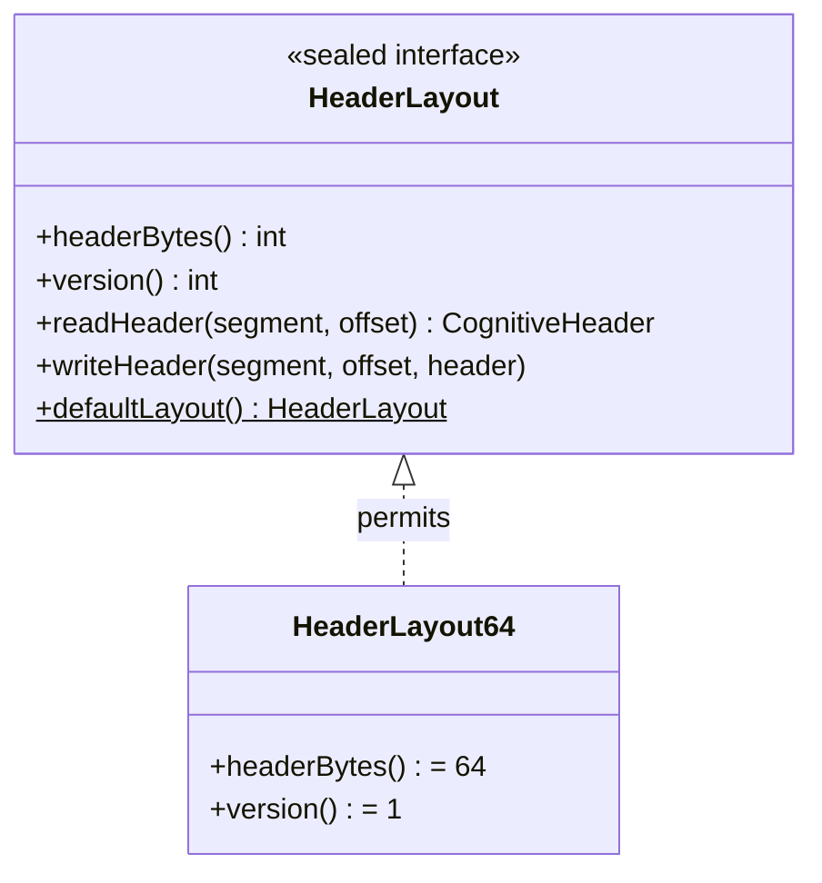

# 🔗 Synapse — Tags & Scoring

> **Package**: `com.spectrayan.spector.memory.synapse`
>
> **Biological Analog**: In neuroscience, the **Synaptic Tagging and Capture (STC)** hypothesis (Frey & Morris, 1997) describes how synapses are "tagged" during learning with lightweight chemical markers. These tags don't contain the memory itself — they identify *what* the memory is about and *when* it was formed, enabling the brain to route consolidation activity efficiently.

---

## Header Layout — 64-Byte Cache-Line Format

Every cognitive memory record begins with a synaptic header — the digital equivalent of a synaptic tag. The header format is defined by the `HeaderLayout` sealed interface with a single implementation: `HeaderLayout64`.



### Layout (64 bytes) — Cache-Line Aligned

The sole header layout, aligned to a full **CPU cache line** (64 bytes) for optimal sequential scan performance.

```
 Offset   Size   Field              Description
 ──────   ────   ─────              ───────────
    0      1B    header_version     Always 1
    1      1B    flags              Tombstone, type, consolidated, pinned, resolved
    2      1B    valence            Emotional coloring (signed: -128 to +127)
    3      1B    arousal            Emotional intensity (unsigned: 0-255)
    4      4B    importance         Base importance score (0.05 – 10.0)
    8      8B    timestamp_ms       Unix epoch ms when memory was formed
   16      4B    agent_recall_count LTP reinforcement counter
   20      4B    exact_norm         L2 norm of original float vector
   24      8B    synaptic_tags      64-bit Bloom filter of contextual markers
   32      2B    centroid_id        IVF partition routing ID
   34      2B    _pad0              Alignment padding
   36      4B    storage_strength   Two-Factor Memory S(t) (Bjork & Bjork)
   40      4B    spector_recall_cnt Auto-LTP passive counter
   44      4B    _reserved_f1       Future float
   48      8B    last_auto_ltp      Auto-LTP timestamp
   56      8B    _reserved_l1       Future (128-bit tag upper half)
                                    ═══════════════════════════════════
                                    Total: 64 bytes (1× cache line, 2× AVX2)
```

!!! tip "Why 64 bytes?"
    **Cache-line alignment** eliminates split-line reads during sequential scans. When the scorer iterates over 1M records, each header read hits exactly one cache line — no partial line loads, no false sharing. The CPU prefetcher can pre-fetch the next record's header while the current one is being scored. The 8 bytes of reserved space prevent future migration costs when new fields are added.

### Memory Cost

| Header | Stride (768-dim) | 1M Records | Alignment |
|:---|:---:|:---:|:---|
| 64B | 832B | ~793 MB | 1× cache line (64B) |

---

## Flags Bitfield

The `flags` byte at offset 1 encodes per-record state:

```
 Bit   Name          Description
 ───   ────          ───────────
  0    tombstone     Record is logically deleted (pruned by Deep Sleep)
  1-2  memory_type   2-bit type: 0=WORKING, 1=EPISODIC, 2=SEMANTIC, 3=PROCEDURAL
  3    consolidated  Has been reflected into Semantic tier
  4    pinned        Exempt from decay and pruning (flashbulb memories)
  5    resolved      Zeigarnik Effect — resolved tasks return to normal decay
  6-7  reserved      Future use
```

### Zeigarnik Effect (Bit 5)

Unresolved memories (bit 5 = 0) resist time-decay — their decay bucket is clamped to 0, keeping them perpetually "fresh." This models the psychological phenomenon where incomplete tasks remain more accessible than completed ones.

```java
// In CognitiveScorer Phase 4:
if (!isResolved(flags) && !isPinned(flags)) {
    adjustedBucket = 0;  // acts like the memory was just formed
}

// Agent marks task complete:
memory.markResolved("task-123");  // bit 5 → 1, normal decay resumes
```

---

## SynapticTagEncoder — The Inline Bloom Filter

The `synaptic_tags` field is a **64-bit inline Bloom filter** rather than a discrete bitmap. This enables encoding thousands of unique tag strings across the system while each individual record holds 5-50 tags with negligible false positive rates.

### How It Works

```java
public static long encode(String... tags) {
    long filter = 0L;
    for (String tag : tags) {
        filter |= encodeTag(tag);
    }
    return filter;
}

private static long encodeTag(String tag) {
    long h = murmurHash64(tag);
    long h1 = h;
    long h2 = h >>> 32 | h << 32; // Swap halves for second hash
    
    long filter = 0L;
    for (int i = 0; i < K; i++) {  // K = 3 hash functions
        int bitIndex = Math.abs((int) ((h1 + (long) i * h2) % M)); // M = 64
        filter |= (1L << bitIndex);
    }
    return filter;
}
```

**Key properties**:

| Property | Value |
|:---|:---|
| Filter size | 64 bits (fits in a single CPU register) |
| Hash functions | k = 3 (MurmurHash3-inspired double hashing) |
| Bits per tag | 3 |
| Match operation | `(record & query) == query` (containment check) |
| Cost | **1 CPU cycle** (single `long` read + bitwise AND) |

### False Positive Rates

| Tags per Record | FPR | Assessment |
|:---|:---|:---|
| 5 tags | 0.03% | Excellent — 1 false match per 3,000 records |
| 10 tags | 0.2% | Excellent — 1 false match per 500 records |
| 20 tags | 2.3% | Good — vector distance rejects false matches |
| 50 tags | 12% | Acceptable — still useful for coarse gating |

!!! tip "System vs. Record Tags"
    The system can have **thousands** of unique tag strings. But any single record should have at most **10-50 tags** for the Bloom filter to remain effective. This is a natural fit — a single memory rarely has more than 5-15 contextual associations.

### Tag Overlap Scoring

Beyond binary gating, the `SynapticTagEncoder` also computes a **fractional overlap ratio** for weighted tag relevance in Phase 6:

```java
public static float overlapRatio(long recordTags, long queryMask) {
    if (queryMask == 0) return 0f;
    int overlapBits = Long.bitCount(recordTags & queryMask);
    int queryBits = Long.bitCount(queryMask);
    return (float) overlapBits / queryBits;
}
```

This ratio is used as a multiplier in the scoring formula: `finalScore = baseScore × (1 + tagOverlap × tagRelevanceBoost)`. A record matching 3 of 5 query tags gets a 60% tag boost vs 100% for a full match.

---

## CognitiveRecordLayout — Binary Format

The `CognitiveRecordLayout` class manages reading/writing headers and quantized vectors to/from off-heap `MemorySegment`. It delegates header operations to the active `HeaderLayout`:

```java
public record CognitiveRecordLayout(int quantizedVecBytes, HeaderLayout headerLayout) {
    
    /** Default constructor — uses the default 64-byte header layout. */
    public CognitiveRecordLayout(int quantizedVecBytes) {
        this(quantizedVecBytes, HeaderLayout.defaultLayout());
    }
    
    /**
     * Record stride = header bytes + vector payload.
     * Always 64 + vecBytes (one cache line + vector).
     */
    public int stride() {
        return headerLayout.headerBytes() + quantizedVecBytes;
    }
    
    /**
     * Offset where the quantized vector begins within a record.
     */
    public long vectorOffset(long recordOffset) {
        return recordOffset + headerLayout.headerBytes();
    }
    
    public void writeHeader(MemorySegment segment, long offset, CognitiveHeader header) {
        headerLayout.writeHeader(segment, offset, header);
    }
    
    public CognitiveHeader readHeader(MemorySegment segment, long offset) {
        return headerLayout.readHeader(segment, offset);
    }
}
```

### CognitiveHeader Record

The header data is represented as a Java `record` with all fields:

```java
public record CognitiveHeader(
    long timestampMs,       // when the memory was formed
    long synapticTags,      // 64-bit Bloom filter
    float exactNorm,        // L2 norm of original vector
    float importance,       // cognitive importance (0.05 – 10.0)
    int agentRecallCount,   // LTP reconsolidation counter
    short centroidId,       // IVF partition routing ID
    byte valence,           // emotional coloring (-128 to +127)
    byte flags,             // bit field (tombstone, type, consolidated, pinned, resolved)
    byte arousal,           // emotional intensity (unsigned 0-255)
    float storageStrength   // Two-Factor durability S(t)
) {}
```

---

## DecayStrategy — SIMD-Friendly Temporal Decay

!!! warning "The `exp()` Problem"
    The naive decay formula `Math.exp(-λ·age)` costs 50-100ns per call and is a **scalar operation** — it cannot be SIMD-vectorized. At 1M memories, this adds 50-100ms of pure overhead, destroying the SIMD advantage.

### The Solution: Power-Law Decay Buckets

`DecayStrategy` quantizes time into **12 discrete buckets** spanning 5+ years and uses precomputed lookup tables derived from the power law of forgetting: `R(t) = a · t^{-d}`.

Bucket values are generated at startup by `DecayConfig.computeBuckets()`, not hardcoded — making the decay curve fully configurable:

```java
// Bucket values from DecayConfig.DEFAULT (d=0.15, floor=0.10)
static final float[] DECAY_BUCKETS = DecayConfig.DEFAULT.buckets();

public static float decay(int bucket) {
    return DECAY_BUCKETS[Math.min(bucket, MAX_BUCKET)];
}
```

### 12-Bucket Time Ranges

| Bucket | Time Range | Decay Multiplier (d=0.15) |
|:---:|:---|:---:|
| 0 | 0–1 hours | 1.00 |
| 1 | 1–6 hours | ~0.87 |
| 2 | 6–24 hours | ~0.67 |
| 3 | 1–3 days | ~0.53 |
| 4 | 3–7 days | ~0.43 |
| 5 | 1–4 weeks | ~0.32 |
| 6 | 1–3 months | ~0.24 |
| 7 | 3–6 months | ~0.20 |
| 8 | 6–12 months | ~0.17 |
| 9 | 1–2 years | ~0.14 |
| 10 | 2–5 years | ~0.11 |
| 11 | 5+ years | 0.10 (permastore floor) |

### DecayConfig Presets

Three presets are available for different agent personalities:

| Preset | Exponent | Floor | Use Case |
|:---|:---:|:---:|:---|
| `DEFAULT` | d=0.15 | 0.10 | General-purpose agent memory |
| `SLOW_FORGET` | d=0.08 | 0.15 | Digital legacy, long-term knowledge bases |
| `FAST_FORGET` | d=0.30 | 0.05 | Chat assistants, fast-moving contexts |

### Reconsolidation Adjustment (LTP)

Each recall effectively **halves the memory's perceived age** by bit-shifting the bucket index right. This mirrors biological spaced repetition where each successful retrieval doubles the memory's half-life:

```java
public static int adjustForReconsolidation(int rawBucket, int agentRecallCount) {
    int shift = Math.min(agentRecallCount, 5);
    return rawBucket >> shift;
}
```

| Recall Count | Shift | Effect |
|:---:|:---:|:---|
| 0 | ÷1 | No change |
| 1 | ÷2 | bucket 6 → 3 |
| 2 | ÷4 | bucket 6 → 1 |
| 3 | ÷8 | bucket 7 → 0 |
| 5+ | ÷32 | Effectively fresh |

A memory recalled 3 times is **8× "younger"** than its actual age — it powerfully resists forgetting.

### Auto-LTP (Passive Recall)

Spector also tracks internal passive recalls separately from agent-explicit reinforcement. Passive recall uses a gentler linear shift: `min(spectorRecallCount / 3, 2)` — capped at 2 buckets to prevent passive retrieval from making memories artificially immortal:

```java
public static int adjustForAutoRecall(int bucket, int spectorRecallCount) {
    int shift = Math.min(spectorRecallCount / 3, 2);
    return Math.max(0, bucket - shift);
}
```

### Arousal-Modulated Decay

Emotionally intense memories resist forgetting. The `arousal` byte modulates the decay curve through a 4-entry lookup table:

```java
static final float[] AROUSAL_DECAY_MODIFIERS = {
    1.00f,  // arousal 0-63:    neutral     → no change
    1.15f,  // arousal 64-127:  mild        → 15% slower decay
    1.35f,  // arousal 128-191: moderate    → 35% slower decay
    1.65f   // arousal 192-255: extreme     → 65% slower decay
};

public static float arousalModifier(byte arousal) {
    int unsigned = Byte.toUnsignedInt(arousal);
    int bucket = Math.min(3, unsigned / 64);
    return AROUSAL_DECAY_MODIFIERS[bucket];
}
```

| Arousal Range | Bucket | Modifier | Biological Basis |
|:---|:---:|:---:|:---|
| 0-63 (neutral) | 0 | 1.00× | Normal forgetting — routine memories |
| 64-127 (mild) | 1 | 1.15× | Slightly persistent — mildly emotional |
| 128-191 (moderate) | 2 | 1.35× | Noticeably persistent — significant events |
| 192-255 (extreme) | 3 | 1.65× | Very hard to forget — flashbulb memories |

The modifier **multiplies the base decay factor**, slowing the decay rate. A production outage at arousal=200 decays 1.65× slower than a routine log entry at arousal=0.

```java
public static float computeDecayWithArousal(long timestampMs, long nowMs,
                                              int agentRecallCount, byte arousal) {
    float baseDecay = computeDecay(timestampMs, nowMs, agentRecallCount);
    float modifier = arousalModifier(arousal);
    return Math.min(1.0f, baseDecay * modifier);
}
```

**Automatic arousal derivation:** When arousal is not explicitly set by the LLM, it is auto-derived from valence at ingestion time:

$$
\text{arousal} = \min(255, |\text{valence}| \times 2)
$$

This means both extremely positive (valence=+100) and extremely negative (valence=-100) memories are equally arousing — matching the psychological finding that emotional intensity, not polarity, drives memory persistence.

### Wiring in CognitiveScorer

The scorer reads arousal from the header and applies the modifier to both standard and lateral scoring paths:

```java
// In CognitiveScorer, after Phase 4 (temporal/importance pre-screen):

// Read arousal from 64-byte header
byte arousal = segment.get(LAYOUT_AROUSAL, offset + OFFSET_AROUSAL);

// Phase 6: Standard scoring
float decay = DecayStrategy.decay(adjustedBucket) * DecayStrategy.arousalModifier(arousal);
decay = Math.min(1.0f, decay);
float baseScore = alpha * similarity + beta * importance * decay;
```

---

## Next Steps

- :material-head-cog: [**Dopamine — Surprise Detection**](dopamine.md) — auto-importance scoring
- :material-brain: [**Cortex — Tier Stores**](cortex.md) — the 4-tier architecture
- :material-lightning-bolt: [**6-Phase Scoring Pipeline**](scoring-pipeline.md) — how scoring uses the header
- :material-flask: [**Labs — Research Roadmap**](../labs/roadmap.md) — Two-Factor Memory, Dynamic Quantization
