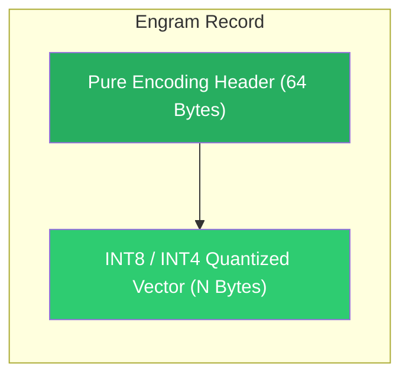
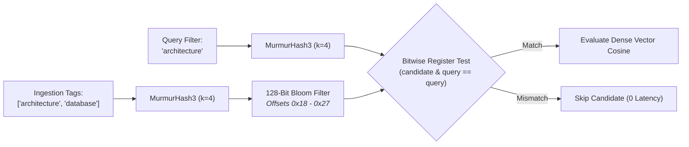

# 🔗 Synapse — Tags & Cognitive Scoring

> **Biological Analog**: In neuroscience, the **Synaptic Tagging and Capture (STC)** hypothesis (Frey & Morris, 1997) describes how synapses are "tagged" during learning with lightweight chemical markers. These tags identify *what* the memory is about and *when* it was formed, enabling the brain to route consolidation activity efficiently.

---

## 64-Byte Pure Encoding Header (V2)

Every cognitive memory record begins with a synaptic header — the digital equivalent of a biological synaptic tag. The header is strictly aligned to a full **CPU cache line** (64 bytes) for optimal sequential scan performance.


```mermaid
graph LR
    subgraph "Engram Record"
        H["Pure Encoding Header (64 Bytes)"] --> V["INT8 / INT4 Quantized Vector (N Bytes)"]
    end
    style H fill:#27ae60,color:white
    style V fill:#2ecc71,color:white
```

### Layout Overview (64 Bytes)

| Offset | Field | Size | Type | Description |
|:---:|:---|:---:|:---|:---|
| `0x00` | `header_version` | 1B | uint8 | Current version: `2` |
| `0x01` | `flags` | 1B | uint8 | Tombstone, tier type, consolidated, pinned, resolved, modality |
| `0x02` | `valence` | 1B | int8 | Emotional coloring (signed: $-128$ to $+127$) |
| `0x03` | `arousal` | 1B | uint8 | Emotional intensity ($0$ to $255$) |
| `0x04` | `importance` | 4B | float32 | Base importance score ($0.05$ to $10.0$) |
| `0x08` | `timestamp_ms` | 8B | int64 | Unix epoch ms when memory was formed |
| `0x10` | `exact_norm` | 4B | float32 | L2 norm of original float vector |
| `0x14` | `centroid_id` | 2B | int16 | IVF partition routing ID |
| `0x16` | `_pad0` | 2B | bytes | Alignment padding |
| `0x18` | `synaptic_tags_lo` | 8B | uint64 | Low 64 bits of 128-bit Bloom filter |
| `0x20` | `synaptic_tags_hi` | 8B | uint64 | High 64 bits of 128-bit Bloom filter |
| `0x28` | `consolidation_flags` | 1B | uint8 | Provenance bits (simulated, crystallized, dreamed) |
| `0x29` | `encoding_profile` | 1B | uint8 | Cognitive state during ingestion |
| `0x2A` | `encoding_alpha` | 1B | uint8 | Quantized associative attention weight ($0$ to $255$) |
| `0x2B` | `encoding_beta` | 1B | uint8 | Quantized contextual balance weight ($0$ to $255$) |
| `0x2C` | `soul_version` | 2B | uint16 | Monotonic persona configuration counter |
| `0x2E` | `_reserved_geo` | 2B | bytes | Reserved for manifold coordinates |
| `0x30` | `encoding_surprise` | 4B | float32 | Bayesian surprise $z$-score at ingestion |
| `0x34` | `_reserved` | 12B | bytes | Zero-padded reserved block |

> For complete field-by-field bitwise descriptions and separation from mutable strength telemetry, see [Binary Record Specifications & Synaptic Header](../kernel/layouts.md).

---

## 128-Bit Inline Synaptic Bloom Filter

The `synaptic_tags` field is an expanded **128-bit inline Bloom filter** (occupying 16 bytes across `synaptic_tags_lo` and `synaptic_tags_hi`). This allows thousands of unique tag strings to be used across the system while individual records carry contextual tags with virtually zero false positives.


```mermaid
flowchart LR
    TAGS["Ingestion Tags:<br/>['architecture', 'database']"] --> HASH["MurmurHash3 (k=4)"]
    HASH --> BLOOM["128-Bit Bloom Filter<br/><i>Offsets 0x18 - 0x27</i>"]
    QUERY["Query Filter:<br/>'architecture'"] --> QHASH["MurmurHash3 (k=4)"]
    QHASH --> TEST{"Bitwise Register Test<br/>(candidate & query == query)"}
    BLOOM --> TEST
    TEST -->|Match| VECTOR["Evaluate Dense Vector Cosine"]
    TEST -->|Mismatch| SKIP["Skip Candidate (0 Latency)"]
```

### False Positive Characteristics

| Tags per Record | 64-Bit Filter FPR | 128-Bit Filter FPR (Spector) | Improvement |
|:---:|:---:|:---:|:---:|
| 3 tags | 0.01% | **< 0.0001%** | ~100× reduction |
| 5 tags | 0.03% | **0.0005%** | ~60× reduction |
| 10 tags | 0.20% | **0.004%** | ~50× reduction |
| 20 tags | 2.30% | **0.06%** | ~38× reduction |

Because matching requires only two 64-bit CPU register bitwise `AND` instructions, non-matching engrams are rejected in under a nanosecond, preserving SIMD vector registers for relevant candidates.

---

## Psychological Memory Modulations

### 1. Zeigarnik Effect (Active Task Accessibility)
In psychology, the **Zeigarnik Effect** describes the phenomenon where unresolved tasks remain more accessible in memory than completed ones. Spector models this in the `flags` bitfield:
- **Unresolved Engram**: The memory resists normal temporal decay, keeping active action items and open questions immediately available.
- **Resolved Engram**: When the task is completed (`client.memory.resolve(id)`), the flag is toggled and standard time-decay resumes.

### 2. Arousal-Modulated Retention
Emotionally intense experiences resist forgetting. Spector uses an unsigned `arousal` byte ($0$ to $255$) to modulate the power-law forgetting curve:
- High arousal (e.g. critical production failure, major milestone) slows decay by up to **$1.65\times$**.
- Neutral engrams (routine conversational exchanges) decay according to baseline retention curves.
- When omitted, arousal is automatically derived from emotional valence:
  $$\text{arousal} = \min(255, |\text{valence}| \times 2)$$

---

## Power-Law Temporal Decay

Rather than computing computationally expensive exponential functions in the hot loop, Spector quantizes time into **12 discrete time buckets** spanning seconds to years, evaluating decay according to the power law of forgetting:

$$R(t) = a \cdot t^{-d}$$

| Bucket | Elapsed Time | Decay Multiplier ($d = 0.15$) |
|:---:|:---|:---:|
| 0 | 0 – 1 hours | $1.00$ |
| 1 | 1 – 6 hours | $\sim 0.87$ |
| 2 | 6 – 24 hours | $\sim 0.67$ |
| 3 | 1 – 3 days | $\sim 0.53$ |
| 4 | 3 – 7 days | $\sim 0.43$ |
| 5 | 1 – 4 weeks | $\sim 0.32$ |
| 6 | 1 – 3 months | $\sim 0.24$ |
| 7 | 3 – 6 months | $\sim 0.20$ |
| 8 | 6 – 12 months | $\sim 0.17$ |
| 9 | 1 – 2 years | $\sim 0.14$ |
| 10 | 2 – 5 years | $\sim 0.11$ |
| 11 | 5+ years | $0.10$ (permastore floor) |

### Long-Term Potentiation (LTP) Reinforcement
Every time a memory is explicitly reinforced by an agent or user (`client.memory.reinforce(id)`), its perceived age is shifted right along the bucket index. A memory recalled and reinforced 3 times is perceived as **$8\times$ younger** than its chronological age, effectively preserving critical operational knowledge indefinitely.

---

## Client SDK Connectivity

=== "Python"

    ```python
    from spector_client import SpectorClient, MemoryTier

    client = SpectorClient.builder().with_rest("http://localhost:7070").build()

    # Store with synaptic tags and emotional valence
    record = client.memory.remember(
        text="Production database failover drill successful",
        tier=MemoryTier.SEMANTIC,
        tags=["database", "drill", "dr"],
        interest=0.9,
        valence=1,
    )

    # Reinforce memory via Long-Term Potentiation (LTP)
    client.memory.reinforce(record.get('id', 'stored'), valence=1)
    ```

=== "TypeScript"

    ```typescript
    import { SpectorClient, MemoryTier } from '@spectrayan/spector-client';

    const client = SpectorClient.createDefault('http://localhost:7070');

    // Store with synaptic tags and emotional valence
    const record = await client.memory.remember({
      text: 'Production database failover drill successful',
      tier: MemoryTier.SEMANTIC,
      tags: ['database', 'drill', 'dr'],
      interest: 0.9,
      valence: 1,
    });

    // Reinforce memory via Long-Term Potentiation (LTP)
    await client.memory.reinforce(record.id as string, 1);
    ```

=== "Java"

    ```java
    import com.spectrayan.spector.client.SpectorClient;
    import java.util.List;

    try (var client = SpectorClient.builder().baseUri("http://localhost:7070").build()) {
        // Store with synaptic tags
        var record = client.memory().remember(
            "Production database failover drill successful",
            "SEMANTIC",
            List.of("database", "drill", "dr")
        );

        // Reinforce memory
        client.memory().reinforce(record.getId(), 1);
    }
    ```

=== "cURL / REST"

    ```bash
    # Store memory
    curl -X POST http://localhost:7070/api/v1/memory/remember \
      -H "Content-Type: application/json" \
      -d '{
        "text": "Production database failover drill successful",
        "tier": "SEMANTIC",
        "tags": "database,drill,dr",
        "interest": 0.9,
        "valence": 1
      }'

    # Reinforce memory
    curl -X POST http://localhost:7070/api/v1/memory/{id}/reinforce \
      -H "Content-Type: application/json" \
      -d '{"boost": 1.0}'
    ```

---

## Next Steps

- :material-lightning-bolt: [**The 6-Phase Scoring Pipeline**](scoring-pipeline.md) — hot-loop SIMD scoring
- :material-memory: [**Memory Kernel Layouts**](../kernel/layouts.md) — byte-level layout specifications
- :material-head-cog: [**Dopamine — Surprise Detection**](dopamine.md) — Bayesian surprise and flashbulb memories
- :material-brain: [**Cortex — 4-Tier Memory**](cortex.md) — 4 cognitive memory tiers
