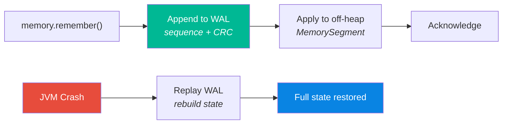
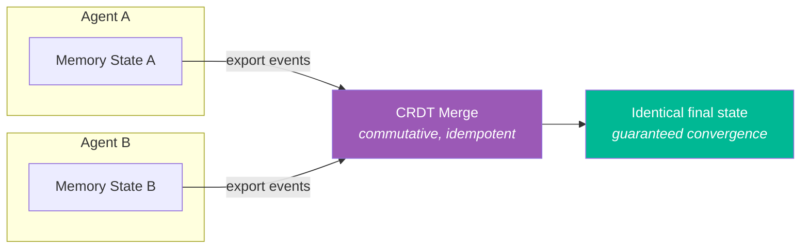
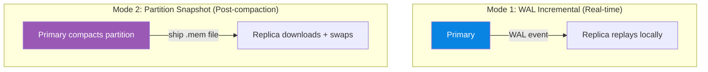

# 🔄 Sync — Persistence & Replication

> **Biological Analog**: Memory consolidation doesn't happen in isolation. During sleep, the brain replays memories and transfers them between regions (hippocampus → neocortex). The sync subsystem provides the infrastructure for **durable persistence** and **distributed memory merge**.

---

## Write-Ahead Log (WAL)

The WAL provides crash-safe durability for cognitive memory operations. Every memory mutation is first written to an append-only log before being applied to the in-memory state.

**Key capabilities:**

| Capability | Description |
|---|---|
| **Crash recovery** | Replay the log → full state reconstruction |
| **Event types** | REMEMBER, FORGET, REINFORCE, REFLECT, TAG_MERGE, RECALL_HIT |
| **Chunked files** | Auto-roll at 8 MB boundaries |
| **Dual CRC-32** | Independent header + payload checksums |
| **Compression** | Optional DEFLATE for large payloads |

**Two modes**:

| Mode | Storage | Use Case |
|---|---|---|
| **File-backed** | Append-only chunk files | Production — survives JVM restarts |
| **In-memory** | Volatile event list | Testing — fast, no disk I/O |

📖 **Deep dive**: [WAL Design](wal-design.md) — binary format, crash recovery, chunk rolling, compression

---

## CRDT Merge — Distributed Sync

For multi-agent or distributed deployments, the merge strategy resolves conflicts between divergent memory replicas using **Conflict-free Replicated Data Types (CRDTs)**:

**Merge rules per field:**

| Field | CRDT Type | Merge Rule | Guarantee |
|---|---|---|---|
| `timestamp` | LWW Register | `max(local, remote)` | Most recent write wins |
| `synapticTags` | G-Set (OR) | `local \| remote` | Tags only accumulate, never removed |
| `importance` | Max Register | `max(local, remote)` | Highest signal preserved |
| `recallCount` | G-Counter | `max(local, remote)` | Monotonic counter |
| `valence` | LWW Register | Value from newer `timestamp` | Latest emotional signal wins |
| `tombstone` (flag) | OR | `local \| remote` | Once deleted, always deleted |
| `consolidated` (flag) | OR | `local \| remote` | Once consolidated, stays consolidated |
| `pinned` (flag) | OR | `local \| remote` | Once pinned, stays pinned |

**Convergence guarantee**: All merge operations are commutative, associative, and idempotent — any order of merges from any agents produces the **same final state**.

**Key insight**: Synaptic tags use **bitwise OR** for merge — this is a natural CRDT (G-Set). Tags can only be added, never removed, which guarantees convergence without coordination.

---

## Partition Replicator — Snapshot Shipping

For clustered deployments, partition replication operates in two modes:

| Event | Action |
|---|---|
| **Partition rolls** (becomes immutable) | Ship entire file to all replicas (one-time) |
| **Partition compacted** | Re-ship compacted file to all replicas |
| **New replica joins** | Full sync — ship all partition files |

Immutable partitions are shipped exactly once per replica. Only the active (mutable) partition requires WAL-based delta replication.

---

## Next Steps

- :material-memory: [**Off-Heap Panama Design**](panama-design.md) — how persistence interacts with mmap
- :material-brain: [**Architecture**](architecture.md) — system overview
- :material-cog: [**Configuration**](../configuration/parameters.md) — cluster and partition settings
