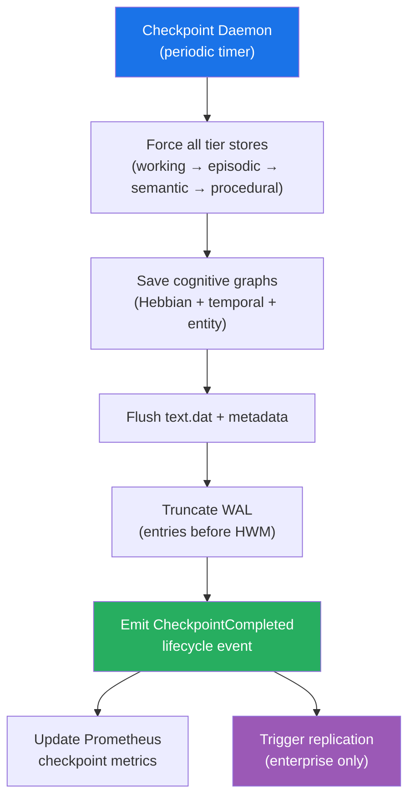
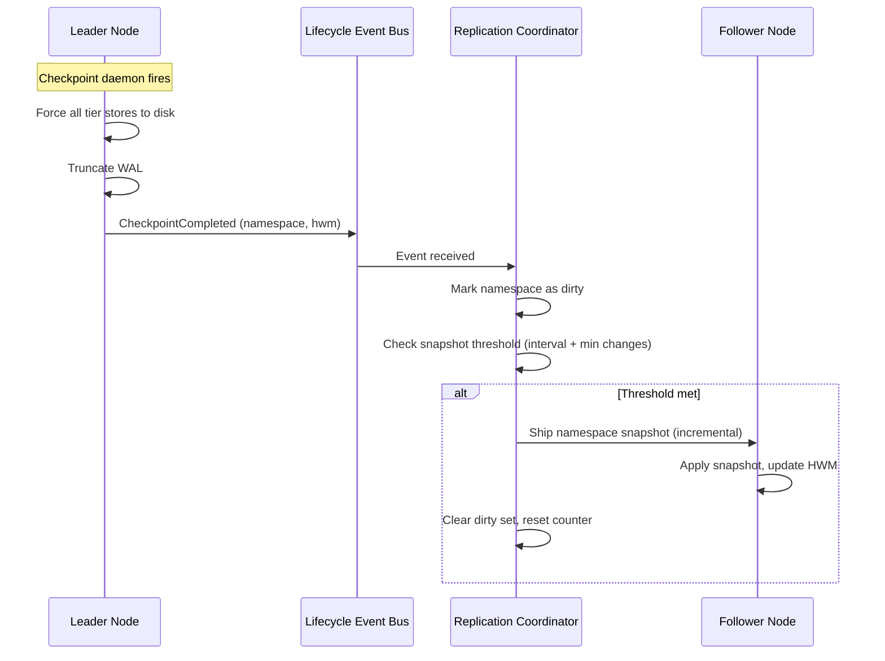
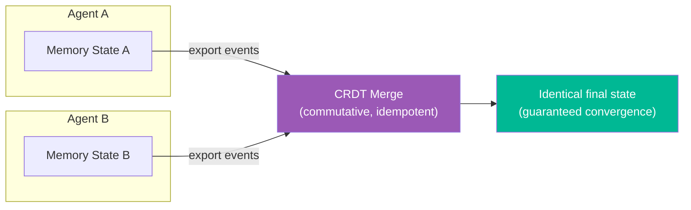
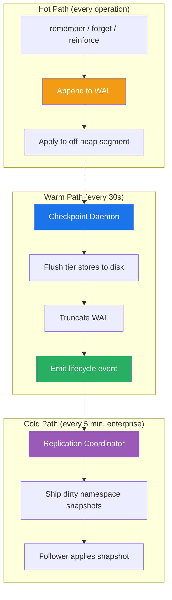

# 🔄 Sync — Persistence & Replication

> **Biological Analog**: Memory consolidation doesn't happen in isolation. During sleep, the brain replays memories and transfers them between regions (hippocampus → neocortex). The sync subsystem provides the infrastructure for **durable persistence**, **checkpoint-driven snapshots**, and **distributed memory replication**.

---

## Write-Ahead Log (WAL)

The WAL provides crash-safe durability for cognitive memory operations. Every memory mutation is first written to an append-only log before being applied to the in-memory state.

**Key capabilities:**

| Capability | Description |
|---|---|
| **Crash recovery** | Replay the log → full state reconstruction |
| **Event types** | REMEMBER, FORGET, REINFORCE, REFLECT, TAG_MERGE, RECALL_HIT |
| **Chunked files** | Auto-roll at 8 MB boundaries |
| **Dual CRC-32** | Independent header + payload checksums |
| **Compression** | Optional DEFLATE for large payloads |
| **Encryption** | WAL payloads encrypted with per-tenant AES-256-GCM keys |

**Two modes**:

| Mode | Storage | Use Case |
|---|---|---|
| **File-backed** | Append-only chunk files | Production — survives JVM restarts |
| **In-memory** | Volatile event list | Testing — fast, no disk I/O |

📖 **Deep dive**: [WAL Design](wal-design.md) — binary format, crash recovery, chunk rolling, compression

---

## Checkpoint-Driven Persistence

Spector uses a **checkpoint daemon** that periodically saves all dirty state to disk. This is the primary durability mechanism — the WAL exists for crash recovery between checkpoints.

**Checkpoint cycle**:

1. **Force tier stores** — each memory tier (working, episodic, semantic, procedural) flushes dirty segments to disk
2. **Save graphs** — Hebbian associations, temporal chains, and entity graphs are serialized
3. **Flush metadata** — text.dat and header files are synced
4. **Truncate WAL** — all WAL entries before the high-water mark are removed (they're now durably stored in the tier files)
5. **Emit event** — a lifecycle event is published to notify subscribers (metrics, replication, analytics)

**Configuration**:

| Parameter | Default | Description |
|---|---|---|
| Checkpoint interval | 30 seconds | Time between checkpoint cycles |
| Checkpoint on shutdown | `true` | Run a final checkpoint on graceful shutdown |

---

## Namespace Snapshot Replication

For enterprise clustered deployments, replication is driven by checkpoint events rather than WAL streaming. When a checkpoint completes, dirty namespaces are snapshot-shipped to follower nodes.

### Why Checkpoint-Driven?

| Aspect | WAL Streaming (deprecated) | Checkpoint Snapshots |
|---|---|---|
| **Bandwidth** | Every individual WAL event shipped | Only changed namespaces, batched |
| **Recovery** | Gap-fill logic for missed events | Complete namespace snapshot — no gaps |
| **Consistency** | Eventually consistent per-event | Point-in-time consistent per checkpoint |
| **Complexity** | TCP multiplexing, per-namespace HWMs | Simple file shipping |
| **Multi-tenant safety** | Per-event tenant validation needed | Namespace-level isolation built-in |

### Snapshot Scheduling

The replication coordinator uses a scheduling model inspired by Redis's `save` configuration:

> **save N C** — Take a snapshot if at least **C** changes occurred in the last **N** seconds.

| Parameter | Default | Description |
|---|---|---|
| Snapshot interval | 5 minutes | Minimum time between snapshots |
| Min changes threshold | 1,000 | Minimum WAL events before snapshot triggers |
| Max lag before re-sync | 50,000 | WAL events — triggers full re-sync if exceeded |

---

## CRDT Merge — Distributed Sync

For multi-agent or distributed deployments, the merge strategy resolves conflicts between divergent memory replicas using **Conflict-free Replicated Data Types (CRDTs)**:

**Merge rules per field:**

| Field | CRDT Type | Merge Rule | Guarantee |
|---|---|---|---|
| `timestamp` | LWW Register | `max(local, remote)` | Most recent write wins |
| `synapticTags` | G-Set (OR) | `local \| remote` | Tags only accumulate, never removed |
| `importance` | Max Register | `max(local, remote)` | Highest signal preserved |
| `recallCount` | G-Counter | `max(local, remote)` | Monotonic counter |
| `valence` | LWW Register | Value from newer `timestamp` | Latest emotional signal wins |
| `tombstone` (flag) | OR | `local \| remote` | Once deleted, always deleted |
| `consolidated` (flag) | OR | `local \| remote` | Once consolidated, stays consolidated |
| `pinned` (flag) | OR | `local \| remote` | Once pinned, stays pinned |

**Convergence guarantee**: All merge operations are commutative, associative, and idempotent — any order of merges from any agents produces the **same final state**.

---

## Full Persistence Flow

---

## Next Steps

- :material-bell-ring: [**Event Notifications**](../architecture/event-notifications.md) — the event system powering checkpoint-driven replication
- :material-memory: [**Off-Heap Panama Design**](panama-design.md) — how persistence interacts with mmap
- :material-brain: [**Architecture**](architecture.md) — system overview
- :material-shield-lock: [**Encryption at Rest**](../architecture/encryption-at-rest.md) — encrypted WAL payloads and text
- :material-cog: [**Configuration**](../configuration/parameters.md) — cluster and partition settings
