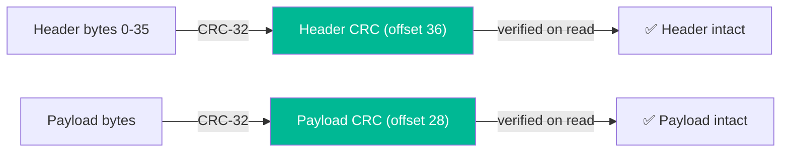
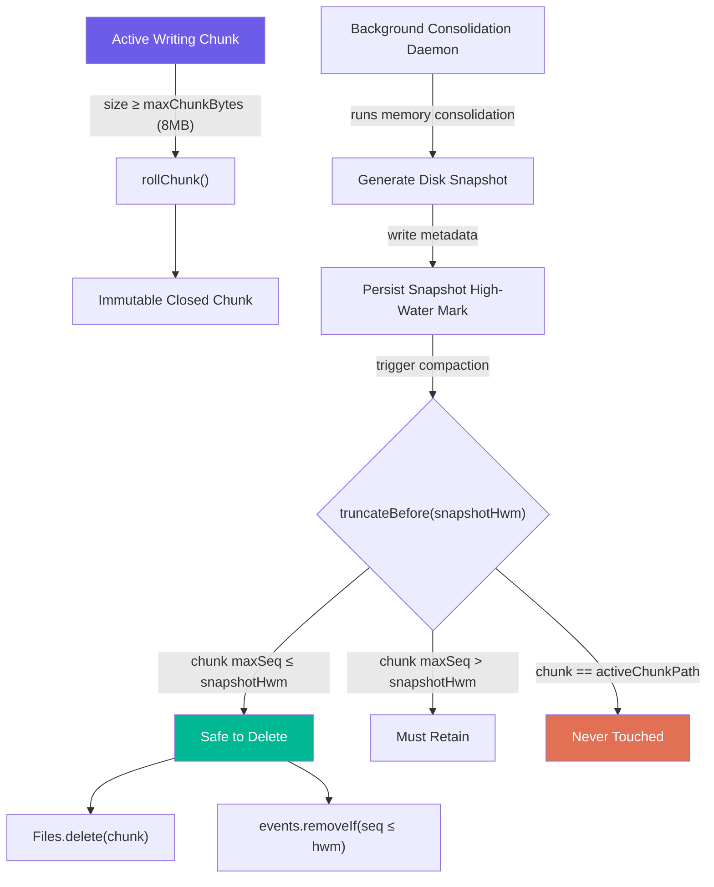
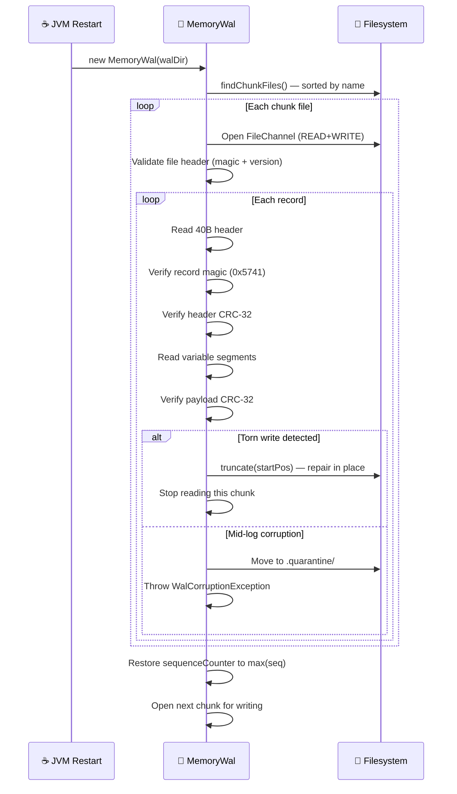
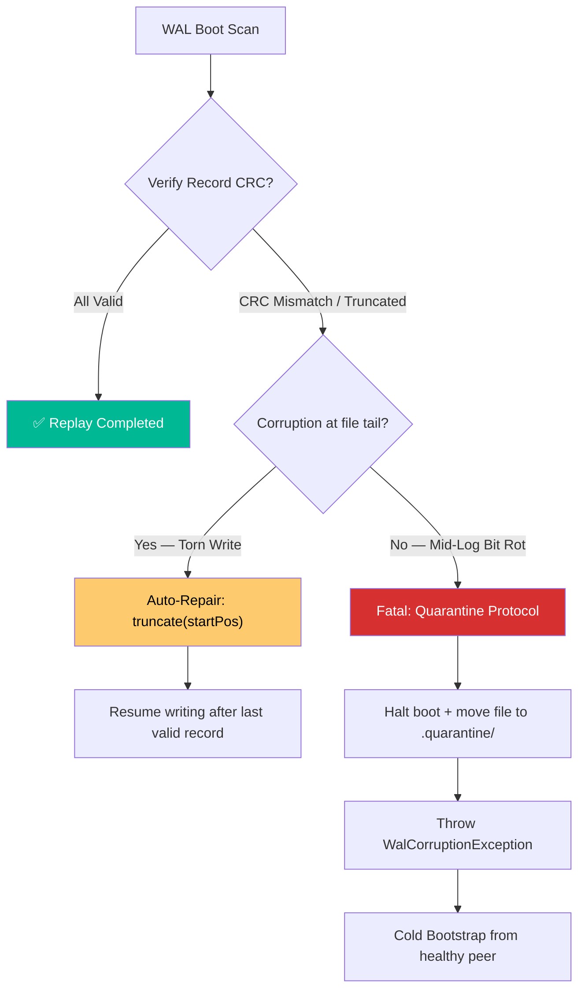
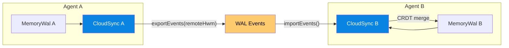

# 📝 WAL Design — Write-Ahead Log

> **Biological Analog**: The hippocampus doesn't write memories directly to the neocortex. It first records a transient "replay buffer" — a sequential log of experiences — and consolidates them during sleep. The WAL is the digital equivalent: an ordered, append-only log of every memory mutation that can be replayed to reconstruct state.

---

## Why a WAL?

Cognitive memory stores mutable state (importance, valence, recall count, tags) in off-heap `MemorySegment` buffers. Without durability, a JVM crash loses everything. The WAL provides:

| Concern | WAL Guarantee |
|---|---|
| **Crash recovery** | Replay the log → full state reconstruction |
| **Ordering** | Monotonic sequence numbers → total order |
| **Distributed sync** | Ship events after a high-water mark → pull-based replication |
| **Auditability** | Every mutation is recorded (who, what, when) |
| **Compaction** | Truncate chunks below a snapshot HWM |

---

## Architecture Overview

```mermaid
graph TD
    subgraph "Write Path"
        A["SpectorMemory.remember()"] --> B["MemoryWal.append()"]
        B --> C["writeLock.lock()"]
        C --> D["events.add(event)"]
        C --> E["writeEventToChannel()"]
        E --> F["CRC-32 header + payload"]
        F --> G["FileChannel.write()"]
        G --> H{"chunk ≥ 8MB?"}
        H -->|yes| I["rollChunk()"]
        H -->|no| J["fsync (optional)"]
    end

    subgraph "Read Path (Recovery)"
        K["JVM restart"] --> L["recoverFromDisk()"]
        L --> M["findChunkFiles()"]
        M --> N["readChunkFile() × N"]
        N --> O["Validate magic + CRC"]
        O --> P["Rebuild in-memory cache"]
        P --> Q["Restore sequenceCounter"]
    end

    subgraph "Replication"
        R["CloudSync.exportEvents()"] --> S["replay(afterHwm)"]
        S --> T["Ship to remote agent"]
        T --> U["importEvents() + CRDT merge"]
    end

    style A fill:#6c5ce7,color:white
    style B fill:#00b894,color:white
    style K fill:#e17055,color:white
    style R fill:#0984e3,color:white
```



---

## Dual Mode Operation

`MemoryWal` operates in two modes, selected at construction time:

| Mode | Constructor | Storage | Durability | Use Case |
|---|---|---|---|---|
| **File-backed** | Append-only chunk files | ✅ Survives crashes | Production |
| **In-memory** | In-memory event list | ❌ Volatile | Testing, ephemeral agents |

---

## Event Types

Every memory mutation produces a WAL event with the following fields:

| Field | Description |
|---|---|
| **sequence** | Monotonically increasing counter |
| **type** | Event type (see table below) |
| **memoryId** | The affected memory ID |
| **timestamp** | When the event occurred |
| **payload** | Serialized event data (format varies by type) |

| Event Type | Trigger | Payload |
|---|---|---|
| `REMEMBER` | `memory.remember(text)` | Full cognitive record (header + quantized vector + text) |
| `FORGET` | `memory.forget(id)` | Empty (tombstone marker) |
| `REINFORCE` | `memory.reinforce(id, valence)` | 1 byte: valence value |
| `REFLECT` | Sleep consolidation cycle | Consolidation metadata |
| `TAG_MERGE` | Synaptic tag update | Updated tag bitfield |
| `RECALL_HIT` | `memory.recall(query)` | Recall count increment |

---

## Binary Record Format (V2)

### File Header

Each WAL chunk file begins with an 8-byte header:

```
Offset   Size   Field      Value
──────   ────   ─────      ─────
  0       4B    magic      0x53504543 ("SPEC" in ASCII)
  4       4B    version    2
```

### Record Layout

Each event is serialized as a **40-byte fixed header** followed by variable-length segments, aligned to 8-byte boundaries:

```
 0                   1                   2                   3
 0 1 2 3 4 5 6 7 8 9 0 1 2 3 4 5 6 7 8 9 0 1 2 3 4 5 6 7 8 9 0 1
+-+-+-+-+-+-+-+-+-+-+-+-+-+-+-+-+-+-+-+-+-+-+-+-+-+-+-+-+-+-+-+-+
|         recMagic (2B)         |  version (1B) |   flags (1B)  |  ← Offset 0
+-+-+-+-+-+-+-+-+-+-+-+-+-+-+-+-+-+-+-+-+-+-+-+-+-+-+-+-+-+-+-+-+
|  typeOrd (1B) |          idLen (2B)           | reserved (1B) |  ← Offset 4
+-+-+-+-+-+-+-+-+-+-+-+-+-+-+-+-+-+-+-+-+-+-+-+-+-+-+-+-+-+-+-+-+
|                                                               |
+                      sequence (8B)                            +  ← Offset 8
|                                                               |
+-+-+-+-+-+-+-+-+-+-+-+-+-+-+-+-+-+-+-+-+-+-+-+-+-+-+-+-+-+-+-+-+
|                                                               |
+                timestamp — epoch millis (8B)                  +  ← Offset 16
|                                                               |
+-+-+-+-+-+-+-+-+-+-+-+-+-+-+-+-+-+-+-+-+-+-+-+-+-+-+-+-+-+-+-+-+
|                    payloadLen (4B)                             |  ← Offset 24
+-+-+-+-+-+-+-+-+-+-+-+-+-+-+-+-+-+-+-+-+-+-+-+-+-+-+-+-+-+-+-+-+
|                    payloadCRC (4B)                             |  ← Offset 28
+-+-+-+-+-+-+-+-+-+-+-+-+-+-+-+-+-+-+-+-+-+-+-+-+-+-+-+-+-+-+-+-+
|                     reserved (4B)                             |  ← Offset 32
+-+-+-+-+-+-+-+-+-+-+-+-+-+-+-+-+-+-+-+-+-+-+-+-+-+-+-+-+-+-+-+-+
|                     headerCRC (4B)                            |  ← Offset 36
+-+-+-+-+-+-+-+-+-+-+-+-+-+-+-+-+-+-+-+-+-+-+-+-+-+-+-+-+-+-+-+-+
|                  memoryId (idLen bytes, UTF-8)                |  ← Offset 40
+-+-+-+-+-+-+-+-+-+-+-+-+-+-+-+-+-+-+-+-+-+-+-+-+-+-+-+-+-+-+-+-+
|          payload (payloadLen bytes, optionally compressed)    |
+-+-+-+-+-+-+-+-+-+-+-+-+-+-+-+-+-+-+-+-+-+-+-+-+-+-+-+-+-+-+-+-+
|                 padding (0–7 bytes to 8-byte align)           |
+-+-+-+-+-+-+-+-+-+-+-+-+-+-+-+-+-+-+-+-+-+-+-+-+-+-+-+-+-+-+-+-+
```

### Field Reference

| Offset | Size | Field | Description |
|--------|------|-------|-------------|
| 0 | 2B | `recMagic` | `0x5741` ("WA") — record start sentinel |
| 2 | 1B | `version` | Record format version (matches file version) |
| 3 | 1B | `flags` | Bit 0: compressed payload |
| 4 | 1B | `typeOrd` | `WalEvent.EventType` ordinal |
| 5 | 2B | `idLen` | Memory ID length in bytes (unsigned) |
| 7 | 1B | reserved | Future use |
| 8 | 8B | `sequence` | Monotonic sequence number |
| 16 | 8B | `timestamp` | Epoch milliseconds |
| 24 | 4B | `payloadLen` | Payload length in bytes |
| 28 | 4B | `payloadCRC` | CRC-32 of (possibly compressed) payload |
| 32 | 4B | reserved | Future use |
| 36 | 4B | `hdrCRC` | CRC-32 of bytes [0..35] |
| 40 | N | `memoryId` | UTF-8 encoded memory ID |
| 40+N | M | `payload` | Event-specific data |
| 40+N+M | P | padding | `(8 - ((N+M) % 8)) % 8` zero bytes |

**Total record size**: `40 + idLen + payloadLen + padding`

### Integrity: Dual CRC-32

Every record has **two** independent CRC-32 checksums:



This split design detects:

- **Torn headers**: header CRC fails → truncate at record start
- **Corrupt payloads**: payload CRC fails → quarantine chunk file
- **Partial writes**: record magic missing → truncate at boundary

---

## Chunked File Layout

WAL data is spread across multiple **chunk files** in a directory:

```
.spector/memory/wal/
├── wal-000000.bin    ← oldest chunk (may be truncated after snapshot)
├── wal-000001.bin
├── wal-000002.bin
├── wal-000003.bin    ← active chunk (currently being written)
└── .quarantine/      ← corrupted chunks moved here
    └── wal-000001.bin
```

### Chunk Rolling

When the active chunk exceeds `maxChunkBytes` (default **8 MB**), the WAL:

1. Flushes all data and metadata to disk
2. Closes the file
3. Increments the chunk index
4. Opens a new chunk file with a fresh file header

### Compaction & Garbage Collection

As memories decay or undergo sleep-consolidation, older WAL chunks become redundant. The WAL enforces **snapshot-driven truncation** — chunks are only deleted after a snapshot proves their events have been fully materialized to disk.



**How it works:**

1. **Snapshot trigger**: The consolidation daemon (hippocampus) periodically snapshots the full in-memory state to disk (mmap partition files)
2. **HWM declaration**: The snapshot records the highest WAL sequence number that has been fully materialized
3. **Chunk disposal**: `truncateBefore(snapshotHwm)` sweeps all closed chunks — any chunk where the maximum sequence ≤ HWM is safely deleted
4. **Active chunk protection**: The currently active chunk is **never** deleted, even if all its events are below the HWM
5. **In-memory cache pruning**: Events with sequence ≤ HWM are also removed from the in-memory cache to prevent bloating

**Example**: After a snapshot at sequence 5042:

- ✅ Deletes `wal-000000.bin` (maxSeq=3200) and `wal-000001.bin` (maxSeq=4980)
- ⏳ Retains `wal-000002.bin` (maxSeq=5100 — has events after HWM)
- 🔒 Retains `wal-000003.bin` (active chunk — never touched)

!!! tip "Zero Page-Cache Poisoning"
    Chunk deletion uses `Files.delete()` at the file level — the compaction scanner does **not** read old WAL data back into memory. This avoids evicting the host's page cache, which would degrade active mmap partition performance during concurrent queries.

---

## Crash Recovery

On startup, `MemoryWal` automatically recovers from disk:



### Corruption Recovery Strategy

Because distributed nodes can experience power cuts, OS crashes, or disk hardware decay, the recovery process must handle corruption gracefully and **never allow silent data loss**.

#### Classification of Corruptions



#### A. Torn Writes (End-of-File Corruption)

| Aspect | Detail |
|---|---|
| **Cause** | Crash occurred while writing a record, leaving an incomplete block at the active chunk's tail |
| **Diagnosis** | Record's expected boundary exceeds actual file size, or header/payload CRC fails with no subsequent valid records in the file |
| **Safety** | The write was never acknowledged to the caller — the event is uncommitted |
| **Resolution** | `handleTornWrite()` truncates the file to `startPos` (the last fully-written record boundary) and forces to disk. Writing resumes from the repaired position |

**Action**: The WAL truncates the file to the last valid record boundary (`startPos`) and flushes to disk. Writing resumes from the repaired position.

#### B. Mid-Log Corruption (Bit Rot)

| Aspect | Detail |
|---|---|
| **Cause** | Magnetic/SSD decay in historical, closed chunks — a valid record is followed by corrupted bytes, then more valid records |
| **Diagnosis** | CRC mismatch detected at a position that is NOT the file tail — valid records exist after the corruption point |
| **Safety** | Truncating would discard **committed** operations, causing silent partition state divergence |
| **Resolution** | **Never auto-repair.** The chunk is moved to `.quarantine/` to preserve forensic evidence, and a `WalCorruptionException` halts startup. In cluster mode, the node initiates a **Cold Bootstrap** from a healthy peer |

**Action**: The chunk file is moved to the `.quarantine/` directory to preserve forensic evidence. A `WalCorruptionException` halts startup. In cluster mode, the node initiates a Cold Bootstrap from a healthy peer.

#### Summary Matrix

| Scenario | Detection | Action | Data Loss? |
|---|---|---|---|
| **Torn write** (EOF) | Record too short or CRC fails at tail | `truncate(startPos)` — auto-repair | ❌ No — write was uncommitted |
| **Bit rot** (mid-log) | CRC fails with valid records after | Quarantine + `WalCorruptionException` | ❌ No — manual recovery required |
| **Invalid file magic** | File header ≠ `0x53504543` | Skip file, log warning | ❌ No — file is not a WAL |
| **Version mismatch** | File version ≠ `WAL_VERSION` | Skip file, log warning | ❌ No — incompatible format |

!!! warning "Why Not Auto-Repair Bit Rot?"
    Truncating in the middle of a historical chunk would discard committed operations that downstream consumers (replicas, snapshots) may depend on. The quarantine-and-halt approach ensures **zero silent data loss** — the operator or cluster protocol must explicitly resolve the corruption before the node can serve traffic.

---

## Compression

Payload compression is opt-in and uses **DEFLATE**:

| Setting | Default | Description |
|---|---|---|
| `compressionEnabled` | `false` | Master switch |
| `compressionThreshold` | `1024` bytes | Minimum payload size before compression kicks in |

When compression is enabled:

1. Payloads larger than the threshold are DEFLATE-compressed before writing
2. The `flags` byte (offset 3) has bit 0 set to `1`
3. On read, the flag is checked and the payload is decompressed with `Inflater`
4. CRC-32 is computed on the **compressed** bytes (what's on disk)

!!! tip "When to Enable"
    Compression is most useful for `REMEMBER` events, which carry full text + quantized vectors (hundreds to thousands of bytes). `FORGET` and `REINFORCE` events have tiny payloads and skip compression regardless of the threshold.

---

## Distributed Sync — CloudSync

`CloudSync` provides **pull-based replication** between agents using the WAL as the replication log:



### Replication Protocol

1. **Agent B** sends its `highWaterMark` to Agent A
2. **Agent A** calls `wal.replay(remoteHwm)` → returns only new events
3. Events are shipped to Agent B (in-process V2, HTTP/gRPC V3)
4. **Agent B** replays each event into its local memory store
5. Conflicts are resolved via **CRDT merge** (see below)

### Cold Bootstrap

When a new agent joins (or corruption triggers a full resync):

The new agent requests a full state snapshot from a healthy leader via `GET /api/v2/memory/snapshot`. The leader serves its entire off-heap state as a zip archive. The new agent unpacks it, restoring all mmap partition files and WAL chunks.

---

## CRDT Merge Strategy

When two agents modify the same memory concurrently, `CrdtMergeStrategy` resolves conflicts deterministically:

| Field | CRDT Type | Merge Rule | Guarantee |
|---|---|---|---|
| `timestamp` | LWW Register | `max(local, remote)` | Most recent write wins |
| `synapticTags` | G-Set (OR) | `local \| remote` | Tags only accumulate, never removed |
| `importance` | Max Register | `max(local, remote)` | Highest signal preserved |
| `recallCount` | G-Counter | `max(local, remote)` | Monotonic counter |
| `valence` | LWW Register | Value from newer `timestamp` | Latest emotional signal wins |
| `tombstone` (flag) | OR | `local \| remote` | Once deleted, always deleted |
| `consolidated` (flag) | OR | `local \| remote` | Once consolidated, stays consolidated |
| `pinned` (flag) | OR | `local \| remote` | Once pinned, stays pinned |

**Convergence guarantee**: All merge operations are commutative, associative, and idempotent — any order of merges from any agents produces the **same final state**.

The merge is applied only if the remote state would actually change the local state, avoiding unnecessary writes.

---

## Thread Safety

| Operation | Lock | Mechanism |
|---|---|---|
| `append()` | `writeLock` (ReentrantLock) | Serializes writes — safe with Virtual Threads |
| `replay()` | None | Reads from in-memory `ArrayList` snapshot |
| `truncateBefore()` | `writeLock` | Serializes with appends |
| `close()` | `writeLock` | Final `force(true)` + channel close |

!!! tip "No `synchronized`"
    `MemoryWal` uses `ReentrantLock` exclusively — never `synchronized` — to avoid Virtual Thread pinning. This is consistent with the zero-`synchronized` policy across the entire Spector codebase.

---

## Configuration

WAL behavior is controlled via `spector.yml`:

```yaml
spector:
  memory:
    persistence-mode: DISK          # DISK | IN_MEMORY
    persistence-path: .spector/memory
```

| Parameter | Default | Description |
|---|---|---|
| `persistence-mode` | `DISK` | `DISK` = file-backed WAL, `IN_MEMORY` = volatile |
| `persistence-path` | `.spector/memory` | Root directory (WAL stored in `{path}/wal/`) |
| Chunk size | 8 MB | Hardcoded default, configurable via constructor |
| Compression | `false` | Configurable via constructor |
| fsync-per-write | `false` | Configurable via constructor |

---

## Storage Adapter SPI

For cloud-based WAL replication, the `StorageAdapter` SPI provides a pluggable backend:

The `StorageAdapter` SPI provides a pluggable backend for cloud-based WAL replication. Implementations must support:

| Operation | Description |
|---|---|
| **upload** | Upload a chunk to cloud storage |
| **download** | Download a chunk from cloud storage |
| **listChunks** | List all chunks in a namespace |
| **listNamespaces** | List all available namespaces |
| **isAvailable** | Health check |

Planned implementations:

| Adapter | Backend | Status |
|---|---|---|
| `S3StorageAdapter` | AWS S3 | Planned (V3) |
| `GcsStorageAdapter` | Google Cloud Storage | Planned (V3) |
| `LocalStorageAdapter` | Local filesystem | Planned (V3) |

---

## Next Steps

- :material-memory: [**Off-Heap Panama Design**](panama-design.md) — how mmap partitions store cognitive records
- :material-sleep: [**Hippocampus — Sleep Consolidation**](hippocampus.md) — the consolidation daemon that triggers snapshot + truncation
- :material-brain: [**Architecture**](architecture.md) — system overview
- :material-lightning-bolt: [**Synapse — Tags & Scoring**](synapse.md) — the synaptic header that WAL events serialize
