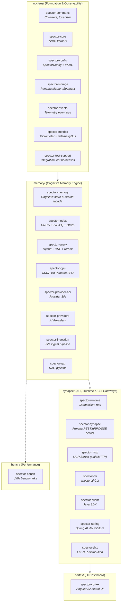
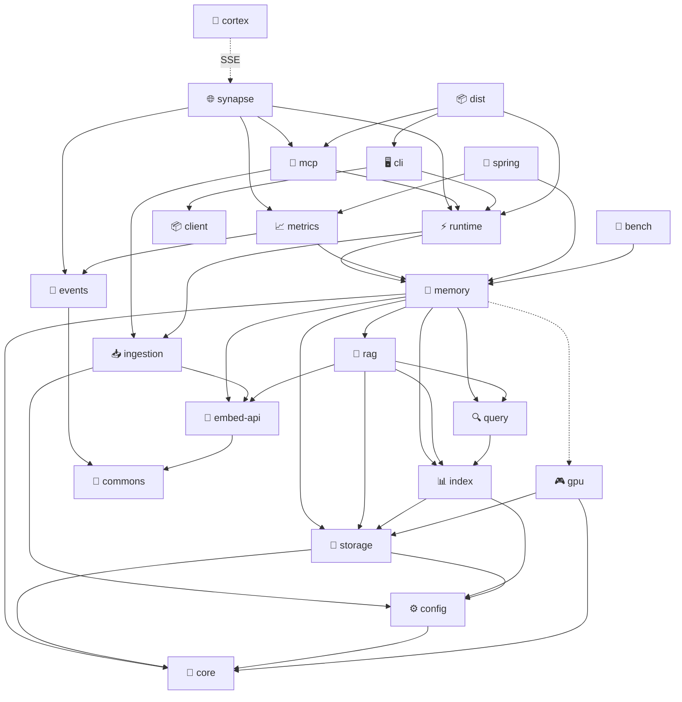
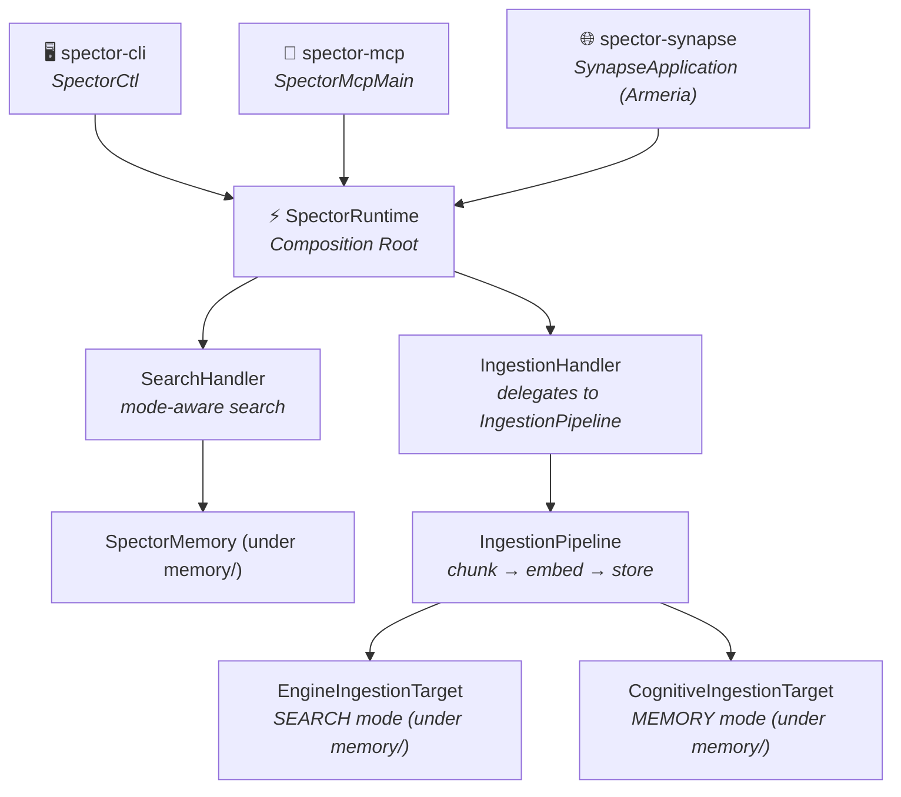

# Modules

Spector is organized as a multi-module Maven project. Each module has a focused responsibility, clear API boundaries, and minimal cross-module coupling.

---

## Architecture Hierarchy

---

## Module Dependency Graph

> **Legend:** Solid arrows = compile dependency. Dotted arrows = optional/runtime dependency (`gpu` = optional Maven dep, `cortex` = connects via SSE at runtime).

!!! important "Architecture"
    `spector-ingestion` defines the `IngestionPipeline` and `IngestionTarget` interface. `spector-memory` depends on it to implement both `EngineIngestionTarget` and `CognitiveIngestionTarget`. The entry points route requests to `SpectorRuntime`, which acts as the composition root.

---

## Architecture: Entry Points → Runtime → Subsystems

All entry points (MCP, CLI, Server) route through `SpectorRuntime`:

**SpectorRuntime** is a thin composition root — it creates and wires subsystems but contains no business logic. Each handler owns its domain:

| Handler | Responsibility | Routes to |
|---------|---------------|-----------|
| `SearchHandler` | Mode-aware search & retrieval | SpectorMemory (SEARCH or MEMORY modes) |
| `IngestionHandler` | Delegates to unified `IngestionPipeline` | Pipeline → `EngineIngestionTarget` or `CognitiveIngestionTarget` |

---

## Module Overview

### Foundation Layer

| Module | Description |
|:---|:---|
| [spector-commons](spector-commons.md) | Shared utilities — concurrent primitives, I/O helpers |
| [spector-core](spector-core.md) | Core abstractions — quantization, SIMD, similarity functions |
| [spector-config](spector-config.md) | Configuration — `SpectorProperties`, `SpectorConfigFactory`, YAML loading |
| [spector-storage](spector-storage.md) | Persistent storage — memory-mapped files, arena management |

### Embedding Layer

| Module | Description |
|:---|:---|
| [spector-provider-api](spector-provider-api.md) | LLM and embedding provider SPI — model-agnostic interfaces |
| [spector-providers](spector-providers.md) | Out-of-the-box LLM and embedding providers (Ollama, OpenAI, Google, Anthropic, Mistral, Azure) |

### Search Layer

| Module | Description |
|:---|:---|
| [spector-index](spector-index.md) | Vector indexing — HNSW, IVF, brute-force |
| [spector-query](spector-query.md) | Query processing — parsing, planning, execution |
| [spector-gpu](spector-gpu.md) | GPU acceleration — Panama FFM bindings |

### Intelligence Layer

| Module | Description |
|:---|:---|
| [spector-rag](spector-rag.md) | RAG pipeline — retrieval-augmented generation |
| [spector-ingestion](spector-ingestion.md) | Unified ingestion pipeline — `IngestionPipeline` (builder), `IngestionTarget` interface, `FileDiscoveryService` |
| [spector-memory](spector-memory.md) | Flagship cognitive memory and search engine — off-heap HNSW, BM25 indices, and neuro-inspired scoring/consolidation (incorporates former spector-engine search facade) |

### Runtime Layer

| Module | Description |
|:---|:---|
| [spector-runtime](spector-runtime.md) | Composition root — wires cognitive memory + ingestion pipeline, exposing `SearchHandler` and `IngestionHandler` |
| [spector-mcp](spector-mcp.md) | MCP server — Model Context Protocol integration via stdio/HTTP |
| [spector-synapse](spector-synapse.md) | API Gateway and central nervous system — Armeria HTTP REST + gRPC + SSE events + cluster coordination (incorporates former spector-node) |

### Client Layer

| Module | Description |
|:---|:---|
| [spector-cli](spector-cli.md) | CLI tool — `spectorctl` with remote (HTTP) and local batch (runtime) modes |
| [spector-client](spector-client.md) | Java client — programmatic HTTP API access |
| [spector-spring](spector-spring.md) | Spring AI integration — auto-configuration |

### Infrastructure

| Module | Description |
|:---|:---|
| [spector-events](spector-events.md) | Telemetry — decoupled event bus (`TelemetryBus`, `TelemetryScope`, 12 event types) |
| [spector-metrics](spector-metrics.md) | Metrics — Micrometer + TelemetryBus instrumentation |
| [spector-cortex](spector-cortex.md) | ⚠️ **Moved to [spector-enterprise](https://github.com/spectrayan/spector-enterprise)** — Angular 22 neural dashboard |
| [spector-bench](spector-bench.md) | Benchmarks — JMH performance testing |
| [spector-dist](spector-dist.md) | Distribution — single fat JAR packaging |
