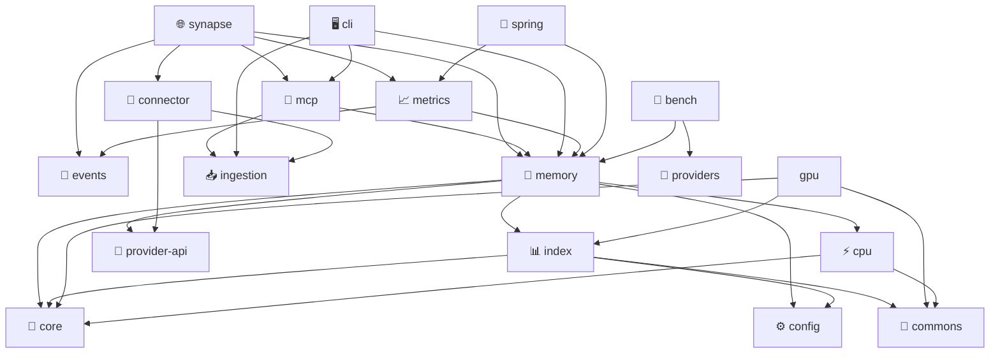
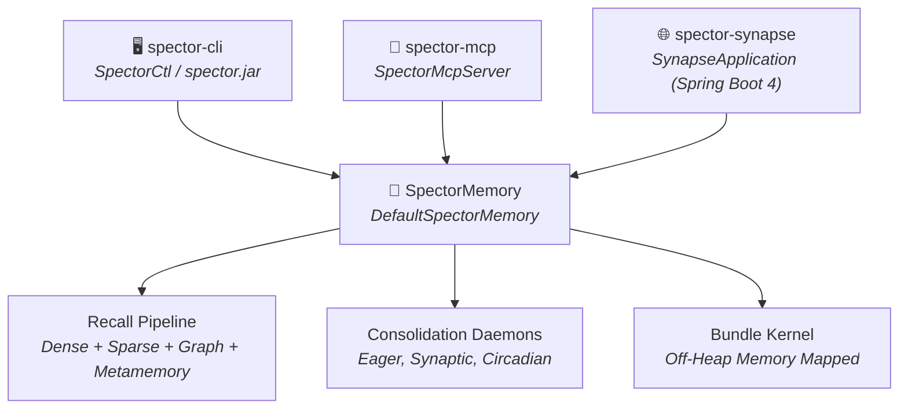

# Modules

Spector is organized as a multi-module Maven project (24 modules). Each module has a focused responsibility, clear API boundaries, and minimal cross-module coupling.

---

## Architecture Hierarchy

```mermaid
graph TB
    subgraph nucleus["nucleus/ (Foundation & Acceleration)"]
        commons["spector-commons<br/><i>Error codes & utilities</i>"]
        core["spector-core<br/><i>Compute SPIs & quantization</i>"]
        cpu["spector-cpu<br/><i>Java 25 SIMD acceleration</i>"]
        gpu["spector-gpu<br/><i>Panama FFM + CUDA GPU</i>"]
        hdc["spector-hdc<br/><i>Hyperdimensional vectors</i>"]
        index["spector-index<br/><i>HNSW + SpectorIndex + BM25</i>"]
        config["spector-config<br/><i>SpectorConfig + YAML</i>"]
        events["spector-events<br/><i>Telemetry event bus</i>"]
        testsupport["spector-test-support<br/><i>Test harnesses & mocks</i>"]
    end

    subgraph memory["memory/ (Cognitive Memory Engine)"]
        spectormemory["spector-memory<br/><i>Bundle Kernel, Recall Pipeline & Daemons</i>"]
        providerApi["spector-provider-api<br/><i>Provider SPI</i>"]
        providers["spector-providers<br/><i>AI Providers (Ollama, OpenAI, ONNX)</i>"]
        ingestion["spector-ingestion<br/><i>File & sensory ingest pipeline</i>"]
        inspect["spector-inspect<br/><i>Bundle inspection tool</i>"]
        metrics["spector-metrics<br/><i>Micrometer + Prometheus metrics</i>"]
    end

    subgraph synapse["synapse/ (API, Integration & Gateways)"]
        synapseapp["spector-synapse<br/><i>Spring Boot 4 / REST, SSE & Chat Graph</i>"]
        connector["spector-connector<br/><i>Camel data connectors</i>"]
        mcp["spector-mcp<br/><i>MCP Server (STDIO/SSE)</i>"]
        cli["spector-cli<br/><i>spectorctl CLI & standalone spector.jar</i>"]
        spring["spector-spring<br/><i>Spring AI VectorStore</i>"]
        batch["spector-batch<br/><i>Batch migration engine</i>"]
    end

    subgraph bench["bench/ (Performance & Validation)"]
        spectorbench["spector-bench<br/><i>JMH & cognitive benchmarks</i>"]
    end

    nucleus --> memory --> synapse
    synapse --> bench
    memory -.-> bench
```

---

## Module Dependency Graph

```mermaid
graph TD
    synapseapp["🌐 synapse"] --> mcp["🤖 mcp"]
    synapseapp --> connector["🔌 connector"]
    synapseapp --> metrics["📈 metrics"]
    synapseapp --> events["📡 events"]
    synapseapp --> memory["🧠 memory"]
    
    mcp --> memory
    mcp --> ingestion["📥 ingestion"]
    cli["🖥️ cli"] --> memory
    cli --> mcp
    cli --> ingestion

    memory --> index["📊 index"]
    memory --> core["🔬 core"]
    memory --> cpu["⚡ cpu"]
    memory --> config["⚙️ config"]
    memory --> providerApi["🧬 provider-api"]

    index --> core
    index --> config
    index --> commons["📄 commons"]

    gpu --> index
    gpu --> core
    gpu --> commons

    cpu --> core
    cpu --> commons

    metrics --> memory
    metrics --> events

    connector --> ingestion
    connector --> providerApi

    spring["🌱 spring"] --> memory
    spring --> metrics
    bench["🧪 bench"] --> memory
    bench --> providers["🤖 providers"]
```

> **Legend:** Solid arrows = compile dependency. Dotted arrows = optional/benchmark dependency.

!!! important "Bundle Kernel Architecture"
    `spector-memory` is backed by the off-heap **Bundle Kernel Architecture** (`PartitionBundle`, `RuntimeBundle`, `EngramLayout`). In-memory vector indexes are managed directly by `spector-index`, and SIMD/GPU operations are accelerated by `spector-cpu` and `spector-gpu`.

---

## Architecture: Direct Memory Composition

All entry points (MCP Server, CLI, Spring Boot Synapse) interact directly with `SpectorMemory`:

```mermaid
graph TD
    cli["🖥️ spector-cli<br/><i>SpectorCtl / spector.jar</i>"]
    mcp["🤖 spector-mcp<br/><i>SpectorMcpServer</i>"]
    synapseapp["🌐 spector-synapse<br/><i>SynapseApplication (Spring Boot 4)</i>"]

    cli --> memory["🧠 SpectorMemory<br/><i>DefaultSpectorMemory</i>"]
    mcp --> memory
    synapseapp --> memory

    memory --> recall["Recall Pipeline<br/><i>Dense + Sparse + Graph + Metamemory</i>"]
    memory --> daemons["Consolidation Daemons<br/><i>Eager, Synaptic, Circadian</i>"]
    memory --> storage["Bundle Kernel<br/><i>Off-Heap Memory Mapped</i>"]
```

---

## Module Overview

### Foundation & Acceleration Layer (`/nucleus`)

| Module | Description |
|:---|:---|
| [spector-bom](spector-bom.md) | Bill of Materials POM managing dependency versions across all modules |
| [spector-commons](spector-commons.md) | Shared utilities, concurrent queues, base exceptions, `ErrorCode` registry |
| [spector-core](spector-core.md) | Core compute SPIs (Similarity, HNSW, SVASQ, MaxSim) and quantization algorithms |
| [spector-cpu](spector-cpu.md) | Java 25 Panama Vector SIMD acceleration kernel implementations |
| [spector-gpu](spector-gpu.md) | Java 25 Panama FFM + CUDA GPU hardware acceleration kernels |
| [spector-hdc](spector-hdc.md) | Hyperdimensional computing vector algebra and operations |
| [spector-index](spector-index.md) | In-memory vector indexes (HNSW, SpectorIndex) and keyword indexes (BM25, Splade) |
| [spector-config](spector-config.md) | Configuration — `SpectorProperties`, `SpectorConfigFactory`, YAML parsing |
| [spector-events](spector-events.md) | Decoupled telemetry event bus (`TelemetryBus`, `TelemetryScope`) |
| [spector-test-support](spector-test-support.md) | Common test harnesses, assertions, and mock providers |

### Cognitive Memory Layer (`/memory`)

| Module | Description |
|:---|:---|
| [spector-memory](spector-memory.md) | Flagship cognitive memory engine — 4-tier memory, bundle kernel, recall pipeline, consolidation daemons |
| [spector-provider-api](spector-provider-api.md) | Model-agnostic LLM and embedding provider SPI |
| [spector-providers](spector-providers.md) | Out-of-the-box LLM/embedding providers (Ollama, OpenAI, Google, Anthropic, ONNX) |
| [spector-ingestion](spector-ingestion.md) | Unified ingestion pipeline — chunking, sensory extractors (PDF, audio, images), metadata extraction |
| [spector-inspect](spector-inspect.md) | Binary inspection tool for partition bundles and runtime bundles |
| [spector-metrics](spector-metrics.md) | Micrometer + Prometheus telemetry and distributed tracing instrumentation |

### Nervous System & Gateways (`/synapse`)

| Module | Description |
|:---|:---|
| [spector-synapse](spector-synapse.md) | API gateway and central nervous system — Spring Boot 4 REST/SSE server and agentic chat graph |
| [spector-connector](spector-connector.md) | Enterprise data connector subsystem powered by Apache Camel |
| [spector-mcp](spector-mcp.md) | Model Context Protocol server exposing Spector memory via STDIO and SSE |
| [spector-cli](spector-cli.md) | Multi-function `spectorctl` CLI and standalone `spector.jar` runner |
| [spector-spring](spector-spring.md) | Spring AI VectorStore integration and auto-configuration |
| [spector-batch](spector-batch.md) | Batch migration and re-indexing engine |

### Benchmarks (`/bench`)

| Module | Description |
|:---|:---|
| [spector-bench](spector-bench.md) | JMH micro-benchmarks and end-to-end cognitive memory evaluation harness |
