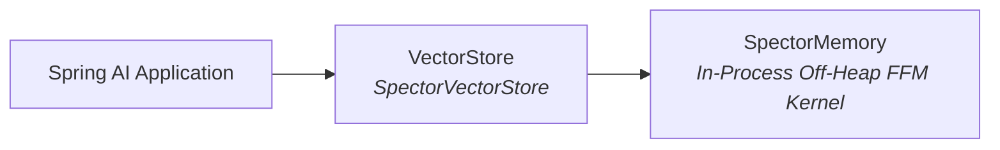

# 🌱 Spring AI Integration

> **Seamlessly integrate Spector into your Spring AI applications.** The `spring-ai-starter-spector-store` module implements Spring AI's standard `VectorStore` interface, giving you access to metadata filter expressions, RAG patterns, and the entire Spring AI ecosystem backed by sub-millisecond memory-mapped search.

---

## 📦 Maven Dependency

```xml
<dependency>
    <groupId>com.spectrayan</groupId>
    <artifactId>spring-ai-starter-spector-store</artifactId>
    <version>0.1.0-alpha</version>
</dependency>
```

Spring AI dependencies (BOM recommended):

```xml
<dependencyManagement>
    <dependencies>
        <dependency>
            <groupId>org.springframework.ai</groupId>
            <artifactId>spring-ai-bom</artifactId>
            <version>1.0.0</version>
            <type>pom</type>
            <scope>import</scope>
        </dependency>
    </dependencies>
</dependencyManagement>
```

---

## ⚡ Integration & Configuration

`SpectorVectorStore` implements Spring AI's `VectorStore` backed by the in-process `SpectorMemory` engine.



### 1. Spring Boot Auto-Configuration (Recommended)

When `spring-ai-starter-spector-store` is on the classpath, `SpectorAutoConfiguration` automatically wires the `SpectorMemory` and `SpectorVectorStore` beans. Simply inject `VectorStore` into your services:

```java
import org.springframework.ai.vectorstore.VectorStore;
import org.springframework.stereotype.Service;

@Service
public class KnowledgeService {

    private final VectorStore vectorStore;

    public KnowledgeService(VectorStore vectorStore) {
        this.vectorStore = vectorStore;
    }
}
```

### 2. Explicit Bean Configuration (Custom Setup)

If you need programmatic control over engine parameters and embedding models:

```java
import org.springframework.ai.vectorstore.VectorStore;
import org.springframework.ai.vectorstore.spector.SpectorVectorStore;
import com.spectrayan.spector.memory.SpectorMemory;
import com.spectrayan.spector.memory.DefaultSpectorMemory;
import com.spectrayan.spector.config.SpectorProperties;
import com.spectrayan.spector.provider.embedding.EmbeddingProvider;
import com.spectrayan.spector.provider.embedding.ollama.OllamaEmbeddingProvider;
import org.springframework.context.annotation.Bean;
import org.springframework.context.annotation.Configuration;

@Configuration
public class VectorStoreConfig {

    @Bean
    public SpectorMemory spectorMemory() {
        SpectorProperties props = SpectorProperties.load();
        EmbeddingProvider embedder = new OllamaEmbeddingProvider(props.provider().embedding());

        return DefaultSpectorMemory.builder()
            .properties(props)
            .embeddingProvider(embedder)
            .build();
    }

    @Bean
    public VectorStore vectorStore(SpectorMemory memory) {
        return new SpectorVectorStore(memory);
    }
}
```

---

## 📄 Adding Documents

```java
import org.springframework.ai.document.Document;
import org.springframework.ai.vectorstore.VectorStore;

@Service
public class DocumentService {

    private final VectorStore vectorStore;

    public DocumentService(VectorStore vectorStore) {
        this.vectorStore = vectorStore;
    }

    public void addDocuments() {
        List<Document> documents = List.of(
            new Document("HNSW enables fast approximate nearest neighbor search",
                Map.of("source", "architecture.md", "category", "indexing")),
            new Document("BM25 provides keyword scoring with term frequency saturation",
                Map.of("source", "algorithms.md", "category", "search")),
            new Document("Virtual threads allow millions of concurrent operations",
                Map.of("source", "concurrency.md", "category", "runtime"))
        );

        vectorStore.add(documents);
    }
}
```

---

## 🔍 Similarity Search

### Basic Search

```java
List<Document> results = vectorStore.similaritySearch("nearest neighbor search");
```

### Search with Parameters

```java
import org.springframework.ai.vectorstore.SearchRequest;

List<Document> results = vectorStore.similaritySearch(
    SearchRequest.query("vector search algorithms")
        .withTopK(10)
        .withSimilarityThreshold(0.7)
);
```

### 🎯 Filter Expressions

SpectorVectorStore supports Spring AI's metadata filter expressions:

```java
// Filter by category
List<Document> results = vectorStore.similaritySearch(
    SearchRequest.query("search algorithms")
        .withTopK(5)
        .withFilterExpression("category == 'indexing'")
);

// Complex filters
List<Document> results = vectorStore.similaritySearch(
    SearchRequest.query("performance")
        .withTopK(10)
        .withFilterExpression("category == 'search' && source == 'algorithms.md'")
);
```

**Supported filter operators:**

| Operator | Example |
|----------|---------|
| `==` | `category == 'search'` |
| `!=` | `category != 'draft'` |
| `>`, `>=`, `<`, `<=` | `version > 2` |
| `&&` | `a == 'x' && b == 'y'` |
| `\|\|` | `a == 'x' \|\| a == 'y'` |
| `in` | `category in ['search', 'index']` |
| `not in` | `status not in ['archived']` |

---

## 🗑️ Deleting Documents

```java
vectorStore.delete(List.of("doc-id-1", "doc-id-2"));
```

---

## 🤖 RAG with Spring AI ChatClient

Integrate Spector directly into conversational AI flows using Spring AI's `ChatClient` and `QuestionAnswerAdvisor`:

```java
import org.springframework.ai.chat.client.ChatClient;
import org.springframework.ai.chat.client.advisor.QuestionAnswerAdvisor;
import org.springframework.ai.vectorstore.VectorStore;
import org.springframework.stereotype.Service;

@Service
public class AssistantService {

    private final ChatClient chatClient;

    public AssistantService(ChatClient.Builder builder, VectorStore vectorStore) {
        this.chatClient = builder
            .defaultAdvisors(new QuestionAnswerAdvisor(vectorStore))
            .build();
    }

    public String ask(String question) {
        return chatClient.prompt()
            .system("You are an expert AI assistant answering questions based on stored knowledge.")
            .user(question)
            .call()
            .content();
    }
}
```

> [!TIP]
> Spring AI's `QuestionAnswerAdvisor` automatically queries `SpectorVectorStore` for top-k similar documents and injects them as grounding context into the prompt.

---

## ⚙️ Spring Boot Configuration

Configure off-heap persistence and embedding models via `application.yml`:

```yaml
spector:
  memory:
    dimensions: 384
    persistence-mode: ON_CLOSE  # OFF, ON_CLOSE, PERIODIC
    persistence-path: ./data/spector
  provider:
    embedding:
      type: ollama
      model: nomic-embed-text
      base-url: http://localhost:11434
  metrics:
    enabled: true
```

---

## ⚠️ Error Handling

All vector store exceptions derive from `SpectorVectorStoreException`:

```java
import org.springframework.ai.vectorstore.spector.SpectorVectorStoreException;

try {
    vectorStore.add(documents);
} catch (SpectorVectorStoreException e) {
    log.error("Failed to add documents to SpectorVectorStore: {}", e.getMessage());
}
```

---

## 🎯 Complete Example Application

```java
import org.springframework.ai.document.Document;
import org.springframework.ai.vectorstore.SearchRequest;
import org.springframework.ai.vectorstore.VectorStore;
import org.springframework.boot.CommandLineRunner;
import org.springframework.boot.SpringApplication;
import org.springframework.boot.autoconfigure.SpringBootApplication;
import org.springframework.context.annotation.Bean;

import java.util.List;
import java.util.Map;

@SpringBootApplication
public class SearchApp {

    public static void main(String[] args) {
        SpringApplication.run(SearchApp.class, args);
    }

    @Bean
    CommandLineRunner demo(VectorStore store) {
        return args -> {
            // 1. Ingest documents
            store.add(List.of(
                new Document("HNSW uses multi-layer graphs for fast approximate nearest neighbor search",
                    Map.of("topic", "indexing")),
                new Document("Product quantization compresses vectors up to 32x for sub-millisecond retrieval",
                    Map.of("topic", "compression"))
            ));

            // 2. Perform similarity search with metadata filter
            var results = store.similaritySearch(
                SearchRequest.query("compression techniques")
                    .withTopK(5)
                    .withFilterExpression("topic == 'compression'"));

            results.forEach(doc ->
                System.out.println("Found: " + doc.getText()));
        };
    }
}
```

---

## 🔗 See Also

- [Java SDK Guide](java-client.md) — Direct SDK usage

- [REST API Reference](../api-reference/rest-endpoints.md) — Underlying REST endpoints

- [Configuration Guide](../configuration/parameters.md) — All configurable parameters