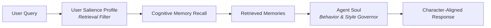
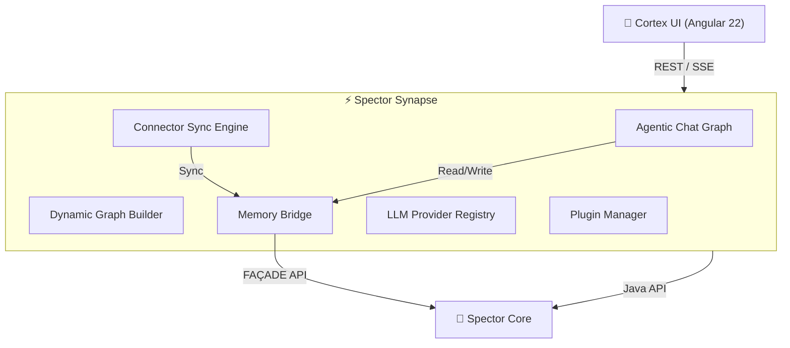
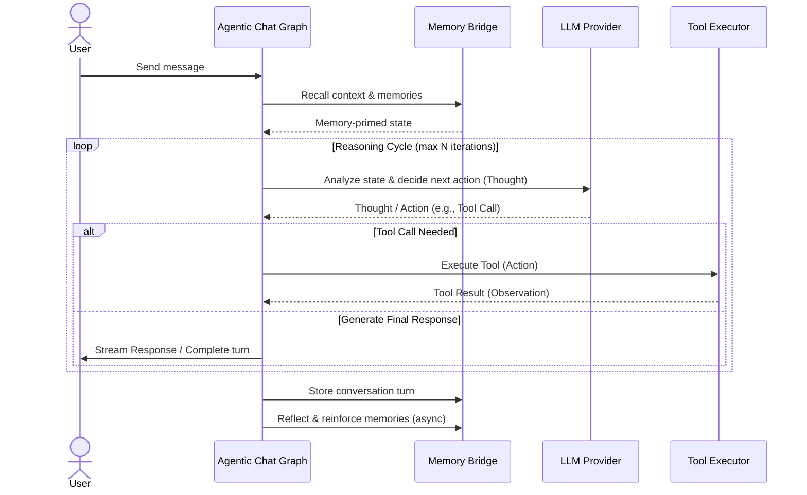
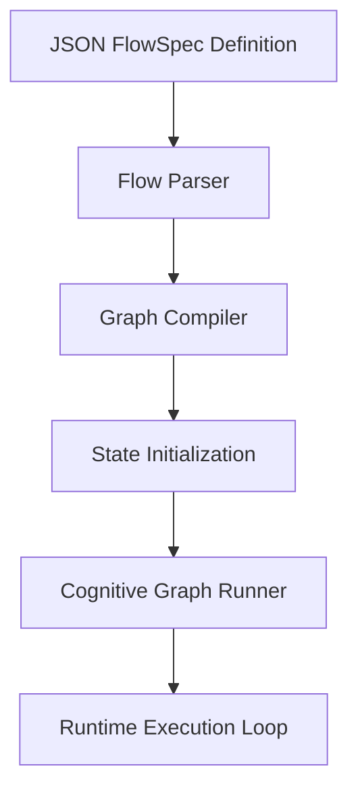
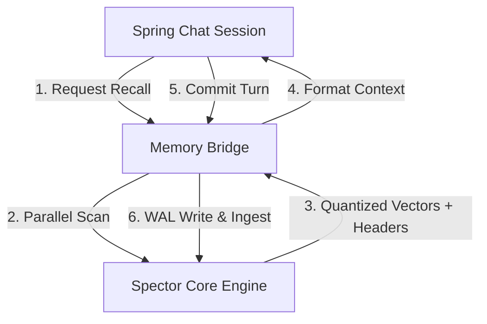
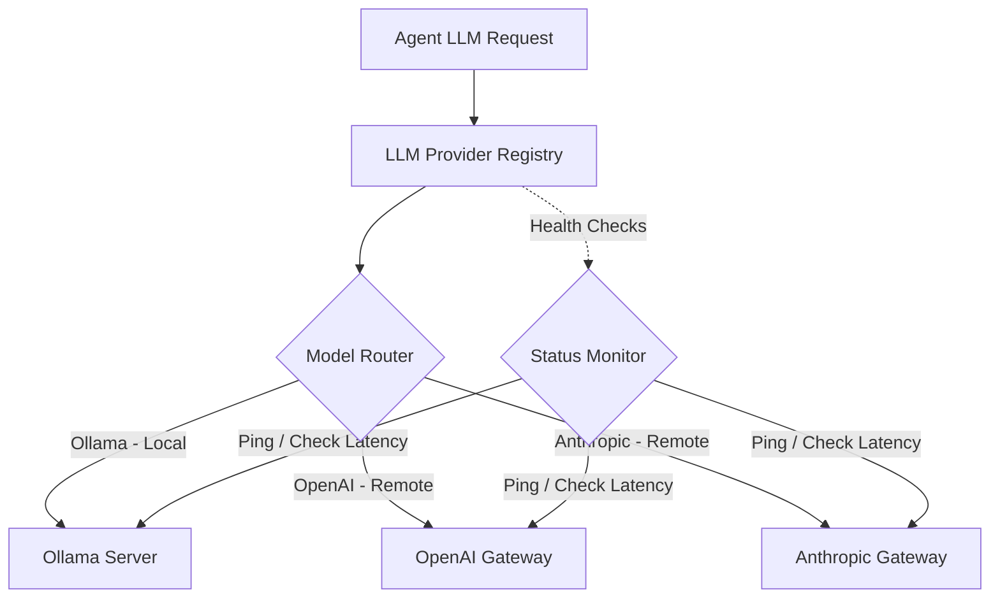
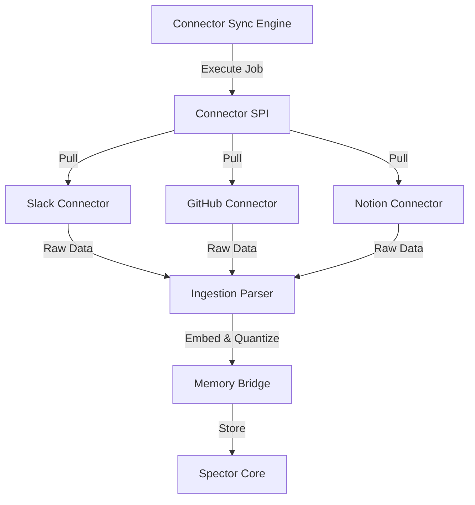

# ⚡ Spector Synapse — The Central Nervous System

!!! quote "The Vision"
    If **Spector Memory** is the brain's hippocampus — learning, storing, recalling — then **Synapse** is the nervous system that connects it to the world. It turns raw cognitive memory into a living, reasoning agent that chats, plans, reflects, and acts.

---

## What is Synapse?

Spector Synapse is the **unified application server and agentic gateway** built on top of the Spector cognitive memory engine. It transforms Spector from an embedded Java library into a standalone, network-accessible AI agent platform and hybrid search server.

| Spector Memory | Spector Synapse |
|:---|:---|
| Stores and recalls memories | Orchestrates conversations and API gateways |
| 16 neuroscience mechanisms | Agentic reasoning graphs & REST/gRPC endpoints |
| Java library (embed anywhere) | Standalone Spring Boot 4 application server |
| Off-heap, SIMD-accelerated | Unified gateway (Search, Memory, RAG, Agents) |
| Passive (responds to API calls) | Active (runnable server + autonomous agents) |

---

## Agent Soul & User Salience Profile

Spector Synapse models agentic interactions through two distinct, complementary cognitive configurations that shape how an agent behaves and what it remembers.

### The Agent Soul
The **Agent Soul** represents the persistent identity and character of the AI agent. It defines the agent's baseline model of self, including:
*   **Purpose & Mission**: The primary objective or goal the agent is designed to achieve.
*   **Personality & Tone**: The behavioral characteristics, communication style, and emotional baseline.
*   **Expertise Domains**: Specific areas of knowledge where the agent has specialized capability.
*   **Core Values & Ethical Guardrails**: Guiding principles and strict safety boundaries that cannot be bypassed or self-modified.

### The User Salience Profile
The [User Salience Profile](../memory/salience-importance.md) represents the personalization filter configured for the human interacting with the system. It defines what concepts, topics, and rules matter to that user. It is expressed in natural language interests (boosts) and disinterests (dampeners) that modify memory importance scores dynamically at recall and ingestion time.

### How They Complement Each Other
The Agent Soul and the User Salience Profile form a **Personalized Cognitive Loop**:



1.  **The User Salience Profile acts as the Retrieval Filter (What to remember)**: It determines *which* memories are retrieved from the cognitive store by boosting topics the user cares about and suppressing noise.
2.  **The Agent Soul acts as the Response Governor (How to behave)**: Once the relevant memories are surfaced, the Agent Soul shapes the reasoning process, tool usage, and tone to generate a response that remains consistent with the agent's persona.

Together, they ensure the agent's actions are highly personalized to the user's focus areas while remaining character-consistent and ethically bounded.

---

## Submodule Architecture & Core Flows

Synapse is divided into modular submodules, each responsible for a distinct aspect of agentic lifecycle, communication, and synchronization.



### 1. Agentic Chat Graph
The `AgenticChatGraph` defines the reasoning loop of an autonomous agent. When a user sends a message, the agent does not merely generate a completion; it runs an iterative loop:



1.  **Recall**: Surfacing relevant semantic, episodic, and working memories via the Memory Bridge.
2.  **Thought**: Deciding whether the user query can be answered directly or if tools are required.
3.  **Action**: Executing approved tools and returning results back into the agent's state as observations.
4.  **Evaluate / Generate**: Iterating until a satisfying response is compiled, then returning the response to the user.
5.  **Consolidate**: Recording the interaction to episodic memory and strengthening related neural pathways.

---

### 2. Dynamic Agent Execution
Instead of hardcoding graph topologies, Synapse includes the `DynamicGraphBuilder`. This engine compiles agent graphs dynamically at runtime from JSON-based `FlowSpec` definitions.



This allows users to define custom agents, tool mappings, step execution ordering, and validation criteria on the fly, entirely via REST APIs without rebuilding the application server.

---

### 3. Memory Bridge
The **Memory Bridge** connects Spring Boot's application layer (managing HTTP requests, chat sessions, and connection pools) with the off-heap Spector core memory engine.



It manages context priming (populating the LLM context window with recalled memories prior to execution) and handles asynchronous memory consolidation (consolidating episodic memories into permanent semantic nodes during reflection sleep cycles).

---

### 4. LLM Provider Registry
The LLM Provider Registry acts as the routing and abstraction gateway for language models.



It supports multi-provider registration (local Ollama instances, external OpenAI/Anthropic gateways), conducts background health monitoring, and automatically reroutes requests to failover providers if an endpoint experiences downtime.

---

### 5. Data Connectors
The Connector Sync Engine schedules and executes background synchronization jobs via a plugin-based SPI.



It fetches data from external workspace tools (Slack history, GitHub PRs/issues, Notion pages), processes and chunks the payloads, and ingests them directly into episodic and semantic memory tiers so they are instantly searchable.

---

### 6. Runtime Plugin System
The Plugin SPI allows developers to extend Synapse capabilities at runtime without restarting the service. By loading external JAR plugins, developers can register custom tools, extend the LLM provider registry, or implement custom connector templates dynamically.

---

## Observability & Tracing

Because agent loops are non-deterministic, understanding why an agent made a decision requires detailed tracing. Synapse exposes comprehensive tracing data at the session level:

### State Tracing Elements
When an agent executes, it populates three core structures in the state log:
*   **`AgentThought`**: The internal reasoning path generated by the LLM prior to taking action.
*   **`AgentAction`**: The tool selected for execution, including its input parameters.
*   **`AgentObservation`**: The raw output returned by the tool, which is fed back into the reasoning loop.

### Inspecting Traces
1.  **Cortex UI Integration**: The Cortex Dashboard displays these steps in real-time as an interactive neural timeline, highlighting scoring weights, tool execution steps, and memory activation.
2.  **API Log Access**: Developers can query the session history endpoint `/api/v1/chat/sessions/{id}/messages` to retrieve the full step-by-step trace of thoughts, actions, and observations.
3.  **Spring Logging System**: Synapse outputs detailed execution spans via SLF4J, allowing external tracing tools (like OpenTelemetry or Jaeger) to monitor latency and routing across agent steps.

---

## Failure Recovery & Loop Prevention

Synapse implements strict guardrails to guarantee the reliability and safety of autonomous agent loops:

### 1. Loop and Iteration Limits
To prevent an agent from entering infinite reasoning loops, the `AgenticChatGraph` enforces a hard limit on maximum iterations per turn (default: `10` iterations). If the agent fails to compile a final answer within this limit, the loop is terminated, and a graceful fallback message is returned.

### 2. Tool Execution Fail-Safes
*   **Sandboxing**: System and Shell execution tools (`shell_execute`) require explicit user authorization tokens or must be disabled via configuration.
*   **Fallback Prompts**: If a tool fails (e.g., a network timeout or file access error), the exception is parsed, formatted into a structured `AgentObservation`, and returned to the LLM. The agent is trained to recognize the error and attempt a workaround or report the failure cleanly.
*   **Write-Protection**: Synapse enforces read-only access on default connectors and file configurations to prevent unauthorized modifications by the agent.

### 3. Provider Failover and Timeouts
Synapse virtual threads manage LLM calls independently. If a provider endpoint goes offline or times out (configured via `SPECTOR_OLLAMA_TIMEOUT`), the registry intercepts the failure, reports it to the agent's runner, and switches to the designated fallback model automatically.

---

## Workflows vs. Autonomous Agents

Developers must choose the correct execution pattern based on their task constraints:

| Feature | Deterministic Workflows | Autonomous Agents |
|:---|:---|:---|
| **Control Flow** | Hardcoded in the graph topology | Dynamically decided by the LLM |
| **Flexibility** | Low — follows strict steps | High — adapts to runtime inputs |
| **Looping** | Cyclic transitions must be predefined | Natural loop cycle (reason → act) |
| **Use Cases** | Ingestion pipelines, document parsing, fixed RAG | Coding assistants, customer support, open-ended research |
| **Configuration** | Built using static Java/DSL chains | Defined via JSON `FlowSpec` or agent templates |

---

## 🔧 14 Built-in Agent Tools

Agents can take action in the real world through tools:

| Tool | Category | Description |
|:-----|:---------|:------------|
| `memory_recall` | Memory | Search cognitive memory for relevant context |
| `memory_remember` | Memory | Store new information in cognitive memory |
| `read_identity` | Identity | Read the agent's own soul/identity |
| `update_agent_soul` | Identity | Self-modify personality (with user approval) |
| `file_read` | Filesystem | Read file contents |
| `file_write` | Filesystem | Write content to files |
| `directory_list` | Filesystem | List directory contents |
| `file_search` | Filesystem | Search files by pattern |
| `http_request` | Network | Make HTTP requests |
| `web_search` | Network | Search the web |
| `shell_execute` | System | Execute shell commands |
| `calculator` | Utility | Evaluate mathematical expressions |
| `json_query` | Data | Query JSON data with JSONPath |
| `current_time` | Utility | Get current date and time |

Tools are categorized (`READ`, `WRITE`, `SYSTEM`) with write-protection for safety.

---

## Building & Running

!!! info "Maven Profile Required"
    Synapse is gated behind the `-Psynapse` Maven profile and is **not built by default** with the core reactor.

```bash
# Build core + synapse
mvn clean compile -Psynapse

# Run synapse tests
mvn verify -pl spector-synapse -Psynapse

# Start the server
mvn spring-boot:run -pl spector-synapse -Psynapse

# Docker
docker compose -f docker-compose.synapse.yml up --build
```

### Configuration

All settings are configurable via environment variables:

| Variable | Default | Description |
|:---------|:--------|:------------|
| `SPECTOR_PORT` | `7070` | Server port |
| `SPECTOR_API_KEY` | `spector-dev-key` | API authentication key |
| `SPECTOR_DATA_DIR` | `./spector-data` | Data storage directory |
| `SPECTOR_OLLAMA_BASE_URL` | `http://localhost:11434` | Ollama server URL |
| `SPECTOR_OLLAMA_MODEL` | `llama3.2` | Default LLM model |
| `SPECTOR_OLLAMA_EMBED_MODEL` | `nomic-embed-text` | Embedding model |
| `SPECTOR_CORS_ORIGINS` | `http://localhost:4200` | Allowed CORS origins |

---

## REST API Overview

| Endpoint | Method | Description |
|:---------|:-------|:------------|
| `/api/v1/engine/search` | POST | Hybrid search (Vector + Keyword) with RRF |
| `/api/v1/engine/ingest` | POST | Ingest raw text payload |
| `/api/v1/engine/ingest/file` | POST | Auto-discover and ingest local directories |
| `/api/v1/engine/ingest/bulk` | POST | Bulk JSON document ingestion |
| `/api/v1/engine/delete` | POST | Delete documents from indices |
| `/api/v1/engine/status` | GET | Retrieve search index stats & health |
| `/api/v1/engine/rag` | POST | Execute retrieval-augmented generation (RAG) |
| `/api/v1/chat/sessions` | POST | Create chat session |
| `/api/v1/chat/sessions/{id}/messages` | POST | Send message |
| `/api/v1/memory` | GET/POST | List/create memories |
| `/api/v1/memory/search` | POST | Semantic memory search |
| `/api/v1/memory/recall` | POST | Cognitive recall |
| `/api/v1/agents` | GET/POST | List/create agents |
| `/api/v1/agents/{id}/soul` | GET/PUT | Read/update agent soul |
| `/api/v1/connectors` | GET/POST | List/create connectors |
| `/api/v1/providers` | GET/POST | List/register LLM providers |
| `/api/v1/mcp/tools` | GET | MCP tool discovery |
| `/api/v1/mcp/tools/{name}` | POST | MCP tool invocation |
| `/health` | GET | Health check |
| `/metrics` | GET | Prometheus metrics |

---

## License

Spector Synapse is licensed under the **Business Source License 1.1** (BSL 1.1).

- **Change Date**: July 6, 2030
- **Change License**: Apache License, Version 2.0
- **Additional Use Grant**: You may use the software freely except for offering it as a managed service or embedding it into a competing AI cognitive memory product.

See [LICENSE](https://github.com/spectrayan/spector/blob/main/spector-synapse/LICENSE) for full terms.
