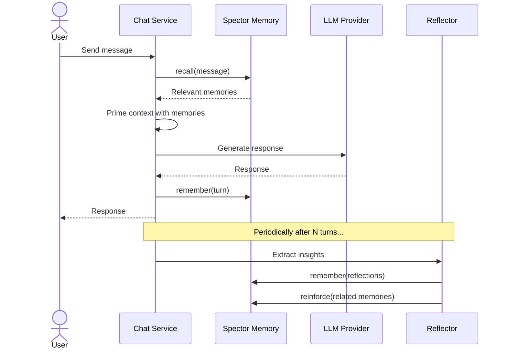
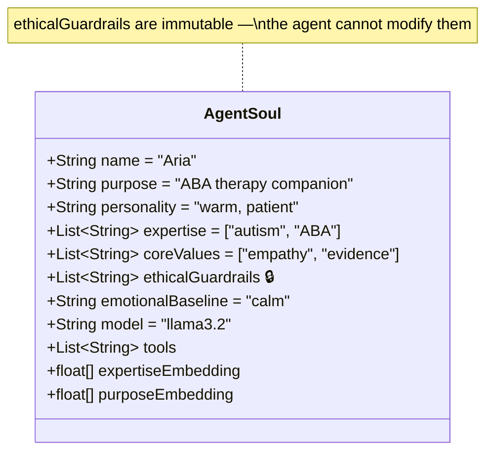
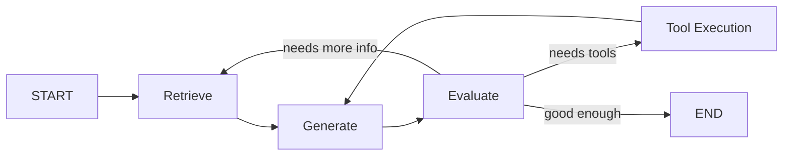

# ⚡ Spector Synapse — The Central Nervous System

!!! quote "The Vision"
    If **Spector Memory** is the brain's hippocampus — learning, storing, recalling — then **Synapse** is the nervous system that connects it to the world. It turns raw cognitive memory into a living, reasoning agent that chats, plans, reflects, and acts.

---

## What is Synapse?

Spector Synapse is the **agentic application layer** built on top of the Spector cognitive memory engine. It transforms Spector from a memory library into a fully autonomous AI agent platform.

| Spector Memory | Spector Synapse |
|:---|:---|
| Stores and recalls memories | Orchestrates conversations with memory |
| 16 neuroscience mechanisms | Agentic reasoning graphs |
| Java library (embed anywhere) | Spring Boot 4 server (deploy as service) |
| Off-heap, SIMD-accelerated | LLM-powered, tool-equipped agents |
| Passive (respond to API calls) | Active (plan, reflect, act autonomously) |

---

## Key Capabilities

### 🧠 Cognitive Chat

Every conversation is memory-primed. Before the LLM generates a response, Synapse:

1. **Recalls** relevant memories from the user's conversation history
2. **Primes** the LLM context with recalled memories (context priming)
3. **Generates** the response with full cognitive context
4. **Remembers** the conversation turn as a new memory
5. **Reflects** periodically — extracting insights, relationships, and patterns
6. **Summarizes** long conversations to prevent context window overflow



This creates agents that genuinely *know* their users — remembering preferences, past conversations, emotional states, and evolving relationships over time.

### 🤖 Autonomous Agent Framework

Agents in Synapse have a **soul** — a persistent identity (the `AgentSoul`) that shapes their behavior:



**Biological analog**: Just as the brain's Default Mode Network (DMN) maintains a persistent self-model, the `AgentSoul` defines **who the agent is** — and this identity persists across sessions, influencing memory encoding, retrieval, and response generation.

### 🔧 14 Built-in Agent Tools

Agents can take action in the real world through tools:

| Tool | Category | Description |
|:-----|:---------|:------------|
| `memory_recall` | Memory | Search cognitive memory for relevant context |
| `memory_remember` | Memory | Store new information in cognitive memory |
| `read_identity` | Identity | Read the agent's own soul/identity |
| `update_agent_soul` | Identity | Self-modify personality (with user approval) |
| `file_read` | Filesystem | Read file contents |
| `file_write` | Filesystem | Write content to files |
| `directory_list` | Filesystem | List directory contents |
| `file_search` | Filesystem | Search files by pattern |
| `http_request` | Network | Make HTTP requests |
| `web_search` | Network | Search the web |
| `shell_execute` | System | Execute shell commands |
| `calculator` | Utility | Evaluate mathematical expressions |
| `json_query` | Data | Query JSON data with JSONPath |
| `current_time` | Utility | Get current date and time |

Tools are categorized (`READ`, `WRITE`, `SYSTEM`) with write-protection for safety.

### 🔀 LangGraph4j Cognitive Graphs

Agent reasoning flows are defined as **directed graphs** using [LangGraph4j](https://github.com/bsc-lang/langgraph4j):



Built-in graph patterns include:

- **Agentic Chat Graph** — Retrieve → Generate → Tool → Evaluate loop
- **Cognitive RAG** — Memory-primed retrieval-augmented generation
- **Coordinator Graph** — Multi-agent orchestration with planner, executor, evaluator
- **Dynamic Graph Builder** — Construct graphs from JSON `FlowSpec` definitions at runtime

### 🧩 Agent Templates

6 pre-built agent templates for common use cases:

| Template | Description |
|:---------|:------------|
| **Conversation Agent** | General-purpose conversational AI with memory |
| **Research Agent** | Web research + memory synthesis |
| **Code Generation** | Code writing with file system access |
| **Content Creation** | Long-form content with research and iteration |
| **Customer Support** | Knowledge-base backed support agent |
| **Data Analysis** | Data querying and visualization |

Templates define the agent's soul, tools, flow graph, and execution policies — all as JSON.

### 🔌 Connector Framework

Bring external data into cognitive memory through connectors:

- **Slack** — channel history, messages
- **Email** — inbox/sent messages
- **GitHub** — issues, PRs, comments
- **Google Drive** — documents, spreadsheets
- **Notion** — pages, databases
- **Custom** — build your own via the connector SPI

### 🌐 LLM Provider Management

Multi-provider LLM abstraction with health checking:

- **Ollama** (local, default) — llama3.2, qwen, mistral, etc.
- Provider registry with health checks and failover
- Configurable per-agent model selection

### 🔌 MCP Endpoint

Model Context Protocol (MCP) compatible HTTP endpoint for tool discovery and invocation — allows external AI systems to discover and use Synapse's tools.

### 🔌 Plugin SPI

Runtime plugin system for extending Synapse:

```java
public interface SynapsePlugin {
    String id();
    void onLoad(PluginContext context);
    void onUnload();
    List<AgentTool> tools();
}
```

---

## Architecture

```mermaid
graph TD
    subgraph cortex["🧬 Cortex UI — Angular 22"]
        chat_ui["Chat"]
        memories_ui["Memories"]
        agents_ui["Agents"]
        connectors_ui["Connectors"]
        settings_ui["Settings"]
    end

    cortex -->|"HTTP / WebSocket"| synapse

    subgraph synapse["⚡ Spector Synapse — Spring Boot 4 + Armeria"]
        direction TB
        subgraph services["Application Layer"]
            chat["Chat Service\n· Context priming\n· Summarizer\n· Reflector"]
            agent["Agent Graph\n· LangGraph4j\n· Tool execution\n· Templates"]
            provider["Provider Registry\n· Ollama bridge\n· Health checks\n· Failover"]
        end
        subgraph integration["Integration Layer"]
            bridge["Memory Bridge\n· recall → cognitive memory\n· remember → store\n· reinforce → strengthen"]
            connector["Connector SPI\n· Templates\n· Sync engine\n· Scheduling"]
        end
        subgraph extension["Extension Layer"]
            plugin["Plugin SPI\n· Load / Unload\n· Custom tools"]
            mcp_ep["MCP Endpoint\n· Tool discovery\n· Tool invocation"]
        end
        services --> integration
        integration --> extension
    end

    synapse -->|"Java API"| core

    subgraph core["🧠 Spector Core"]
        engine["engine"]
        memory["memory"]
        rag["rag"]
        embed["embed"]
        ingestion["ingestion"]
        gpu["gpu"]
    end

    style cortex fill:#1a1a2e,stroke:#7c3aed,color:#e0e0e0
    style synapse fill:#16213e,stroke:#0ea5e9,color:#e0e0e0
    style core fill:#1a2e1a,stroke:#22c55e,color:#e0e0e0
```



---

## Cognitive Conversation Engines

### Conversation Summarizer

When conversations grow beyond a configurable length, the summarizer automatically:

1. Extracts key topics, decisions, and action items
2. Compresses the conversation into a summary memory
3. Stores the summary in cognitive memory for future recall
4. Replaces the full history with the summary in the LLM context

This prevents context window overflow while preserving essential information.

### Conversation Reflector

After significant interactions, the reflector:

1. Analyzes the conversation for insights, patterns, and relationships
2. Extracts user preferences, emotional states, and behavioral patterns
3. Creates reflection memories tagged for long-term retention
4. Strengthens relevant existing memories via Hebbian reinforcement

This is how agents develop genuine understanding of their users over time.

---

## What's Coming

### Near-Term (In Progress)

- [ ] **Streaming responses** — real-time token streaming via Server-Sent Events
- [ ] **Multi-agent coordination** — agents collaborating on complex tasks
- [ ] **Conversation branching** — fork conversations for exploration
- [ ] **Agent marketplace** — community-contributed agent templates
- [ ] **Voice channel adapter** — speech-to-text + text-to-speech integration

### Medium-Term (Planned)

- [ ] **Emotional intelligence** — agents that detect and respond to user emotional states
- [ ] **Proactive memory** — agents that surface relevant memories unprompted
- [ ] **Scheduled actions** — agents that execute tasks on schedules
- [ ] **Multi-modal tools** — image analysis, code execution, data visualization
- [ ] **Fine-tuning pipeline** — continuous learning from conversation outcomes

### Long-Term (Vision)

- [ ] **Federated agents** — agents across organizations sharing knowledge safely
- [ ] **Embodied agents** — integration with robotics and IoT
- [ ] **Cognitive simulation** — replay and simulate cognitive states for debugging

---

## Building & Running

!!! info "Maven Profile Required"
    Synapse is gated behind the `-Psynapse` Maven profile and is **not built by default** with the core reactor.

```bash
# Build core + synapse
mvn clean compile -Psynapse

# Run synapse tests
mvn verify -pl spector-synapse -Psynapse

# Start the server
mvn spring-boot:run -pl spector-synapse -Psynapse

# Docker
docker compose -f docker-compose.synapse.yml up --build
```

### Configuration

All settings are configurable via environment variables:

| Variable | Default | Description |
|:---------|:--------|:------------|
| `SPECTOR_PORT` | `7070` | Server port |
| `SPECTOR_API_KEY` | `spector-dev-key` | API authentication key |
| `SPECTOR_DATA_DIR` | `./spector-data` | Data storage directory |
| `SPECTOR_OLLAMA_BASE_URL` | `http://localhost:11434` | Ollama server URL |
| `SPECTOR_OLLAMA_MODEL` | `llama3.2` | Default LLM model |
| `SPECTOR_OLLAMA_EMBED_MODEL` | `nomic-embed-text` | Embedding model |
| `SPECTOR_CORS_ORIGINS` | `http://localhost:4200` | Allowed CORS origins |

---

## REST API Overview

| Endpoint | Method | Description |
|:---------|:-------|:------------|
| `/api/v1/chat/sessions` | POST | Create chat session |
| `/api/v1/chat/sessions/{id}/messages` | POST | Send message |
| `/api/v1/memory` | GET/POST | List/create memories |
| `/api/v1/memory/search` | POST | Semantic memory search |
| `/api/v1/memory/recall` | POST | Cognitive recall |
| `/api/v1/agents` | GET/POST | List/create agents |
| `/api/v1/agents/{id}/soul` | GET/PUT | Read/update agent soul |
| `/api/v1/connectors` | GET/POST | List/create connectors |
| `/api/v1/providers` | GET/POST | List/register LLM providers |
| `/api/v1/mcp/tools` | GET | MCP tool discovery |
| `/api/v1/mcp/tools/{name}` | POST | MCP tool invocation |
| `/health` | GET | Health check |
| `/metrics` | GET | Prometheus metrics |

---

## License

Spector Synapse is licensed under the **Business Source License 1.1** (BSL 1.1).

- **Change Date**: July 6, 2030
- **Change License**: Apache License, Version 2.0
- **Additional Use Grant**: You may use the software freely except for offering it as a managed service or embedding it into a competing AI cognitive memory product.

See [LICENSE](https://github.com/spectrayan/spector/blob/main/spector-synapse/LICENSE) for full terms.
