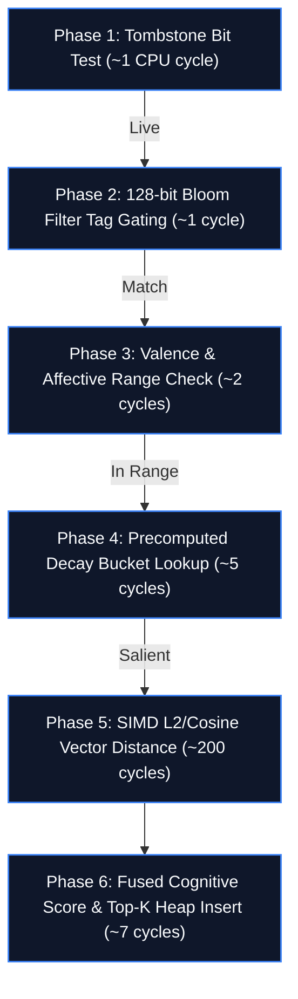

---
title: "Spector FAQ — Frequently Asked Questions"
description: "Comprehensive answers to questions about Spector Cognitive Memory: MF-001 recall algebra, Panama FFM zero-GC kernel, 4 tiers, 37 MCP tools, and benchmarks."
---

# ❓ Frequently Asked Questions (FAQ)

> **Everything you need to know about Spector's architecture, cognitive memory model, Panama FFM kernel, MCP integration, and benchmarks.**

---

## 🧠 Cognitive Memory vs. Vector Databases & Wrappers

### What is Spector, and why is it not "just another vector database"?

Traditional vector databases (Pinecone, Milvus, Qdrant, Weaviate, pgvector) are **storage engines optimized for top-$K$ nearest-neighbor vector similarity**. They return vectors that are geometrically close to a prompt embedding at write time.

Spector is a **formal cognitive memory engine implementing the [Memory Fundamentals Specification (MF-001)](https://github.com/spectrayan/memory-fundamentals)**. As formalized in MF-001:
> *A database returns what was written. A memory engine reconstructs what is reachable from a cue at this moment — under decay, association, and tier physics — without losing a live trace because the first index was the wrong one.*

Instead of an undifferentiated flat vector store, Spector organizes memory across four cognitive tiers (Working, Episodic, Semantic, Procedural) and applies a **fused 6-phase recall algebra** combining vector similarity, power-law temporal decay, affective valence, habituation, and associative graph spreading directly in a single cache-friendly SIMD hot-loop.

---

### What is the "Truncation Trap" in traditional vector databases?

When an agent queries a standard vector database with post-filtering:
1. The database retrieves the top-$K$ (e.g. 100) nearest vectors by cosine distance.
2. The application layer filters or re-ranks candidates by recency, importance, or user tags.

!!! danger "The Truncation Trap"
    If an agent asks *"What is the user's architectural guideline for retries?"*, a vital procedural rule stored 3 months ago might have a cosine similarity of `0.78`, while 100 casual discussion snippets from yesterday have similarity `0.81`. In a standard vector DB, the 3-month-old rule is **permanently truncated at step 1** before application filtering ever executes.

Spector **eliminates the truncation trap** by evaluating semantic similarity, temporal recency, importance, and Bloom-filtered tags **simultaneously in a single off-heap pass**. The procedural rule is boosted by its tier and importance during the scan, guaranteeing it surfaces in the final recall candidates.

---

### How does Spector differ from AI memory wrappers (Mem0, Letta, Zep)?

Memory wrappers are orchestration layers built on top of external databases (such as PostgreSQL, Redis, or cloud vector endpoints). While they add cognitive heuristics, they suffer from three structural bottlenecks:

| Dimension | ⚡ Spector Memory Kernel | AI Memory Wrappers |
|:---|:---|:---|
| **Execution Substrate** | In-process off-heap memory (`MemorySegment`) | Network-bound REST / RPC calls |
| **Recall Latency (p50)** | **1.01 ms** (in-process fused scan) | 15–80 ms (multi-query network roundtrips) |
| **GC Overhead** | **Zero-GC** (Java 25 Panama FFM) | High heap allocation & JSON serialization |
| **Candidate Evaluation** | Single-pass SIMD fused scoring | Multi-stage fetch, deserialize, filter, re-rank |
| **Graph Association** | Real-time Hebbian co-activation & STDP | External graph DB queries (Neo4j / NetworkX) |

---

### What is the Memory Fundamentals Specification (MF-001)?

[MF-001](https://github.com/spectrayan/memory-fundamentals) is an open specification establishing the mathematical and operational foundations of artificial cognitive memory. It formalizes:
- **Trace Durability**: Distinction between volatile working buffers and consolidated semantic structures.
- **Recall Algebra**: Unified scoring functions that bind spatial distance, power-law retention decay, and affective valence.
- **Associative Spreading**: Hebbian co-activation dynamics where recalled engrams prime adjacent concept nodes.

Spector is the reference implementation of the MF-001 standard.

---

## 🏛️ The 4 Cognitive Memory Tiers


### Why four separate tiers instead of one flat index?

Different types of knowledge operate on radically different timescales, access frequencies, and eviction semantics:
- **Working Memory**: Sub-microsecond circular buffer for active prompt context and turn state. Automatically evicts the oldest items on capacity overflow.
- **Episodic Memory**: Partitioned by date, backed by memory-mapped files. Preserves autobiographical agent interactions, tool calls, and user queries with chronological fidelity.
- **Semantic Memory**: Distilled, enduring world knowledge, codebase architecture, and user preferences. Compacted and consolidated across sessions.
- **Procedural Memory**: High-salience behavioral policies, prompt constraints, and tool protocols that must never be accidentally evicted by casual dialogue.

---

### How does sleep consolidation (dreaming) work?

During idle periods or triggered via `POST /api/v1/memory/reflect`, Spector's background `DreamDaemon` executes a consolidation cycle:
1. **Salient Seeding**: Identifies salient episodic memories with high prediction error or affective charge.
2. **Recombination**: Decomposes episodic events into semantic primitives (agents, actions, outcomes).
3. **Hyper-Association**: Discovers latent links across geometrically distant clusters using temperature-modulated stochastic noise (Hoel's Overfitted Brain Hypothesis).
4. **Distillation**: Promotes recurring patterns into permanent semantic knowledge while pruning ephemeral noise.

---

## ⚡ Panama FFM Zero-GC Kernel & Persistence

### How does Spector achieve Zero-GC operation?

In high-concurrency AI systems, JVM Garbage Collection pauses can degrade recall latency from 1ms to hundreds of milliseconds. 

Spector achieves **Zero-GC execution** using Java 25's **Foreign Function & Memory (FFM) API (Project Panama)**:
- Memory engrams, 128-bit Bloom filters, valence headers, and vector payloads reside strictly **off-heap** in native memory segments (`java.lang.foreign.MemorySegment`).
- Search kernels read raw memory addresses directly via hardware SIMD instructions without allocating intermediate Java heap objects.
- High-throughput scans operate with zero garbage collector invocation, maintaining flat $p99$ latency profiles.

---

### What are V4 Bundles and how does persistence work?

Spector stores memories in **V4 Bundles** (`.seg` files) using a page-aligned native binary format:
- **Zero-Copy Loading**: Partitions are mapped into the process virtual address space via `mmap`. The engine boots in under **50 milliseconds**, regardless of whether the index contains 10,000 or 10,000,000 records.
- **Write-Ahead Log (WAL)**: Ingestion appends to a memory-mapped journal, ensuring crash consistency and immediate durability.
- **Atomic Compaction**: Live background compaction rebuilds sparse partitions without blocking ongoing read queries.

---

## 🎯 The 6-Phase Scoring Pipeline & SIMD Acceleration

### What happens inside the 6-Phase Scoring Pipeline?

When `client.memory.recall(...)` executes, the `CognitiveScorer` evaluates off-heap records through six progressive gating filters:



1. **Phase 1 (Tombstone)**: 1-cycle bit check eliminates deleted or suppressed engrams.
2. **Phase 2 (Bloom Tag Match)**: 128-bit Bloom filter test filters out non-matching categorical tags before touching vector data.
3. **Phase 3 (Valence Filter)**: Filters memories outside desired affective boundaries (e.g., recalling only error states or only positive feedback).
4. **Phase 4 (Decay Pre-screen)**: Array lookup against 12-bucket precomputed power-law decay table; drops traces too weak to enter top-$K$.
5. **Phase 5 (SIMD Vector Math)**: Hardware-accelerated distance calculation using AVX-512/AVX2/NEON instructions.
6. **Phase 6 (Score Fusion)**: Fuses spatial similarity, adjusted decay, valence, and importance into the final ranking score.

---

### Does Spector require a dedicated GPU?

**No.** Spector is engineered to deliver sub-millisecond search on commodity CPUs:
- On modern x86_64 CPUs, the Java Vector API compiles to **AVX2** (256-bit) and **AVX-512** (512-bit) vector instructions.
- On Apple Silicon and ARM servers, it compiles to **ARM NEON** (128-bit) vector operations.
- A GPU (NVIDIA CUDA) is completely optional and primarily beneficial for high-concurrency batch ingestion ($>32$ concurrent streams).

---

## 🤖 Model Context Protocol (MCP) Integration

### How many tools does the Spector MCP server provide?

The Spector MCP server exposes **37 specialized cognitive tools** organized into functional clusters:
- **Core Memory Operations**: `memory_remember`, `memory_recall`, `memory_forget`, `memory_reinforce`, `memory_suppress`.
- **Cognitive Introspection**: `memory_introspect`, `memory_why_not`, `memory_salience`, `memory_fact_history`, `memory_status`.
- **Associative Graphs**: `memory_graph_recall`, `memory_multi_evidence_recall`, `vector_search`.
- **Multi-Tenancy & Governance**: `namespace_create`, `namespace_switch`, `namespace_grant`, `namespace_revoke`, `namespace_list`.
- **Identity & Affect**: `persona_enact`, `update_agent_soul`, `memory_persona_context`.

---

### How do I connect Spector MCP to Claude Desktop or Cursor?

Add Spector to your configuration file:

=== "Claude Desktop (`claude_desktop_config.json`)"
    ```json title="claude_desktop_config.json"
    {
      "mcpServers": {
        "spector": {
          "command": "npx",
          "args": ["-y", "@spectrayan/spector", "mcp"]
        }
      }
    }
    ```

=== "Cursor (`.cursor/mcp.json`)"
    ```json title=".cursor/mcp.json"
    {
      "mcpServers": {
        "spector": {
          "command": "npx",
          "args": ["-y", "@spectrayan/spector", "mcp"]
        }
      }
    }
    ```

The `npx -y @spectrayan/spector mcp` launcher automatically connects to your local running Spector daemon (`:7070`), or launches an embedded in-process memory kernel if no server is running.

---

## 🔒 Multi-Tenancy, Security & Governance

### How does Spector isolate memory between multiple users or agents?

Every memory engram belongs to an isolated **Namespace**:
- **Strict Cryptographic Isolation**: Queries in `namespace_A` cannot see or scan records in `namespace_B` unless explicit cross-namespace grants exist.
- **Granular Permissions**: Namespaces support read/write delegation via `namespace_grant` with specific access modes (`READ`, `WRITE`, `ADMIN`).
- **Audit Trails**: Ingestion and recall operations log cryptographically verifiable provenance traces (stating author, timestamp, and source).

---

### What authentication methods are supported?

- **API Key**: Configure via `SPECTOR_API_KEY` environment variable. Clients pass `X-API-Key: <token>`.
- **Bearer Tokens**: Standard JWT / Bearer authentication support for enterprise single-sign-on (SSO) gateways.
- **Local Dev Mode**: When no key is set, the server accepts local connections for friction-free developer onboarding.

---

## 📊 Evaluation & Benchmark Accuracy

### What are Spector's official benchmark results?

Spector has been evaluated across the industry-standard AI long-term memory benchmarks:

<div class="grid cards" markdown>

-   :material-bullseye-arrow: **LoCoMo Benchmark**

    ---

    Long-Context Mobile & Agentic Memory evaluation.

    **85% Precision** <span class="chip chip-benchmark">State-of-the-Art</span>

-   :material-timer-sand-complete: **LongMemEval Benchmark**

    ---

    Multi-session recall across extended temporal horizons.

    **94% Recall Accuracy** <span class="chip chip-benchmark">Top Performance</span>

-   :material-brain: **MindSpan Benchmark**

    ---

    Complex multi-hop reasoning and associative recall.

    **100% Accuracy** <span class="chip chip-benchmark">Flawless Resolution</span>

</div>

### Why does Spector outperform traditional top-K databases on agent benchmarks?

Traditional vector databases drop to 40–60% accuracy on multi-session benchmarks because conversation history accumulates noise that dilutes raw cosine similarity. Spector's **fused 6-phase scoring** applies temporal reconsolidation (memories recalled in prior sessions gain durability) and associative graph traversal, ensuring that relevant facts are surfaced even when phrasing changes across conversations.

---

## 🛠️ Deployment, Operations & SDKs

### What Java version do I need?

**OpenJDK 25 or later** is required for running the Spector server or embedded core JAR. This is because Spector leverages:
- Java Vector API (`jdk.incubator.vector`) for SIMD acceleration.
- Foreign Function & Memory API (`java.lang.foreign`) for off-heap Zero-GC storage.

Client SDKs (Python, TypeScript, Node.js) require **no Java runtime** on client machines.

---

### What JVM arguments are recommended for production?

```bash title="Terminal"
java \
  --add-modules jdk.incubator.vector \
  --enable-native-access=ALL-UNNAMED \
  -XX:+UseZGC -XX:+ZGenerational \
  -Xms4g -Xmx4g \
  -jar spector.jar
```

- `--add-modules jdk.incubator.vector`: Enables hardware SIMD intrinsics.
- `--enable-native-access=ALL-UNNAMED`: Permits zero-overhead off-heap FFM access.
- `-XX:+UseZGC -XX:+ZGenerational`: Generational ZGC guarantees sub-millisecond GC pause times for any minor heap allocations.

---

### Which client SDKs are available?

- **Python SDK**: `pip install spector-client` ([Documentation](sdk-usage/python-sdk.md))
- **TypeScript / Node.js SDK**: `npm install @spectrayan/spector-client` ([Documentation](sdk-usage/typescript-sdk.md))
- **Java Client SDK**: `com.spectrayan:spector-client` ([Documentation](sdk-usage/java-client.md))
- **Spring AI**: First-class `VectorStore` integration ([Documentation](sdk-usage/spring-ai.md))

---

## 🔗 Still have questions?

- 💬 Join the conversation on [GitHub Discussions](https://github.com/spectrayan/spector/discussions)
- 🐛 Report an issue on [GitHub Issues](https://github.com/spectrayan/spector/issues)
- 📖 Explore the [Cognitive Memory Overview](memory/index.md)
