# 🗺️ Region Reference Overview & Index

> **Comprehensive index of all 30 memory regions across Spector Kernel bundle types.**

---

## Overview

The Spector Memory Kernel distributes memory structures across three distinct bundle types:
1. **Partition Bundle** (`partition.bundle`): Contains read-heavy, often historical or static semantic/episodic records.

2. **Runtime Bundle** (`runtime.bundle`): Contains highly dynamic, volatile, or short-term operational state (e.g., working memory, temporal chains).

3. **Identity Bundle** (`identity.bundle`): Stores tenant/agent self-models, policies, salience, and continuity metadata (ADR-0029).

```mermaid
flowchart TD
    subgraph Kernel["Spector Memory Kernel"]
        direction LR
        PB[Partition Bundle]
        RB[Runtime Bundle]
        IB[Identity Bundle]
    end

    subgraph Partition Regions
        PB --> SEMANTIC
        PB --> EPISODIC
        PB --> PROCEDURAL
        PB --> TEXT
        PB --> STRENGTH
    end

    subgraph Runtime Regions
        RB --> WORKING
        RB --> COACTIVATION
        RB --> INDEX_MIDX
        RB --> INDEX_IDPL
        RB --> HEBBIAN
        RB --> TEMPORAL
        RB --> ENTITY
        RB --> INSULA
        RB --> PROVENANCE
        RB --> SPLADE
        RB --> OTHERS[...]
    end

    subgraph Identity Regions
        IB --> HEADER
        IB --> SOUL
        IB --> SALIENCE
        IB --> CONTINUITY
        IB --> POLICY
        IB --> ORG_DIR
    end
```

## Region Index

### Partition Regions (`partition.bundle`)
| Region Name | RegionId Enum | Numeric ID | Memory Shape | Layout Class | Store Class |
|:---|:---|:---:|:---|:---|:---|
| **SEMANTIC** | `RegionId.SEMANTIC` | 0 | RECORD | `SemanticLayout` | `SemanticMemory` |
| **EPISODIC** | `RegionId.EPISODIC` | 1 | RECORD | `EpisodicLayout` | `EpisodicMemory` |
| **PROCEDURAL** | `RegionId.PROCEDURAL` | 2 | RECORD | `ProceduralLayout` | `ProceduralMemory` |
| **TEXT** | `RegionId.TEXT` | 3 | BLOB | `TextBlobLayout` | `TextBlobMemory` |
| **STRENGTH** | `RegionId.STRENGTH` | 4 | TENSOR | `StrengthLayout` | `StrengthMemory` |

### Runtime Regions (`runtime.bundle`)
| Region Name | RegionId Enum | Numeric ID | Memory Shape | Layout Class | Store Class |
|:---|:---|:---:|:---|:---|:---|
| **WORKING** | `RegionId.WORKING` | 10 | RECORD | `WorkingLayout` | `WorkingMemory` |
| **COACTIVATION** | `RegionId.COACTIVATION` | 11 | GRAPH | `CoActivationLayout` | `CoActivationMemory` |
| **INDEX_MIDX** | `RegionId.INDEX_MIDX` | 12 | INDEX | `IndexEntryLayout` | `IndexEntryMemory` |
| **INDEX_IDPL** | `RegionId.INDEX_IDPL` | 13 | INDEX | `IdBlobLayout` | `IdBlobMemory` |
| **HEBBIAN** | `RegionId.HEBBIAN` | 14 | GRAPH | `HebbianLayout` | `HebbianGraphMemory` |
| **TEMPORAL_CHAIN** | `RegionId.TEMPORAL_CHAIN` | 15 | GRAPH | `TemporalLayout` | `TemporalChainMemory` |
| **TEMPORAL_FACTS** | `RegionId.TEMPORAL_FACTS` | 16 | RECORD | `TemporalFactLayout` | `TemporalFactsMemory` |
| **ENTITY_DIRECTORY** | `RegionId.ENTITY_DIRECTORY` | 17 | RECORD | `EntityDirectoryLayout` | `EntityDirectoryMemory` |
| **ENTITY_NAMES** | `RegionId.ENTITY_NAMES` | 18 | BLOB | `TextBlobLayout` | `TextBlobMemory` |
| **HYPERGRAPH** | `RegionId.HYPERGRAPH` | 19 | GRAPH | `HyperEntityLayout` | `HyperEntityGraphMemory` |
| **ENTITY_TYPES** | `RegionId.ENTITY_TYPES` | 20 | REGISTRY | `RegistryLayout` | `TypeRegistryMemory` |
| **RELATION_TYPES** | `RegionId.RELATION_TYPES` | 21 | REGISTRY | `RegistryLayout` | `TypeRegistryMemory` |
| **BM25** | `RegionId.BM25` | 22 | TENSOR | `Bm25Layout` | `Bm25Memory` |
| **CHECKPOINT** | `RegionId.CHECKPOINT` | 23 | RECORD | `CheckpointLayout` | `CheckpointMemory` |
| **INSULA** | `RegionId.INSULA` | 24 | INSULAR | `InsularLayout` | `InsulaMemory` |
| **CONTINUITY** | `RegionId.CONTINUITY` | 25 | RECORD | `ContinuityLayout` | `ContinuityMemory` |
| **PROVENANCE** | `RegionId.PROVENANCE` | 26 | GRAPH | `ProvenanceLayout` | `ProvenanceMemory` |
| **SPLADE** | `RegionId.SPLADE` | 27 | TENSOR | `SpladeLayout` | `SpladeMemory` |
| **ENTITY_REVERSE_INDEX** | `RegionId.ENTITY_REVERSE_INDEX` | 28 | INDEX | `IndexEntryLayout` | `IndexEntryMemory` |

### Identity Regions (`identity.bundle`)
| Region Name | RegionId Enum | Numeric ID | Memory Shape | Layout Class | Store Class | Reference |
|:---|:---|:---:|:---|:---|:---|:---|
| **HEADER** | `IdentityRegionId.HEADER` | 0 | BUNDLE | [`IdentityBundleHeader`](https://github.com/spectrayan/spector/blob/main/memory/spector-kernel/src/main/java/com/spectrayan/spector/kernel/bundle/identity/IdentityBundleHeader.java) | [`IdentityBundle`](https://github.com/spectrayan/spector/blob/main/memory/spector-kernel/src/main/java/com/spectrayan/spector/kernel/bundle/identity/IdentityBundle.java) | [View](./identity-header.md) |
| **SOUL** | `IdentityRegionId.SOUL` | 1 | INSULAR | [`InsularLayout`](https://github.com/spectrayan/spector/blob/main/memory/spector-kernel/src/main/java/com/spectrayan/spector/kernel/layout/InsularLayout.java) | [`InsulaMemory`](https://github.com/spectrayan/spector/blob/main/memory/spector-kernel/src/main/java/com/spectrayan/spector/kernel/store/InsulaMemory.java) | [View](./soul.md) |
| **SALIENCE** | `IdentityRegionId.SALIENCE` | 2 | Raw Payload | Raw (Managed by Bundle) | [`IdentityBundle`](https://github.com/spectrayan/spector/blob/main/memory/spector-kernel/src/main/java/com/spectrayan/spector/kernel/bundle/identity/IdentityBundle.java) | [View](./salience.md) |
| **CONTINUITY** | `IdentityRegionId.CONTINUITY` | 3 | RECORD | [`ContinuityLayout`](https://github.com/spectrayan/spector/blob/main/memory/spector-kernel/src/main/java/com/spectrayan/spector/kernel/layout/ContinuityLayout.java) | [`ContinuityMemory`](https://github.com/spectrayan/spector/blob/main/memory/spector-kernel/src/main/java/com/spectrayan/spector/kernel/store/ContinuityMemory.java) | [View](./identity-continuity.md) |
| **POLICY** | `IdentityRegionId.POLICY` | 4 | Raw Payload | Raw (Managed by Bundle) | [`IdentityBundle`](https://github.com/spectrayan/spector/blob/main/memory/spector-kernel/src/main/java/com/spectrayan/spector/kernel/bundle/identity/IdentityBundle.java) | [View](./policy.md) |
| **ORG_DIR** | `IdentityRegionId.ORG_DIR` | 5 | Raw Payload | Raw (Managed by Bundle) | [`IdentityBundle`](https://github.com/spectrayan/spector/blob/main/memory/spector-kernel/src/main/java/com/spectrayan/spector/kernel/bundle/identity/IdentityBundle.java) | [View](./org-dir.md) |
