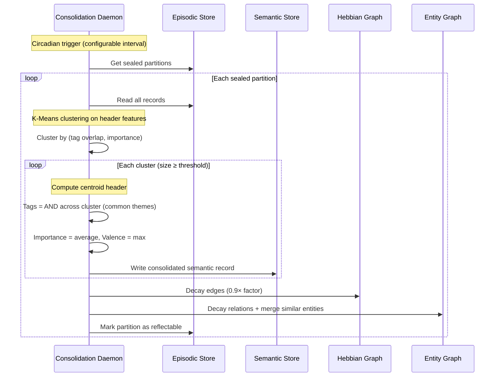
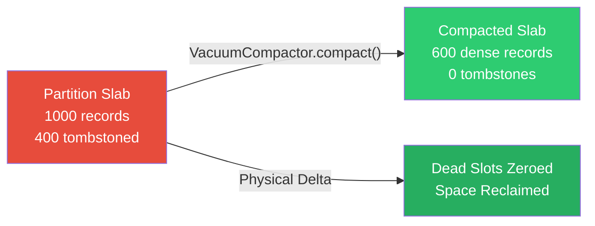
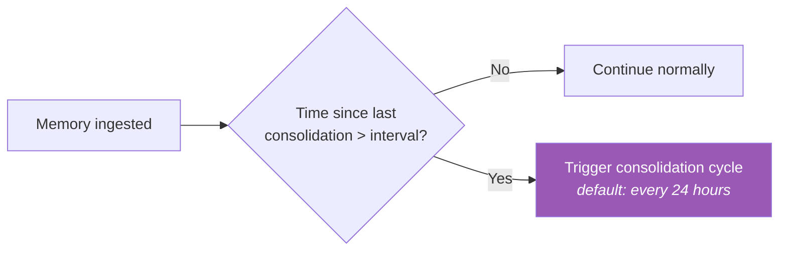
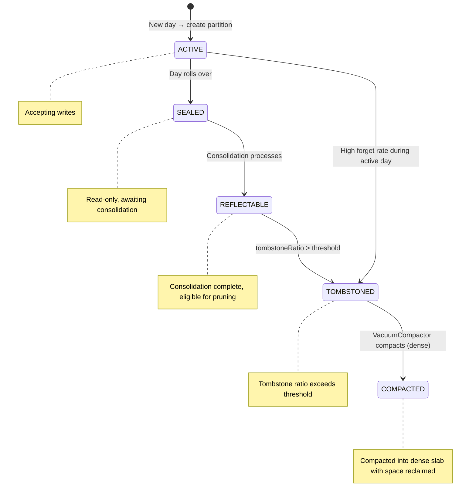

# Offline Consolidation

---

## The Two Mechanisms

### 1. Offline Consolidation — Episodic → Semantic Promotion

The consolidation daemon performs K-Means clustering on episodic memories to extract semantic knowledge:

**Key behaviors**:

- **Tag merging**: Uses bitwise AND across the cluster — only common tags survive, representing the shared theme
- **Importance averaging**: The consolidated memory inherits the mean importance of its source episodes
- **Minimum cluster size**: Small clusters (noise) are not promoted — only patterns are
- **Cross-layer promotion**: Strong Hebbian edges are promoted to Entity Graph relations
- **Entity maintenance**: Similar entities are merged (Levenshtein distance), stale relations decay

!!! example "Example: Consolidation in Action"
    An agent encounters 15 episodic memories tagged `[database, connection, error]` over a week. The consolidation daemon clusters them and promotes a single semantic memory: *"Database connection issues are recurring — check connection pool sizing and timeout settings."*

---

### 2. Tombstone Compaction — Synaptic Pruning

When records are deleted via `forget()` or `purge()`, tombstones (`FLAG_TOMBSTONE`) are marked in the record header, allowing scorer Phase 1 to skip them in ~1 cycle. However, tombstoned records continue to consume disk and slab capacity until **compaction** reclaims the physical space.

Spector performs physical compaction via `VacuumCompactor`, which can be triggered on demand (`SpectorMemoryAdmin.vacuum(tier, force)` / `POST /api/v1/memory/vacuum`) or during background maintenance when the tombstone ratio exceeds the configured threshold.

**The Compaction Process**:

1. **Census & Threshold Evaluation**:
   The store's tombstone ratio is evaluated against `spector.memory.vacuum.threshold` (default `0.20`). If the ratio is below threshold and `force=false`, a census report (`CompactionResult.census`) is returned without moving records.

2. **Dense In-Place Relocation**:
   Live records are copied sequentially to lower offsets within each partition slab (`compactFixed` for fixed-stride semantic/procedural engrams, `compactEpisodic` for variable-length append logs). Abandoned trailing slots are zeroed out in-place.

3. **Atomic Counter Updates**:
   Header prologues (`visibleCount` and `usedBytes`) are atomically updated and published to readers via Panama MemorySegment stores.

4. **Index Offset Remapping Under Lock**:
   Under `PartitionManager.withRollLock` (the same lock coordinating partition roll), `IndexEntryMemory` updates record locations to their new offsets, guaranteeing continuous ID-to-record resolution across concurrent reads.

5. **Graph Edge Reconciliation**:
   Surviving records maintain stable `graphSlot` mappings, keeping Hebbian associations, temporal chains, and hyperedges intact. Dead records have their `graphSlot`s detached across all four cognitive graph planes (Hebbian CSR, temporal chain, entity directory, hypergraph).

6. **Derived Index Reconciliation**:
   Derived indexes (HNSW, BM25, SPLADE) are re-synchronized via `IndexReconcileEngine.reconcile()`.

7. **Measured Space Reclamation**:
   Reclaimed space is measured directly from the physical difference (`beforeUsedBytes - afterUsedBytes`) rather than computed via an unverified multiplication.

### 3. Deletion Semantics: `forget` vs `purge`

Spector provides two distinct deletion verbs with documented semantics:

| Property | `forget` (Logical Tombstone) | `purge` (Physical Destruction) |
|:---|:---|:---|
| **Mechanism** | Sets `FLAG_TOMBSTONE` (bit 0 of flags byte) | Overwrites payload and content headers with zeros in-place; sets `FLAG_PURGED` (`0x40`) |
| **Payload on Disk** | **Retained verbatim** in partition mmap slab and snapshots | **Destroyed** (zeroed off-heap vector, norm, Bloom filter, centroid ID, turn body, unshared text) |
| **Graph Edges** | Filtered during traversal | **Detached** across all 4 planes: Hebbian CSR rebuild, temporal chain unlink, entity directory unlink, and hyperedges scan |
| **WAL Event** | `RECORD_WRITE` tombstone bit update | `PURGE` opcode recorded before zeroing, re-applied during recovery |
| **Legal Hold** | **Permitted** (payload survives for discovery) | **Refused** (`NamespaceLegalHoldException` / HTTP 409) |
| **Export Behavior** | Omitted unless `--include-tombstones` is passed | Omitted unconditionally |
| **Audit Report** | Status confirmation | Returns `PurgeResult` disclosing unreachable copies (DR exports, replica disks, cold tier) |
| **Space Reclaim** | Reclaimed only when partition compaction runs | Space retained in-place (reclaimed only upon compaction) |
| **Reversibility** | Reversible in principle | **Irreversible** |

When memories are `forget()`'d, they are tombstoned (bit 0 of flags byte set to 1). The scorer skips them in Phase 1 (~1 cycle). When records must be permanently destroyed for privacy or compliance (e.g. GDPR erasure), `purge()` must be used. In either case, `vacuum()` subsequently compacts the partition to physically reclaim disk space.

---

## Circadian Trigger

The consolidation daemon runs on a configurable schedule:

The default interval is 24 hours — matching the biological circadian cycle. For testing, it can be set to any duration.

---

## Partition State Machine

---

## ReflectPathway — 9-Relay Sleep Pipeline

Spector 1.3.0 consolidates all sleep reflection operations into a single composable `ReflectPathway` pipeline with 9 specialized relays:

```mermaid
graph LR
    subgraph "NREM Slow-Wave Sleep (SWS)"
        R1["1. SynapticPruningRelay<br/><i>Downscaling & compaction</i>"]
        R2["2. EpisodicLogConsolidationRelay<br/><i>Systems replay & gist extraction</i>"]
    end
    subgraph "REM Dream Sleep"
        R3["3. SoulDriftRefusionRelay<br/><i>#503 Affective restamping & soul re-fusion</i>"]
        R4["4. ProactiveInterferenceRelay<br/><i>Near-duplicate decay</i>"]
    end
    subgraph "Synaptic Homeostasis & Maintenance"
        R5["5. HebbianHomeostasisRelay<br/><i>Edge decay</i>"]
        R6["6. TemporalPruningRelay<br/><i>Retention decay</i>"]
        R7["7. CrossLayerPromotionRelay<br/><i>Hebbian → Entity promotion</i>"]
        R8["8. EntityMaintenanceRelay<br/><i>Entity merge & graph decay</i>"]
    end
    subgraph "Durability"
        R9["9. WalJournalRelay<br/><i>WAL REFLECT checkpoint</i>"]
    end

    R1 --> R2 --> R3 --> R4 --> R5 --> R6 --> R7 --> R8 --> R9
```

### Systems Consolidation & Soul-Drift Re-Fusion (#503)
Following biological systems consolidation (Diekelmann & Born, 2010), declarative memory replay and gist abstraction occur predominantly during **NREM Slow-Wave Sleep (SWS)**. Emotional restamping and persona realignment occur during **REM Sleep**. 

When an agent's cognitive soul or personality configuration evolves, older memories retained with stale soul version stamps undergo re-fusion during REM reflection. The `SoulDriftRefusionRelay` identifies candidates with `header.soulVersion() < currentSoulVersion`, prioritizes candidates via a max-heap of encoding surprise z-scores, adapts the generative prior mean toward the autobiographical centroid, re-scores importance using current ICNU/salience parameters and header-derived hints, and stamps updated headers in-place.

---

## Consolidation Report

Each consolidation cycle produces a structured `ReflectReport` summarizing the sleep cycle:

| Metric | Description |
|---|---|
| **consolidatedCount** | Number of episodic records / facts promoted to Semantic tier |
| **tombstonedCount** | Number of memories tombstoned during Deep Sleep pruning |
| **compactedPartitions** | Count of partitions compacted and space reclaimed during reflection |
| **temporalPrunedCount** | Stale temporal chain nodes pruned |
| **soulDriftedCount** | Count of memories detected with outdated soul version stamps |
| **soulRefusedCount** | Count of soul-drifted memories re-fused with updated importance |
| **averageImportanceDelta** | Average absolute importance delta after soul re-fusion |
| **logTurnsConsolidated** | Episodic log conversation turns distilled into semantic memories |
| **duration** | Total reflection cycle time |
| **graphHealth** | Graph health metrics snapshot |

This report is logged, monitored, and exposed via the introspection API and Micrometer metrics.

---

## Next Steps

- :material-brain: [**Cortex — Tier Stores**](tiers.md) — the 4-tier architecture
- :material-flash: [**Synapse — Tags & Scoring**](tags.md) — the 64-byte header
- :material-head-cog: [**Dopamine — Surprise Detection**](novelty.md) — auto-importance scoring
