# 🚨 Cell Disaster Recovery & Compliance Runbook

> **Operational runbook for cell-level disaster recovery, cold-standby activation, snapshot rehydration, and compliance erasure.** This guide details the step-by-step procedures for handling catastrophic datacenter or cloud region outages, verifying data integrity before serving, and managing post-failover state.

---

## 🎯 Recovery Objectives & Guarantees

When a catastrophic disaster incapacitates an entire primary cell (such as complete NVMe loss, datacenter power outage, or cloud region failure), operations shift to an isolated standby cell.

```mermaid
flowchart LR
    subgraph Primary Cell [Primary Cell - Dead / Incapacitated]
        O1[Owner Pod 1]
        O2[Owner Pod 2]
        NVMe[(Local NVMe Lost)]
    end

    subgraph ObjectStore [S3-Compatible Object Store]
        Snapshots[Encrypted Snapshot Bundles\n+ Atomic Manifests]
    end

    subgraph Standby Cell [Standby Cell - Promoted]
        S1[Standby Owner 1]
        S2[Standby Owner 2]
        SNVMe[(Rehydrated NVMe)]
    end

    Primary Cell -. Periodic Exports .-> ObjectStore
    Snapshots ==>|Paced Rehydration| Standby Cell
```

| Metric | SLA Target | Measurement Basis | Notes |
|:---|:---|:---|:---|
| **RPO (Recovery Point Objective)** | **15 minutes** (configurable) | Measured mutable snapshot export cadence (`spector.dr.export-interval-seconds`) | Represents the maximum write lag between the primary cell and object storage. Long-term L3 cold archive replication is decoupled from live tenant DR. |
| **RTO (Recovery Time Objective)** | **30 minutes** | End-to-end drill wall-clock time from detection to verified serving | Evaluated from cold-standby scale-up (or pre-warmed standby) through layout reconstruction. |
| **Node Loss vs. Cell Loss** | Seconds vs. Minutes | Node failover is autonomous via lease expiration (5–15s); cell failover is human-governed (0–30m) | Node-level recovery preserves local cluster fences; cell-level recovery spans independent cluster boundaries. |

---

## 📋 The 5 Recovery Stages

Cell-level recovery is divided into five sequential 5-minute to 10-minute operational stages, completing within the 30-minute target budget:

```mermaid
gantt
    title Cell Disaster Recovery Timeline (0-30 min Budget)
    dateFormat  X
    axisFormat %s min
    section Stage 1
    Detection (Dead Cell vs Partition) :0, 5
    section Stage 2
    Human Activation & Standby Scale   :5, 10
    section Stage 3
    Snapshot Rehydration & Verification:10, 20
    section Stage 4
    Routing Cutover (Org-to-Cell Pin)  :20, 25
    section Stage 5
    Catalog Verification & HWM Disclosure:25, 30
```



### Stage 1: Detection (0–5 min)

The incident commander must verify that the primary cell has suffered an unrecoverable failure rather than a transient network partition.

> [!WARNING]
> **Never Promote on Network Partition**:
> Promoting a standby cell while the primary cell remains partially functional without isolating routing will result in split-brain write divergence.

Checklist for confirming total cell loss:
1. **Quorum Loss**: All nodes in the primary cell fail heartbeats to the external monitoring plane.
2. **Control Store Unreachable**: Primary control store lease renewal has ceased.
3. **Infrastructure Confirmation**: Cloud provider region status or facility telemetry reports hardware, power, or catastrophic network failure.

---

### Stage 2: Activation & Promotion (5–10 min)

Standby cell activation is strictly a **human decision**. Automated promotion across cell boundaries is disabled by design because distributed fences cannot span a dead control store.

Execute standby cell promotion using the CLI:

```bash
# Attempting promotion without --force will be rejected
spectorctl dr promote --cell cell-standby-02 --reason "Primary region us-east-1 outage" --force
```

The promotion command:
- Transitions the cell state from `STANDBY` to `ACTIVE_PRIMARY`.
- Logs an immutable audit record containing operator identity, timestamp, reason, and target cell.
- Triggers pod scaling in orchestrators (e.g. scaling cold-standby Kubernetes StatefulSets from zero).

---

### Stage 3: Snapshot Rehydration (10–20 min)

The standby cell restores active namespaces from the remote object store (`spector.dr.object-store.*`).

1. **Atomic Epoch Selection**: Restorer scans the object store prefix for valid epochs. Only directories containing a completed `manifest.json` are eligible. Partial uploads without manifests are automatically ignored.
2. **Prioritized Ingestion**: High-priority tenant namespaces (e.g. tier-1 accounts) are hydrated ahead of background or analytical namespaces.
3. **Paced Bandwidth**: Ingress bandwidth throttling prevents saturating host network adapters (`spector.dr.bandwidth-limit-bytes-per-sec`).
4. **Layout Reconstruction**: Files are restored into their authoritative filesystem layout (`tenant-rooted` or `flat`) based on metadata embedded in the manifest.

> [!IMPORTANT]
> **Strict Verification Before Serving**:
> Every restored partition bundle undergoes cryptographic and structural validation before being exposed to query traffic:
> - **Preamble Magic Check**: Must equal `SMKM` (`0x534D4B4D`).
> - **Layout Identifier Check**: Must equal `BUND` (`0x42554E44`).
> - **SHA-256 Checksum**: Computed file digest must match the manifest checksum byte-for-byte.
>
> Any bundle failing verification is immediately quarantined and **REFUSES TO SERVE**. Serving partial or corrupt data turns an infrastructure outage into a silent data integrity catastrophe.

---

### Stage 4: Routing Cutover (20–25 min)

Update global load balancers, DNS, and edge API gateways to repoint organization traffic to the newly active cell:

1. **Update Org-to-Cell Pinning**: Remap organization records in the global directory from `cell-primary-01` to `cell-standby-02`.
2. **Residency Verification**: Verify that the destination cell satisfies the tenant's data residency constraints. If an organization is pinned to a specific jurisdiction (e.g. `EU_CENTRAL`), the gateway will reject cutover to a cell outside that jurisdiction.
3. **Drain Old Connections**: Terminate any lingering ingress connections directed to the previous primary IP range.

---

### Stage 5: Verification & High-Water Mark Disclosure (25–30 min)

Before declaring the recovery complete, verify data posture and disclose high-water marks to clients:

```bash
spectorctl dr status
```

Verification outputs:
- **Snapshot High-Water Mark (HWM)**: Each namespace reports its restored epoch and sequence number, enabling downstream applications to reconcile any writes submitted after the snapshot timestamp.
- **Disclosure of Unrecovered Namespaces**: Any namespace that lacked a valid snapshot or failed verification is explicitly listed as unrecovered rather than silently ignored.
- **Cross-Cell Catalog Identity**: Identity state is rebuilt locally on the standby cell without dependencies on the lost cell's catalog.

---

## 🔄 Returning Primary & The Reverse Path

When the disabled primary datacenter or cluster recovers, it must **NOT** be symmetrically restored as primary.

> [!CAUTION]
> **The Reverse Path is a Structured Data Migration, Not an Undo**:
> Once the standby cell has accepted client writes, the standby is the sole source of truth. Bringing the old primary back online immediately creates a dual-writer split-brain condition.

Procedure for primary cluster return:
1. **Fence Dead Cell**: Before reconnecting network interfaces to the old primary, revoke its gateway credentials and demote its role to `STANDBY` in local configuration.
2. **Inspect Divergence**: Read-only compare local state on the recovered cluster against the standby's snapshot lineage.
3. **Reverse Sync**: Execute a scheduled data migration from the active standby back to the restored cluster during an agreed maintenance window.

---

## 🛡️ Compliance Erasure & Residency Controls

### Physical Erasure vs. Tombstoning

Standard deletion (`deleteNamespace`) marks an entry as `TOMBSTONED` in the catalog to prevent immediate name reuse while retaining data for potential recovery. In contrast, compliance erasure executes permanent physical destruction:

1. **Local NVMe Tree Deletion**: Recursively wipes the namespace directory tree from local disk storage.
2. **Object Store Prefix Removal**: Issues bulk deletion requests against remote object store prefixes matching the tenant identifier.
3. **Replica Dispatch**: Broadcasts erasure instructions across all warm follower replicas.

### Legal Hold Precedence

If a namespace is tagged with `legalHold = true`, all compliance erasure and tombstone requests are **strictly refused**. Legal hold overrides all automated or operator deletion calls until explicitly removed by an authorized compliance officer.

### Incompleteness Disclosure

When auditing tenant deletions, the erasure engine explicitly lists data classes that were not inspected (for example, shared cluster logs or unpartitioned metrics). Deletion audits claim completeness only over inspected storage namespaces.

---

## 🧪 Disaster Recovery Drills

Regular automated and operational drills validate recovery capability under realistic conditions:

```bash
# Execute disaster recovery drill with simulated NVMe destruction
./deploy/dr/dr-drill.sh --source-cell cell-primary-01 --standby-cell cell-standby-02 --interval 900
```

Drill requirements:
- **Local State Destruction**: The drill physically deletes simulated local data directories rather than merely terminating a process.
- **Wall-Clock Timing**: RTO wall-clock time is measured across all 5 stages and benchmarked against the 30-minute budget.
- **Actual RPO Measurement**: Write sequence numbers verify that data loss does not exceed the configured export interval.
