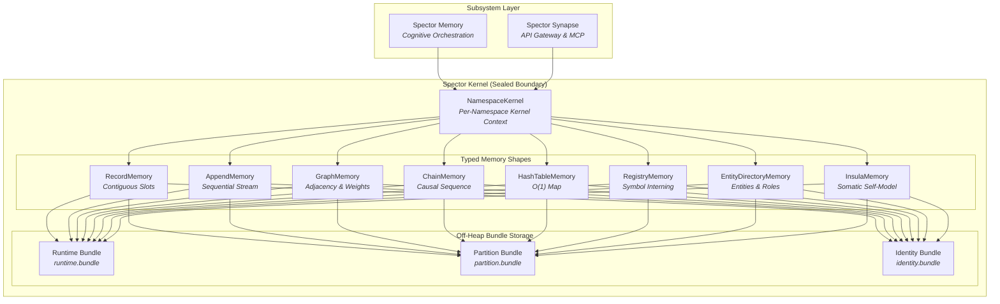

# Spector Kernel (`spector-kernel`)

> **Sealed memory-mapped kernel for the Spector cognitive architecture.**
> Zero-GC off-heap storage, hardware cache-line aligned binary layouts, growable bundle containers, and typed memory shapes running on Java 25 Foreign Function & Memory (FFM).

---

## Overview

`spector-kernel` is the foundational storage and execution engine of Spector. It encapsulates all low-level off-heap memory management, raw virtual address translation, memory-mapped file operations, and byte-level record layouts behind a sealed abstraction boundary.

Outer subsystems (`spector-memory`, `spector-synapse`, etc.) interact strictly through high-level cognitive interfaces and typed memory shapes. Raw off-heap memory addresses, segment handles, and arena lifecycles never leak outside the kernel.



---

## Architectural Principles

1. **Zero Garbage Collection Pressure**:
   All vector embeddings, engram headers, graph structures, and mutable counters reside in off-heap native memory. The JVM garbage collector never scans, moves, or pauses these regions.

2. **Sealed Boundary Enforcement**:
   Java 25 Project Panama Foreign Function & Memory API (FFM) primitives (`MemorySegment`, `Arena`) are strictly contained within `spector-kernel`. Higher layers consume clean domain models and shape accessors.

3. **Pure Encoding Identity & Telemetry Separation**:
   Engram records separate immutable creation-time metadata (pure 64-byte encoding header with 128-bit Synaptic Bloom tags) from high-frequency mutable recall dynamics (96-byte strength state). This eliminates CPU cache line invalidation and false sharing during parallel SIMD scoring.

4. **Growable Bundle Architecture & Plane Decoupling**:
   Data-plane memory is organized into growable bundles (`runtime.bundle`, `partition.bundle`) within cognitive namespaces, while persistent identity definitions (`identity.bundle`) reside in an independent **Identity Plane** (`identity/accounts/` and `identity/tenants/`). Regions grow dynamically without downtime via atomic directory updates.

5. **Crash Durability & WAL Replay**:
   Every state mutation is recorded in an append-only Write-Ahead Log (WAL) with CRC-32 checksums before off-heap segments are updated. On restart, the kernel verifies integrity and replays the log to restore memory state.

---

## Memory Shapes

The kernel abstracts physical data organization into eight canonical memory shapes:

| Shape | Access Pattern | Backed Subsystems |
|:---|:---|:---|
| **`RecordMemory`** | Fixed-stride, cache-line-aligned slot indexing | Working Memory, Semantic Memory, Procedural Memory, Strength Region |
| **`AppendMemory`** | High-throughput sequential cursor log | Write-Ahead Log (WAL), Text Blob Payloads, Bi-temporal Fact Streams |
| **`GraphMemory`** | Compressed Sparse Row (CSR) & dynamic adjacency | Hebbian Associative Graph, HyperEntity Knowledge Graph |
| **`ChainMemory`** | Chronological bidirectional episode links | Temporal Episode Chains |
| **`HashTableMemory`** | Off-heap lock-free linear probing hash table | Pairwise Co-Activation Matrix |
| **`RegistryMemory`** | Bi-directional symbol-to-integer interning | Dynamic Entity Types, Relation Types |
| **`EntityDirectoryMemory`** | Global entity identifier indexing and name pools | Inter-Namespace Entity Resolution |
| **`InsulaMemory`** | Variable-length single-entry JSON container | Anterior Insular Cortex, Interoceptive Somatic Markers, Task Confidence |

---

## Bundle Storage Hierarchy

Spector decouples the high-throughput **Cognitive Memory Plane** from the **Identity Plane**:

```
${SPECTOR_DATA_DIR}/
├── cognitive/
│   └── namespaces/{xx}/{yy}/{namespace_id}/
│       ├── namespace.json              # Metadata, dimension spec, and tenant flags
│       ├── runtime.bundle              # Hot working memory, graph matrices, and InsulaMemory
│       ├── wal.log                     # Write-Ahead Log for crash durability
│       └── partitions/
│           └── 00000/
│               └── partition.bundle    # Episodic chunks, semantic engrams, and strength state
└── identity/
    ├── accounts/{aa}/{bb}/{account_id}/
    │   └── identity.bundle             # User or Agent persona, salience profile, continuity
    └── tenants/{tt}/{uu}/{tenant_id}/
        ├── identity.bundle             # Tenant enterprise soul, compliance policies, org directory
        └── accounts/{aa}/{bb}/{account_id}/
            └── identity.bundle         # Tenant-scoped account persona
```

### Bundle Types

- **`runtime.bundle`**: Single-mmap container for hot, frequently referenced state: working memory ring buffers, the Hebbian association graph, entity directory, temporal chain links, and the somatic self-model (`InsulaMemory`).
- **`partition.bundle`**: Immutable and time-partitioned memory bundles housing episodic traces, consolidated semantic knowledge, procedural skills, and the dedicated 96-byte recall strength audit region.
- **`identity.bundle`**: Houses persistent persona contexts (`UserSoul`, `AgentSoul`, `TenantSoul`, `OrgUnitSoul`), baseline ICNU salience weights, and cryptographic compliance checks outside transient namespace churn.

---

## Binary Record Specifications

### 64-Byte Pure Encoding Header (V2)

Aligned to exactly one CPU cache line (64 bytes) to maximize sequential memory bandwidth:

```
 0                   1                   2                   3
 0 1 2 3 4 5 6 7 8 9 0 1 2 3 4 5 6 7 8 9 0 1 2 3 4 5 6 7 8 9 0 1
+-+-+-+-+-+-+-+-+-+-+-+-+-+-+-+-+-+-+-+-+-+-+-+-+-+-+-+-+-+-+-+-+
| ver(1B)|flg(1B)| val(1B)| aro(1B)| importance (float32, 4B)    |  0x00
+-+-+-+-+-+-+-+-+-+-+-+-+-+-+-+-+-+-+-+-+-+-+-+-+-+-+-+-+-+-+-+-+
|                      timestamp (int64, 8B)                    |  0x08
+-+-+-+-+-+-+-+-+-+-+-+-+-+-+-+-+-+-+-+-+-+-+-+-+-+-+-+-+-+-+-+-+
|       exact_norm (float32, 4B) |centroid(int16)|  pad0 (2B)   |  0x10
+-+-+-+-+-+-+-+-+-+-+-+-+-+-+-+-+-+-+-+-+-+-+-+-+-+-+-+-+-+-+-+-+
|                                                               |  0x18
+           128-bit Synaptic Tags Bloom Filter (16B)            +
|                                                               |  0x20
+-+-+-+-+-+-+-+-+-+-+-+-+-+-+-+-+-+-+-+-+-+-+-+-+-+-+-+-+-+-+-+-+
|consol(1B)|prof(1B)|alpha| beta |  soul_version | reserved_geo |  0x28
+-+-+-+-+-+-+-+-+-+-+-+-+-+-+-+-+-+-+-+-+-+-+-+-+-+-+-+-+-+-+-+-+
|   encoding_surprise (4B)       |       reserved block (12B)   |  0x30
+-+-+-+-+-+-+-+-+-+-+-+-+-+-+-+-+-+-+-+-+-+-+-+-+-+-+-+-+-+-+-+-+
```

### 128-Bit Synaptic Tags

Synaptic tags utilize an expanded 128-bit Bloom filter occupying offsets `0x18` through `0x27`. Contextual markers (e.g., `#user-preference`, `#financial-report`) are hashed into this 128-bit space using non-cryptographic MurmurHash3 distributions, reducing pre-screening false positives by ~60× compared to 64-bit filters and enabling sub-microsecond candidate filtering prior to vector similarity scoring.

### 96-Byte Strength State (Audit Region)

Mutable dynamics are stored in an independent 96-byte record aligned to 32 bytes:
- Two-Factor storage strength $S(t) \in [1.0, 5.0]$ (Bjork & Bjork learning model)
- ACT-R activation ring buffer: 8 relative-second timestamp history slots
- Explicit agent reinforcement counter vs. passive auto-LTP retrieval counter
- Micro-plasticity weight shift delta and last recall timestamp

---

## Client Connectivity & Subsystem Architecture

`spector-kernel` is an internal engine subsystem sealed within the Spector deployment. External applications and AI agents connect to Spector services using our lightweight client SDKs:

- **Python**: `pip install spector-client` ([Python SDK Documentation](../sdk-usage/python-sdk.md))
- **TypeScript / JavaScript**: `npm install @spectrayan/spector-client` ([TypeScript SDK Documentation](../sdk-usage/typescript-sdk.md))
- **Java Client**: `com.spectrayan:spector-client` ([Java Client Documentation](../sdk-usage/java-client.md))
- **Agent Protocols**: Model Context Protocol (MCP) server on STDIO and SSE

