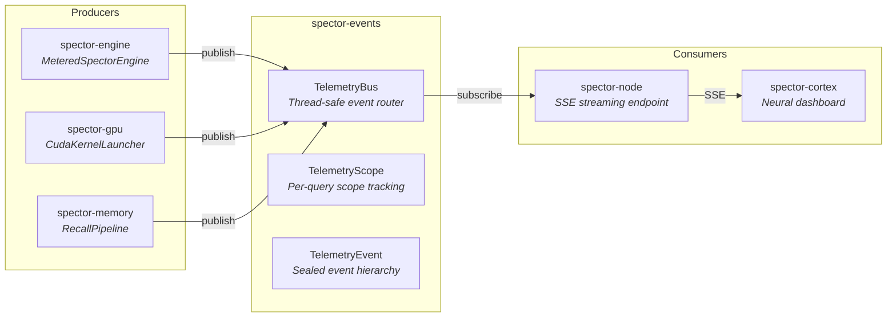

# spector-events 📡

> **Decoupled telemetry event bus for Spector — lightweight, instance-based, thread-safe event streaming for real-time observability.**

`spector-events` defines the telemetry event model and bus that all Spector modules can publish to — without depending on the web server, dashboard, or metrics framework. It is the canonical source of truth for real-time telemetry data that flows from the engine to the Cortex dashboard via SSE.

---

## 🏗️ Architecture



---

## 📦 Components

### `TelemetryBus`

Instance-based, thread-safe event router. Supports typed listener registration with automatic dispatch.

```java
var bus = new TelemetryBus();

// Subscribe to SIMD events
bus.onSimdKernel(event -> dashboard.updateSimdPanel(event));

// Subscribe to all events
bus.onAny(event -> logger.debug("Telemetry: {}", event));
```

**Design decisions:**
- **Instance-based** (not static) — supports HA environments with multiple engine instances
- **Thread-safe** — uses `CopyOnWriteArrayList` for lock-free reads during hot path
- **No circular dependencies** — events module depends only on `spector-commons`

### `TelemetryScope`

Per-query scope that accumulates telemetry events during a search/recall operation and publishes them as a batch on completion.

```java
try (var scope = new TelemetryScope(bus)) {
    scope.recordSimdKernel(laneWidth, vectorsProcessed, durationMicros);
    scope.recordQueryTrace(trace);
    // Events are flushed on scope.close()
}
```

### `TelemetryEvent`

Sealed event hierarchy. Each event type maps 1:1 to a Cortex dashboard card:

| Event Class | Dashboard Card | Data |
|:---|:---|:---|
| `SimdKernelTelemetry` | SIMD Panel | Lane width, vectors processed, duration |
| `QueryTraceTelemetry` | Query Pipeline | Top-K, hebbian activated, temporal linked |
| `GpuKernelTelemetry` | GPU Timeline | Kernel name, stream index, duration |
| `EmbeddingProjectionTelemetry` | Vector Space | 3D projections, tier, importance |
| `GraphPulseTelemetry` | Neural Graph | Edges traversed, nodes activated |
| `MemoryDiagnosticTelemetry` | Memory Stats | Tier counts, total memories, heap usage |
| `MemorySnapshotTelemetry` | Memory Diff | Pre/post reflect snapshots |
| `ReflectCycleTelemetry` | Consolidation | Edges removed, memories promoted |
| `ClusterTopologyTelemetry` | Cluster View | Node status, shard count, query rate |

---

## 🔗 Integration with spector-metrics

The `MeteredSpectorEngine` decorator (in `spector-metrics`) integrates both Micrometer metrics **and** telemetry events through a single decorator layer:

```java
// Metrics + telemetry in one decorator
SpectorEngine engine = new DefaultSpectorEngine(config);
SpectorEngine metered = new MeteredSpectorEngine(engine, registry, telemetryBus);
// All search/ingest calls are both timed (Micrometer) and published (TelemetryBus)
```

This avoids dual-decorator overhead and ensures consistent observation of every operation.

---

## ⚙️ Dependencies

```xml
<dependency>
    <groupId>com.spectrayan</groupId>
    <artifactId>spector-events</artifactId>
    <version>0.1.0-SNAPSHOT</version>
</dependency>
```

| Dependency | Purpose |
|:---|:---|
| `spector-commons` | Shared utilities and base types |

> **Zero external dependencies.** The events module intentionally has no dependency on Micrometer, Armeria, or any web framework.
