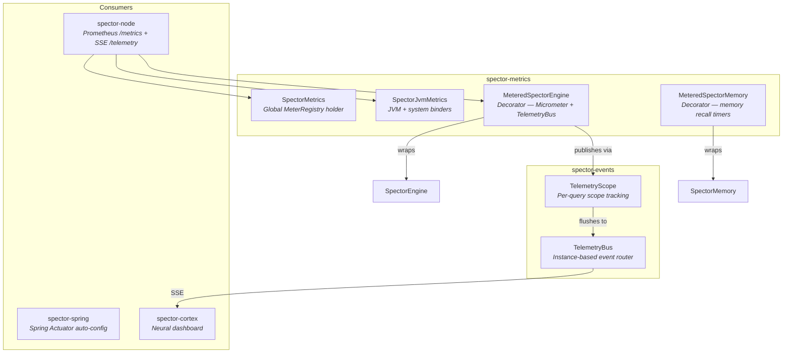

# spector-metrics 📊

> **Micrometer-based observability layer for Spector — Prometheus metrics, JVM telemetry, event-bus telemetry, and decorator-pattern engine instrumentation.**

`spector-metrics` provides transparent instrumentation for the Spector engine and JVM runtime. It uses the [Micrometer](https://micrometer.io/) metrics facade, compatible with Prometheus, Datadog, JMX, and any Micrometer-supported backend.

---

## 🏗️ Architecture



---

## 📦 Components

### `SpectorMetrics`

Global `MeterRegistry` holder. By default uses a `SimpleMeterRegistry` (zero overhead, discards metrics). Call `init()` at startup to wire a real backend.

```java
var registry = new PrometheusMeterRegistry(PrometheusConfig.DEFAULT);
SpectorMetrics.init(registry);
```

### `SpectorJvmMetrics`

Binds standard JVM telemetry to a registry:

| Metric Group | Source |
|-------------|--------|
| JVM Memory | `JvmMemoryMetrics` (heap, non-heap, buffer pools) |
| GC Activity | `JvmGcMetrics` (pause times, collection counts) |
| Thread Pools | `JvmThreadMetrics` (live, daemon, peak) |
| CPU / System | `ProcessorMetrics` (CPU usage, load average) |

```java
SpectorJvmMetrics.bind(registry);
```

### `MeteredSpectorEngine`

Decorator (Proxy pattern) wrapping a `SpectorEngine` to record metrics for all coarse-grained operations. Accessor methods are passed through without overhead.

| Metric Name | Type | Description |
|------------|------|-------------|
| `spector.engine.search.duration` | Timer | Search query latency |
| `spector.engine.search.total` | Counter | Total search queries |
| `spector.engine.ingest.duration` | Timer | Single-doc ingest latency |
| `spector.engine.ingest.batch.duration` | Timer | Batch ingest latency |
| `spector.engine.ingest.total` | Counter | Total ingested documents |
| `spector.engine.delete.total` | Counter | Total deletions |
| `spector.engine.errors.total` | Counter | Total engine errors |
| `spector.engine.documents` | Gauge | Current document count |

```java
SpectorEngine engine = new DefaultSpectorEngine(config);
SpectorEngine metered = new MeteredSpectorEngine(engine, registry);
// Or with event bus for real-time dashboard telemetry:
SpectorEngine metered = new MeteredSpectorEngine(engine, registry, telemetryBus);
// All search/ingest calls are both timed (Micrometer) and published (TelemetryBus)
```

**TelemetryScope integration:** When a `TelemetryBus` is provided, each search/ingest call opens a `TelemetryScope` that accumulates SIMD kernel events, query traces, and GPU kernel data, then flushes the batch on completion. This unified decorator avoids the overhead of two separate wrapper layers.

### `MeteredSpectorMemory`

Decorator wrapping `SpectorMemory` with timers and counters for cognitive memory operations (recall, store, reinforce, forget).

---

## 🔗 Integration with spector-node

`SpectorNode` automatically wires metrics at startup:

```java
var registry = new PrometheusMeterRegistry(PrometheusConfig.DEFAULT);
SpectorMetrics.init(registry);
SpectorJvmMetrics.bind(registry);

SpectorEngine engine = new MeteredSpectorEngine(rawEngine, registry);
```

Prometheus scrapes the `/metrics` endpoint served on the same Armeria port.

---

## 📊 Prometheus Scrape

```bash
curl http://localhost:7070/metrics
```

```text
# HELP spector_engine_search_duration Time spent executing search queries
# TYPE spector_engine_search_duration summary
spector_engine_search_duration_count 1234
spector_engine_search_duration_sum 0.892

# HELP spector_engine_documents Current number of indexed documents
# TYPE spector_engine_documents gauge
spector_engine_documents 50000
```

---

## ⚙️ Dependencies

```xml
<dependency>
    <groupId>com.spectrayan</groupId>
    <artifactId>spector-metrics</artifactId>
    <version>0.1.0-SNAPSHOT</version>
</dependency>
```

| Dependency | Purpose |
|-----------|---------|
| `micrometer-core` | Metrics facade (Timer, Counter, Gauge) |
| `micrometer-registry-prometheus` | Prometheus text format export |
| `spector-engine` | Engine interface for decorator wrapping |
| `spector-memory` | Memory interface for decorator wrapping |
| `spector-events` | TelemetryBus and TelemetryScope for real-time event streaming |
