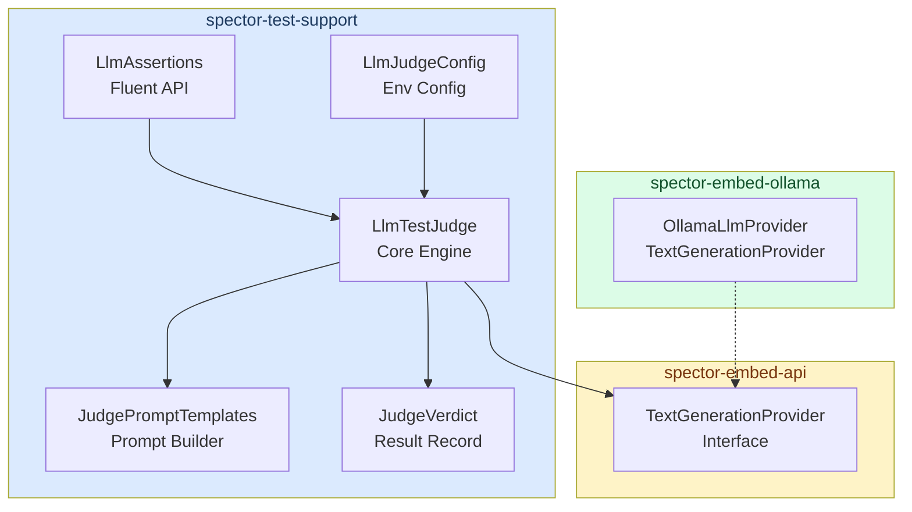

# spector-test-support

> Shared testing infrastructure for the Spector ecosystem — includes the **LLM-as-Judge** framework for semantic test validation.

## Overview

`spector-test-support` is a Maven module that provides cross-cutting testing utilities used across all Spector modules. Its primary feature is the **LLM Test Judge** — a framework that uses a language model to semantically validate test results beyond what traditional assertions can verify.

## Module Dependency

```xml
<dependency>
    <groupId>com.spectrayan</groupId>
    <artifactId>spector-test-support</artifactId>
    <version>${project.version}</version>
    <scope>test</scope>
</dependency>
```

## Architecture



## Quick Start

### 1. Enable LLM Judge

The LLM judge is **disabled by default** — tests run normally without it. Enable it via environment variable or system property:

```bash
# Via Maven system property
mvn test -pl spector-memory -DLLM_JUDGE=true -DOLLAMA_LIVE=true

# Via environment variable
export LLM_JUDGE=true
mvn test -pl spector-memory
```

### 2. Add LLM Assertions to Tests

```java
import com.spectrayan.spector.test.judge.LlmAssertions;
import com.spectrayan.spector.test.judge.LlmTestJudge;

class MyRecallTest extends AbstractE2ETest {

    @Test
    void databaseQueryReturnsRelevantResults() {
        List<CognitiveResult> results = memory.recall(
                "PostgreSQL connection pool timeout", options);

        // Traditional assertions
        assertThat(results).isNotEmpty();

        // LLM semantic validation (non-blocking)
        if (isLlmJudgeEnabled()) {
            llmAssertRecall("PostgreSQL connection pool timeout", results)
                    .warnIfIrrelevant("Results should contain database connection memories")
                    .hasGoodRanking()
                    .coversTopics("database", "connection pool");
        }
    }
}
```

## Fluent Assertion API

The `LlmAssertions` class provides a fluent interface for LLM-based test validation:

| Method | Behavior | Fails Test? |
|--------|----------|-------------|
| `.isRelevantTo(criteria)` | Hard-fails if LLM judges results as NOT relevant | ✅ Yes |
| `.warnIfIrrelevant(criteria)` | Logs warning if NOT relevant, test continues | ❌ No |
| `.hasGoodRanking()` | Warns if ranking order seems wrong | ❌ No |
| `.coversTopics(topics...)` | Warns if expected topics are not covered | ❌ No |
| `.verdict(criteria)` | Returns raw `JudgeVerdict` for custom handling | ❌ No |

### Assertion Modes

- **Hard assertion** (`isRelevantTo`): Use for critical domain invariants. If the LLM judges results as irrelevant, the test fails with the LLM's reasoning in the failure message.
- **Soft warning** (`warnIfIrrelevant`, `hasGoodRanking`, `coversTopics`): Use for semantic quality checks. Non-deterministic LLM models may produce different verdicts — warnings provide signal without flaky failures.

## Configuration

All configuration is loaded from environment variables (system properties take precedence):

| Variable | Default | Description |
|----------|---------|-------------|
| `LLM_JUDGE` | `false` | Enable/disable the LLM judge |
| `LLM_JUDGE_MODEL` | `llama3.1` | Model name for judging |
| `LLM_JUDGE_URL` | `http://localhost:11434` | Ollama server base URL |
| `LLM_JUDGE_FAIL_ON_REJECT` | `false` | Hard-fail ALL assertions on NOT_RELEVANT |
| `LLM_JUDGE_CONFIDENCE` | `0.6` | Minimum confidence threshold |

## Components

### `LlmTestJudge`

The core judgment engine. Sends structured prompts to a `TextGenerationProvider` and parses the JSON verdict. Features:

- **Retry logic**: Configurable retries (default: 2) with exponential backoff
- **Response parsing**: Handles LLM quirks — thinking tags (`<think>...</think>`), markdown fences, extra text around JSON
- **Structured output**: Forces JSON response format `{"relevant": bool, "confidence": float, "reasoning": string}`
- **Low temperature**: Default 0.1 for deterministic judgments

### `JudgePromptTemplates`

Pre-built prompt templates for three validation types:

- **Relevance**: "Are these results semantically relevant to the query?"
- **Ranking**: "Are higher-scored results more relevant than lower-scored ones?"
- **Coverage**: "Does the result set cover the expected topics?"

Each template truncates results to 200 chars and limits to 10 results per prompt to stay within token budgets.

### `JudgeVerdict`

Immutable Java record containing the LLM's structured verdict:

```java
public record JudgeVerdict(
    boolean relevant,      // LLM's relevance judgment
    float confidence,      // 0.0–1.0 confidence score
    String reasoning,      // LLM's explanation
    String query,          // The original query
    int resultCount,       // Number of results evaluated
    long latencyMs         // Judgment latency
) { }
```

### `LlmJudgeConfig`

Configuration loaded from environment variables with sensible defaults. Supports:
- System property override: `-DLLM_JUDGE_MODEL=qwen3:0.6b`
- Environment variable: `export LLM_JUDGE_MODEL=qwen3:0.6b`
- Programmatic: `LlmJudgeConfig.localDefaults()`

## License

Apache License, Version 2.0
